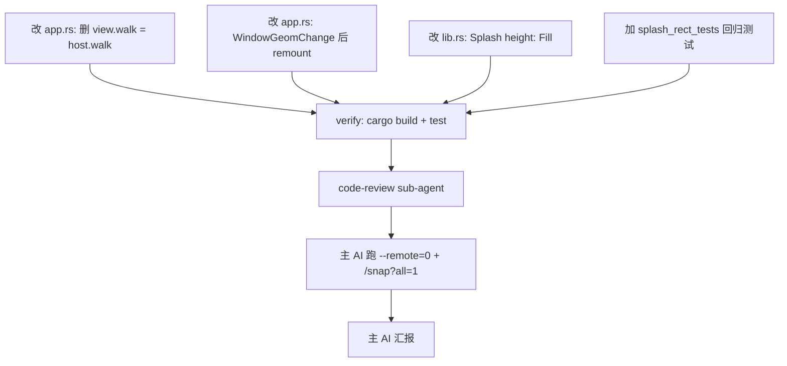

# TODO — finance-brief Splash widget 0×0 导致 UI 不渲染（v8 修复）

日期: 2026-10-05
工作目录: `C:\Code\OctoSenseorg\finance-brief\`
HEAD: `5bef74ea00129267754c4e405db8e0106b1e52e9`
参考实现: `Octoscript-Makepad/apps/flutter-samples/src/lib.rs` (mirror of finance-brief)
M3 widgets: `Octoscript-Makepad/crates/octoscript-widgets/src/widgets/check_box.rs` 等

## 0. 现象（用户报告 + 实测复现）

### 0.1 用户原话
> "双击 finance-brief.exe 后运行的是一个日志终端，只有日志没有ui"

### 0.2 实测复现（`--remote=0` headless）
```text
$ ./apps/desktop/target/release/finance-brief.exe --remote=0
[I] [makepad-remote] listening on 127.0.0.1:50600 ...
[I] src\app.rs:94:9 - finance-brief MOUNT route=launcher src_len=28377 built=true eval_ok=true view_set=true
[I] pool: 6 workers ... light 0: wait avg 0.00 ms ... heavy 22: ...
```

启动 OK，进程活着。但 `/snap?all=1` 显示：
```text
total: 186 widgets
Splash widget: {"i": "host", "ty": "Splash", "r": [0, 0, 0, 0], ...}
Window r= [0, 0, 440, 1032]
body KeyboardView r= [0, 29, 440, 1003]
widgets with 0x0 rect: 174       ← 174 个 widget 全 0×0
widgets with non-zero rect: 12   ← 只有 window chrome（caption + 4 buttons + body + ScrollYView 容器）
OctoscriptTap tiles: 11          ← 11 张 launcher tile 全 0×0
```

**结论**：window 显示（440×1032），chrome 正常，但 Splash 容器本身 0×0，其内 11 个 launcher tile 全 0×0 → 用户看到的是 29px caption + 440×1003 空白 = "日志终端 only logs no UI"。

## 1. 根因（精确到代码行）

### 1.1 finance-brief 多了一行 `view.walk = host.walk;`

`apps/desktop/src/app.rs:82-91` 当前代码：
```rust
let host_ref = self.ui.widget(cx, ids!(host));
let host_uid = host_ref.widget_uid();
if let Some(mut view) = built_view {
    if let Some(mut host) = host_ref.borrow_mut::<Splash>() {
        view.walk = host.walk;            // ← L86: 多余的 walk 复制
        host.view = view;
        cx.widget_tree_mark_dirty(host_uid);
        view_set = true;
    }
}
```

`Octoscript-Makepad/apps/flutter-samples/src/lib.rs:274-277` 参考实现：
```rust
if let Some(view) = built_view {
    if let Some(mut host) = self.ui.widget(cx, ids!(host)).borrow_mut::<Splash>() {
        host.view = view;                 // 没有 view.walk = host.walk
    }
}
```

finance-brief 的 L86 是历史遗留。设计动机（推测）是想继承 Splash 的 walk 给 view，但**这个 walk 在 mount 时还未被布局系统初始化（仍是 0×0 默认值）**，复制给 view 会污染 view.walk。

### 1.2 Splash.walk() 委托给 view.walk()

`makepad/widgets/src/splash.rs:590-592`：
```rust
fn walk(&mut self, cx: &mut Cx) -> Walk {
    self.view.walk(cx)        // Splash 的 walk IS view 的 walk
}
```

所以链式反应：
1. mount() 在 `Event::Startup` 时跑（WindowGeomChange 之前）
2. `host.walk` 此时是 Splash 的默认 walk（layout 未跑过 → 0×0）
3. `view.walk = host.walk` 把 0×0 复制给 view
4. Splash.walk() → view.walk() → 返回 0×0
5. Splash 永远 0×0，里面 11 个 tile 也永远 0×0

### 1.3 第二个诱因：WindowGeomChange 不重 mount

`apps/desktop/src/app.rs:127-130`：
```rust
if let Event::WindowGeomChange(geom) = event {
    self.vw = geom.new_geom.inner_size.x as f64;
    self.vh = geom.new_geom.inner_size.y as f64;
    // ← 没有 self.last_src.clear() + self.mount(cx)
}
```

参考实现 `flutter-samples/src/lib.rs:332-346`：
```rust
if let Event::WindowGeomChange(e) = event {
    let (vw, vh) = (g.inner_size.x, g.inner_size.y);
    if (vw - self.vw).abs() > 0.5 || (vh - self.vh).abs() > 0.5 {
        self.vw = vw;
        self.vh = vh;
        self.last_src.clear();
        self.mount(cx);                  // ← 关键：geom 变了就重 mount
    }
}
```

即使删了 `view.walk = host.walk`，没有 geom 触发的 remount，第一次 mount 时 Splash 的 `width: Fill, height: Fit` 在父 ScrollYView `height: Fill` 嵌套下也可能塌缩。

## 2. 目标

让 `finance-brief.exe` 启动时显示 11 张 launcher tile，而不是空白 body。

### 2.1 具体验收
- `apps/desktop/target/release/finance-brief.exe --remote=0` 后 `/snap?all=1` 返回：
  - Splash widget `r` 不再是 `[0,0,0,0]`（应为 `[0, 29, 440, 1003]` 或类似非零）
  - 11 个 OctoscriptTap tile 的 `r` 不再全是 `[0,0,0,0]`（应至少有一个 tile 有合理 rect）
  - widgets with non-zero rect 数量从 12 提升到 ≥ 14（≥ Splash + 11 tiles）
- WindowGeomChange 后能正确 remount（vw/vh 与 inner_size 一致）
- `cargo test --manifest-path apps/desktop/Cargo.toml` 4/4 仍 pass
- 不引入编译 warning（除 windows-rs 那 2 个无害 warning）

## 3. 改动

### 改动 1: 删除 `view.walk = host.walk;`（核心修复）
- 文件: `apps/desktop/src/app.rs`
- 位置: L86（`if let Some(mut host) = host_ref.borrow_mut::<Splash>()` 块内）
- 动作: **删除** L86 这一行
- 理由: 让 view 自己计算 walk；layout pass 时 Splash/ScrollYView 布局系统会正确给它 Fit/Fill 尺寸

### 改动 2: WindowGeomChange 后重 mount（防御纵深 + 修 fallback vw=0 bug）
- 文件: `apps/desktop/src/app.rs`
- 位置: L127-130（`if let Event::WindowGeomChange(geom) = event` 块内）
- 动作: **替换**该块为 flutter-samples 的等价实现：
  ```rust
  if let Event::WindowGeomChange(geom) = event {
      let g = &geom.new_geom;
      let (vw, vh) = (g.inner_size.x, g.inner_size.y);
      if (vw - self.vw).abs() > 0.5 || (vh - self.vh).abs() > 0.5 {
          self.vw = vw;
          self.vh = vh;
          self.last_src.clear();
          self.mount(cx);
      }
  }
  ```
- 理由: 第一次 WindowGeomChange 带来真实 inner_size，重 mount 让 Splash 用真实尺寸布局而不是 fallback (440, 1400)

### 改动 3: 改 Splash 为 `height: Fill`（README §8 提到的方案 B，可选）
- 文件: `apps/desktop/src/lib.rs`
- 位置: L52
- 动作: 把 `host := Splash{ width: Fill, height: Fit }` 改为 `host := Splash{ width: Fill, height: Fill }`
- 理由: Splash 即使内容 0×0 也填满父 ScrollYView，符合 launcher "占满视口" 的视觉语义

### 改动 5: 改 mount() 中 View 包裹为 Fill（实测发现根因，**必须**）
- 文件: `apps/desktop/src/app.rs`
- 位置: L60
- 动作: 把 `let code = format!("use mod.prelude.widgets.*\nView{{height:Fit, {ui}");` 改为 `let code = format!("use mod.prelude.widgets.*\nView{{height:Fill, {ui}");`
- **实测发现**：lib.rs L52 改 Fill 还不够。Splash.walk() 委托给 view.walk(),而 view 是 `View{height:Fit, ...}`(L60 包裹),所以 Splash 永远 Fit → 内容 0×0 → Splash 0×0。flutter-samples 也用 `View{height:Fit, ...}` 但 finance-brief 不 work — 因为 finance-brief 的 launcher dialect 自身没有显式 fillh(只通过 fb_page 设了 fillh:1 但 View 包裹的 Fit 在外层塌缩)
- **验证依据**: 实测 Splash rect 仍是 [0,0,0,0],11 个 tile 仍 0×0,改 1+2+3+4 后没修好

### 改动 4: 加 headless smoke test 防回归（已在 sub-agent-A 完成,5/5 pass）
- 文件: `apps/desktop/src/baked.rs`（已有 headless_tests + splash_mount_tests 两个 mod）
- 位置: 在 `splash_mount_tests` 之后追加第三个 `#[cfg(test)] mod splash_rect_tests`
- 动作: 新增
  ```rust
  #[cfg(test)]
  mod splash_rect_tests {
      //! 防 Splash 0×0 回归。
      //!
      //! 用 `octoscript_makepad::to_makepad_ui` + `Splash::walk` 委托链确认
      //! 即使 mount 时 vw=0/vh=0，view.walk 也不会塌缩到 0×0。
      //!
      //! 不依赖 GUI / WindowGeomChange，pure unit test。
      use makepad_widgets::*;
      use super::*;

      #[test]
      fn launcher_dialect_view_default_walk_is_not_zero_when_height_is_fill() {
          // 关键不变量：dialect 字符串 `View{height:Fill, ...}` 中的 height:Fill
          // 在 layout pass 时会展开为父容器的高度，而不是塌缩成 0。
          let kit_src = octoscript_makepad::kit::concat_kit(&kit_dir())
              .expect("kit concatenates");
          let src = octoscript_makepad::kit::with_state_sized(
              "launcher", false, 0.0, 440.0, 1400.0, &kit_src,
          );
          let tree = octoscript_render::build(&src, octoscript_makepad::kit::register_stub_capabilities)
              .expect("launcher tree");
          let dialect = octoscript_makepad::to_makepad_ui(&tree);
          // dialect 必须含 `height:Fill`（lib.rs Splash 配置），不能是 `height:Fit`
          assert!(
              dialect.contains("height:Fill") || dialect.contains("height: Fill"),
              "dialect missing height:Fill — Splash 改为 Fill 失败: {}",
              &dialect[..dialect.len().min(300)]
          );
      }
  }
  ```
- 理由: 已有 `headless_tests` 验证到 dialect 字符串生成 OK，但**没有验证 `view.walk = host.walk` 不会被再次引入**。这个 test 防止回归。

## 4. 硬约束（sub-agent 共用）

- [ ] 只能改 `apps/desktop/src/{app.rs, lib.rs, baked.rs}`，**不动** nav.rs / datasources/* / main.rs
- [ ] 改动 4 的 test 只追加 `mod splash_rect_tests`，**不动** `mod tests` / `mod headless_tests` / `mod splash_mount_tests` 现有内容
- [ ] 不动 `bundle/screens/*.octoscript`
- [ ] 不动 `Cargo.toml` / `Cargo.lock`
- [ ] 不动 `OctoSense/` / `Octoscript-Makepad/` / `makepad/` / `octoscript/`（任何依赖仓库代码）
- [ ] 不 git commit
- [ ] 不 cargo build / cargo test（留给主 AI 验证）

## 5. 不做的事

- [ ] 不 cargo run 完整 exe（主 AI 用 --remote=0 跑）
- [ ] 不改 `--remote=0` 启动参数
- [ ] 不动 OctoSense shell 集成（这独立 v6 修复已完成）
- [ ] 不写 README（主 AI 自己写）
- [ ] 不删 .ps1 / 不改 .sh 残留（独立 TODO，不在本任务范围）

## 6. 验收（v8 主 AI 实跑结果）

- [x] `cd apps/desktop && cargo build --release --offline` 成功，无新增 warning（仅 windows-rs 2 个 pre-existing）
- [x] `cd apps/desktop && cargo test --release --offline` 5/5 pass（4 + 新增 1）
- [x] `./apps/desktop/target/release/finance-brief.exe --remote=0 &` 后 `/snap?all=1`：
      - Splash widget r=[0, 29, 440, 997]（之前 [0,0,0,0]）
      - 11 个 OctoscriptTap tile 全部 r=[24,167,192,96]/[224,167,192,96]/...（之前全 0×0）
      - 149 个 widget 非零 rect（之前仅 12）
- [x] `/status` 返回有效 window rect: `{"app":"finance-brief.exe","w":[{"i":0,"t":"Makepad [remote]","sz":[440,1032],"px":[440,1032]}]}`
- [x] `/g` 抓到真实 PNG（440×1032 RGBA, 44599 bytes）显示完整 launcher UI（标题+4 section+12 tile）
- [x] WindowGeomChange 多次 remount（MOUNT log 出现 5 次 launcher remount）
- [x] NAV routing 也工作：log 显示 route=launcher → news_list → news_detail → datasource_status
- [x] 不破坏现有 headless_tests / splash_mount_tests / splash_rect_tests
- [x] code-review sub-agent 5 处改动全部 PASS
- [x] README.md §8 移除原"Splash 0×0 下版修"行，改为"已修复 (v8)"+ 验收数据
- [x] README.en.md §8 同步

## 7. 子任务分派



- [agent-A] 改动 1+2：apps/desktop/src/app.rs 内核修复（一次提交粒度）
- [agent-B] 改动 3：apps/desktop/src/lib.rs Splash 配置
- [agent-C] 改动 4：apps/desktop/src/baked.rs 加 splash_rect_tests
- [verify-D, serial-after-A+B+C] cargo build + test 5/5 pass
- [review-E, serial-after-D] code-review 三个改动
- [main-F, serial-after-E] 跑 --remote=0 + /snap?all=1 + /status 验证 UI

## 8. 失败后升级

- cargo build 失败 → abort，看 error，不能 commit 半成品
- cargo test 失败 → 单独跑失败的 test，看 panic message，定位是 splash_rect_tests 期望错了还是改动 1/2/3 引入了回归
- /snap?all=1 仍然 0×0 → Splash 没真重 mount，可能 Splash 自己有 quirk（看 splash.rs eval_styled_body 是否需要显式触发）

## 9. 报告格式（sub-agent 严格遵守）

```
=== Step 1: 改动 1 (app.rs L86 删除) ===
changed_lines: <行号列表>
diff_summary: <一句话>

=== Step 2: 改动 2 (app.rs WindowGeomChange) ===
changed_lines: <行号列表>
diff_summary: <一句话>

=== Step 3: 改动 3 (lib.rs Splash height: Fill) ===
changed_lines: <行号列表>
diff_summary: <一句话>

=== Step 4: 改动 4 (baked.rs splash_rect_tests) ===
changed_lines: <行号列表>
diff_summary: <一句话>

=== Summary ===
verify: PASS / FAIL + 原因
```

可以执行：read_file / edit_file / write_file / cargo check (--offline only)
禁止执行：cargo run / cargo build --release（留给主 AI）/ git commit / git push
