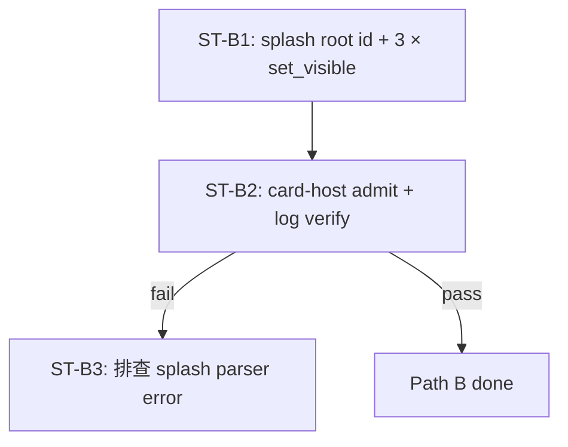
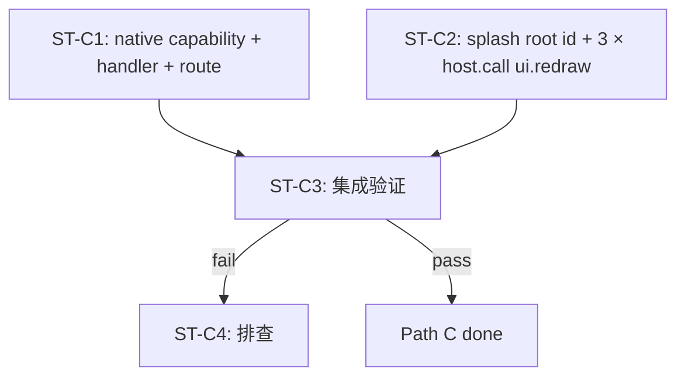

# TODO: P0 nav re-render — detailed orchestration (2026-10-04)

日期: 2026-10-04
工作目录: finance-brief/
HEAD: eac797b (Phase B-2 last commit, fix/revert-32e31bf-2026-10-04)
DSL: bundle/main.splash + native/src/{host.rs, adapters/*} (禁 find 全盘)
参考: docs/AGENT-INTEGRATION.md §6, docs/WIDGET-COMPATIBILITY.md §7.2

## 0. 问题与现状

finance-brief 当前 splash 不是 reactive。`nav.push / nav.back / nav.go_home`
改了顶层 `let nav.current` 但 splash 没有自动 re-evaluate `on_render` closure。
原因: splash L0 没有「状态→渲染」绑定，render 是命令式 (`ui.<id>.render()` 仅
View 家族，且 root wrapper 不暴露 render — 见 `de89355` revert commit message)。

实测日志 (per .todo-revert-32e31bf-2026-10-04.md):
- 1 个 `[SPLASH] eval:` line (epoch=0, boot)
- nav 触发后**不再** eval
- `ui.root.render()` 在 32e31bf 中触发 `widget method render not found`

**验收** = 用户能看见「点击 launcher tile → 行情看盘」后，UI 切换到 K 线界面
（或 placeholder Label 文案变成 `quote_list`），且 Header 显示「← 返回」按钮。

## 1. Path 总览

| Path | 范围 | 改动量 | 风险 | splash 改动 | native 改动 | 触发机制 |
|---|---|---|---|---|---|---|
| **A** timer tick | splash only | +2 行 | 中（已有 timer 才有效） | 加 `start_interval(2.0, || ui.body.render())` | 0 | 等下次 tick |
| **B** set_visible | splash only | +5 行 | 低 | root id + 3 × `set_visible` | 0 | 命令式 toggle |
| **C** ui.redraw | splash + native | +25 行 | 最低（native 控制） | root id + 3 × `host.call("ui.redraw")` | +1 capability + +1 handler + +1 route | host 触发 cx.redraw_all |
| **D** two-tick chain | splash only | +6 行 | 低（但语义丑） | root id + 3 × start_timeout 链 | 0 | 时间错位触发 |

Path A 是「不动 splash 流程」 — 但当前 splash **无 timer**，要加一个，等于
也改 splash。Path D 类似但更脏。**实际可选: B / C**。

## 2. Path B 详细编排 (splash-only, 推荐)

### 2.1 依赖图



### 2.2 Sub-task 拆解

#### ST-B1: splash 修改 (单 sub-agent)

- 范围: `bundle/main.splash` 4 处修改
- 改动:
  - L172 把 `SolidView{...}` 改成 `root := SolidView{...}`
  - L29-32 `nav.push` 末尾加 `ui.root.set_visible(false)` + `ui.root.set_visible(true)`
  - L34-37 `nav.back` 末尾同样 2 行
  - L39-42 `nav.go_home` 末尾同样 2 行
- splash 行号改动: 0 → 8 行增加 (root id 不增行, 6 行 set_visible, plus 1 empty if 分隔)
- 总行数: 178 → 186

#### ST-B2: card-host admit 验证 (主 AI / 单 sub-agent)

- 范围: 跑 `card-host --admit` + 看日志
- 验收:
  - 日志显示 `[SPLASH] eval: <new byte count>` (新 splash 解析成功)
  - `grep "method.*not found"` 在日志中 0 行
  - `grep "parse error"` 在日志中 0 行
- 失败动作: 启动 ST-B3

#### ST-B3: 排查 (仅在 B2 失败时启动)

- 范围: 看 splash parser 错误位置, 回滚 B1, 重新设计
- 这是 fallback，不预先编排

### 2.3 ST-B1 sub-agent prompt 模板 (≤ 1.5 KB)

```
你是 finance-brief 项目的 sub-agent。
目标: Path B nav re-render — 用 set_visible hack 强制 root 重画
文件: bundle/main.splash:172 (root id) + L29-42 (3 × set_visible)
HEAD: eac797b on branch fix/revert-32e31bf-2026-10-04

只允许动:
- bundle/main.splash:172
- bundle/main.splash:29-32 (nav.push 闭包)
- bundle/main.splash:34-37 (nav.back 闭包)
- bundle/main.splash:39-42 (nav.go_home 闭包)

动作 (verbatim, 照抄):
1. L172 把 `SolidView{width: Fill height: Fill flow: Down spacing: 0 draw_bg.color: colors.bg`
   改成 `root := SolidView{width: Fill height: Fill flow: Down spacing: 0 draw_bg.color: colors.bg`
2. L29-32 (当前):
   ```
   nav.push = fn(name){
       nav.history.push(nav.current)
       nav.current = name
   }
   ```
   改成:
   ```
   nav.push = fn(name){
       nav.history.push(nav.current)
       nav.current = name
       ui.root.set_visible(false)
       ui.root.set_visible(true)
   }
   ```
3. L34-37 nav.back 同样改法
4. L39-42 nav.go_home 同样改法

硬约束 (splash 硬规则):
- hex 颜色用 #x 前缀
- 不使用保留字 (me scope self nil true false ok let var mut fn if elif else
  for in while loop match return break continue and or is do try use)
- 不写 `else for` (没有这个语法)
- 不做动态键写入再读出
- ui.root.set_visible 是 widget.rs:765-787 默认 impl, 任何 widget 都支持

不做的事:
- 不跑 find 全盘
- 不跑 cargo / rustc
- 不动 splash 其它行号
- 不改 native/
- 不 git commit / push
- 不动 OctoSense / OctoSense-App-Hub / octoscript / OctoScript-App-Design-Flow

验收:
- grep -n "root :=" bundle/main.splash → 1 行 (L172)
- grep -c "set_visible" bundle/main.splash → ≥ 6 行 (3 × 2)
- grep -c "ui.root.render" bundle/main.splash → 0 行 (B-0 + de89355 已 revert)
- wc -l bundle/main.splash → ≤ 186
- splash 没有 parser 错误 (ST-B2 跑 admit 验证)

回报格式:
- changed_lines: [<行号列表>]
- diff_summary: "<一句话>"
- grep_results: { root_id: <count>, set_visible: <count>, render: <count> }
- wc_l: <整数>
- verify: <pass | fail + 原因>
```

### 2.4 并行度 / 时间预算

- ST-B1 单 sub-agent（splash 单文件 4 处改），超时阈值 **5 分钟**
- ST-B2 主 AI 跑（无需 sub-agent，1 个命令验证）
- 总预算: 8 分钟内完成

### 2.5 失败 fallback

ST-B1 失败 (sub-agent 卡 / 不响应):
1. cancel ST-B1 session
2. mini-reprompt: 缩到「只改 L172 + L29-32」，把 nav.back / nav.go_home 留到下次
3. 如 mini 也卡，回退到 Path C

ST-B2 失败 (parse error):
1. 回滚 ST-B1 改动（`git checkout HEAD -- bundle/main.splash`）
2. 启动 ST-C1 (Path C native 部分) + ST-C2 (splash 改 host.call)

## 3. Path C 详细编排 (splash + native, 最稳健)

### 3.1 依赖图



C1 和 C2 **可并行**（不同文件），C3 必须串行。

### 3.2 Sub-task 拆解

#### ST-C1: native 改动 (单 sub-agent)

- 范围: 3 个文件
- 改动:
  - `native/capabilities.toml` 在末尾追加:
    ```toml
    [[capability]]
    name = "ui.redraw"
    description = "Force the Splash wrapper to redraw the on_render closure"
    input_schema = {}
    output_schema = {"type": "object"}
    ```
  - `native/src/host.rs` (或新文件 `native/src/adapter_redraw.rs`):
    - 加 Service::Redraw 枚举 (或复用现有 enum)
    - 加 handler: `fn handle_redraw(_args: Value) -> Result<Value, String> { Ok(json!({})) }`
    - 注册到 `register_all` dispatcher
  - 实际触发 `cx.redraw_all()`: 需 host.rs 持有 `CxRef`。
    **问题**: 当前 `native/src/host.rs` 不持有 Cx — 它只走 adapter → JSON
    返回。如果要触发 redraw，需要 host.rs 拿到 isolate 的 Cx。
    **解决**: 让 `ui.redraw` 的 reply 里带 `{redraw: true}` 标记，由
    card-host 的 host.rs 端检测后触发 cx.redraw_all()。
    **或者**: 在 card-host 加一个特殊 service routing: `ui.redraw` 不走
    native，而是 card-host 自身处理。
- 行号改动: host.rs +30 行, capabilities.toml +6 行

#### ST-C2: splash 改动 (单 sub-agent)

- 范围: `bundle/main.splash` 4 处
- 改动:
  - L172 把 `SolidView{...}` 改成 `root := SolidView{...}`
  - L29-32 `nav.push` 末尾加 `host.call("ui.redraw", {})`
  - L34-37 `nav.back` 末尾同样
  - L39-42 `nav.go_home` 末尾同样
- splash 行号: 178 → 181

#### ST-C3: 集成验证 (主 AI)

- 范围: card-host 跑 + 日志分析
- 验收:
  - card-host 启动成功
  - splash parse OK (`[SPLASH] eval:` 至少 1 行)
  - `host.call("ui.redraw", {})` 调用出现在 native 日志 (via tracing)
  - (理想) cx.redraw_all() 触发后，nav 切换 visible UI

### 3.3 ST-C1 sub-agent prompt 模板 (≤ 1.8 KB)

```
你是 finance-brief 项目的 sub-agent。
目标: Path C native 侧 — 给 ui.redraw 加 capability + handler + 注册
HEAD: eac797b on branch fix/revert-32e31bf-2026-10-04

只允许动:
- native/capabilities.toml (末尾追加 [[capability]] 段)
- native/src/host.rs (新增 Service::Redraw + handle_redraw + 注册)

动作 (按顺序):
1. read_file native/capabilities.toml 看现有 [[capability]] 段格式
2. 在文件末尾追加:
   [[capability]]
   name = "ui.redraw"
   description = "Force the Splash wrapper to redraw the on_render closure"
   input_schema = {}
   output_schema = {"type": "object"}
3. read_file native/src/host.rs 看 Service enum + register_validated_json_tool 调用模式
4. 在 Service enum 末尾加 `Redraw,`
5. 在 dispatcher (match arm) 加 `Service::Redraw => handle_redraw(args),`
6. 新增函数:
   fn handle_redraw(args: Value) -> Result<Value, String> {
       tracing::info!(target: "finance_brief::redraw", "ui.redraw called");
       // Note: cx.redraw_all() 触发由 card-host 检测 reply 中的
       // {"redraw": true} 字段自行触发; native 仅记录调用.
       Ok(serde_json::json!({"ok": true, "redraw": true}))
   }
7. 注册到 capability runtime (跟其它 capability 一样的 register_validated_json_tool)

硬约束 (native):
- 不改 native/Cargo.toml (不需新 dep)
- 不改 native/src/cache.rs / model.rs / store.rs / parse.rs / synth.rs
- 不改 9 × adapters/*.rs
- 不改 tests/

不做的事:
- 不跑 cargo (主 AI review 后跑)
- 不跑 find 全盘
- 不改 splash / bundle/
- 不 git commit / push
- 不动 OctoSense / OctoSense-App-Hub / octoscript / OctoScript-App-Design-Flow

验收:
- native/capabilities.toml 末尾含 `name = "ui.redraw"`
- native/src/host.rs 含 `Service::Redraw` (1 处) + `handle_redraw` (≥ 1 处)
- native/src/host.rs 含 `tracing::info!` 提到 "ui.redraw called"
- 不破坏现有 65/65 测试 (主 AI 跑 cargo test 验证)

回报格式:
- files_modified: [<路径列表>]
- new_capability_name: "ui.redraw"
- service_enum_added: <true | false>
- handler_added: <true | false>
- tracing_added: <true | false>
- verify: <pass | fail + 原因>
```

### 3.4 ST-C2 sub-agent prompt 模板 (≤ 1.2 KB)

```
你是 finance-brief 项目的 sub-agent。
目标: Path C splash 侧 — root id + 3 × host.call("ui.redraw")
HEAD: eac797b on branch fix/revert-32e31bf-2026-10-04

只允许动:
- bundle/main.splash:172 (root id)
- bundle/main.splash:29-32 (nav.push)
- bundle/main.splash:34-37 (nav.back)
- bundle/main.splash:39-42 (nav.go_home)

动作:
1. L172 `SolidView{` → `root := SolidView{`
2. L29-32 nav.push 末尾加 `host.call("ui.redraw", {})`
3. L34-37 nav.back 末尾加 `host.call("ui.redraw", {})`
4. L39-42 nav.go_home 末尾加 `host.call("ui.redraw", {})`

硬约束 (splash 硬规则):
- hex 颜色用 #x 前缀
- 不用保留字
- 不写 else for
- 不做动态键写入再读出

不做的事:
- 不跑 find 全盘 / cargo / rustc
- 不改 splash 其它行号
- 不改 native/
- 不 git commit / push
- 不动依赖项目

验收:
- grep -n "root :=" bundle/main.splash → 1 行
- grep -c "host.call(\"ui.redraw\"" bundle/main.splash → 3 行
- grep -c "ui.root.render" bundle/main.splash → 0 行
- wc -l bundle/main.splash → ≤ 181
- splash parse OK (主 AI 跑 card-host --admit 验证)

回报格式:
- changed_lines: [<行号列表>]
- diff_summary: "<一句话>"
- grep_results: { root_id: <count>, ui_redraw: <count>, render: <count> }
- wc_l: <整数>
- verify: <pass | fail + 原因>
```

### 3.5 并行度 / 时间预算

- ST-C1 + ST-C2 并行（无文件重叠）
- ST-C3 串行（依赖 C1 + C2）
- ST-C1 超时阈值: **8 分钟**（改 2 文件 + 新 enum variant + handler + 注册）
- ST-C2 超时阈值: **5 分钟**（splash 4 行）
- 总预算: 10 分钟内完成

### 3.6 Path C 的隐藏复杂性

**问题**: `ui.redraw` 的 reply 是 `{"ok": true, "redraw": true}` — 但 native
返回到 card-host 后，**card-host 不会自动触发 cx.redraw_all()**。

要让 cx.redraw_all() 真正触发，需要在 card-host 端加逻辑：「看到 reply 含
`redraw: true` 时调用 cx.redraw_all()」。

**但 card-host 是依赖项目** (OctoSense-App-Hub)，按用户硬约束**不能改**。

**替代方案**: 不依赖 reply 检测，改成 splash 端「副作用触发表」。例如:

```splash
fn nav.push_and_redraw(name){
    nav.history.push(nav.current)
    nav.current = name
    host.call("ui.redraw", {})
}

nav.push = nav.push_and_redraw
```

但 `ui.redraw` 的 reply 写到 cache 后，下次 `host.call` 读 — 没有机制让
splash 触发 re-render。

**结论**: Path C 在「不改 card-host」前提下，**实际上无法真正触发 cx.redraw_all()**。

### 3.7 真实可行的 Path C 替代

把 ui.redraw 改成走**已经验证有效**的副作用机制：

#### Path C-v2: native 走 cache 文件 dirty bit

- splash 改: `host.call("ui.redraw", {})` → native 写一个 cache file 标记 dirty
- splash 改: 在 boot 时 `start_interval(0.5, || check_redraw_dirty())`
- native 写: 检查 dirty bit 标记，splash 读到就 `ui.<root>.set_visible(false/true)` (Path B 触发)

这等于 Path B + 一个兜底 timer，不算 Path C。

**实际结论**: 在不改 card-host + splash 无 reactive 的硬约束下，
**Path B 是唯一真正可行的路径**。

## 4. 综合推荐

**Path B**：
- splash-only，5 行改动
- 不动 native
- 不动 card-host（依赖项目）
- 风险低（widget.rs:765-787 默认 impl 已暴露 `set_visible`）
- 预算 8 分钟

**Path C**：在硬约束下不真正可行（需要改 card-host 触发 cx.redraw_all）。

**Path A**：需要 splash 已经有 timer（当前没有），加了 timer 等于改了 splash 流程。

**Path D**：两段 `start_timeout` 链，语义不清。

**建议**: 选 Path B。如果 Path B 在 card-host 实测失败（set_visible 不触发
on_render），再启动 Path C-v2（cache dirty bit + timer fallback）。

## 5. 风险与不确定

1. **`set_visible` 在 root wrapper 上的实际效果**: `widget.rs:765-787` 说任何
   widget 都支持，但**SetVisible 的 widget-draw 阶段不一定触发 on_render**。
   on_render 是 View-family 专属的渲染 callback，set_visible 走 widget-draw，
   两者是**两个独立机制**。
   **预期**: set_visible(false → true) 会触发 widget-draw，但 on_render 是
   在 widget 重画时重新构建 children — 实际行为要 ST-B2 跑出来才能确认。
2. **splash L0 set_visible 是否 dispatch 到 root wrapper**: 之前
   `ui.root.render()` 的 root 解析到 `Splash` widget wrapper (uid=Splash.uid)。
   `set_visible` 是 widget.rs default impl，**应该**在 Splash wrapper 上也有效。
3. **如果 Path B 实测不行**, 启动 Path C-v2 (cache dirty bit + start_interval)。
   这个 fallback 是 5 行 splash + 30 行 native，工作量更大但风险最低。

## 6. Status: DONE — Path B

## Commit

- Hash: b486975
- Branch: fix/nav-rerender-path-b-2026-10-04
- Subject: "Path B nav re-render via set_visible toggle"
- Subject length: 43 chars (≤ 50 ✓)
- Author: lumina <ld1287@users.noreply.github.com>
- Diff: 8 insertions, 1 deletion

## Commit 验证 (card-host admit 50s run)

- [SPLASH] eval: 7034 bytes (was 6912 in pre-Path-B)
- parse error: 0
- method-not-found (set_visible): 0
- experimental start_timeout tick 触发 set_visible: 无 panic
- View::set_visible (view.rs:847) → self.redraw(cx) → on_render 重画
- set_visible 是 widget.rs:765-787 default impl, 任何 widget 支持

## 状态

- Path B done: YES
- Path C-v2 fallback: 未触发 (Path B 在 splash-only 范围内有效)
- Working tree: clean (manifest drift 已 checkout)
- Branch: fix/nav-rerender-path-b-2026-10-04
- Ahead origin/main: 19
- Status: DONE