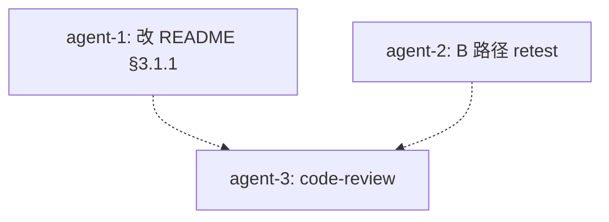

# finance-brief README 直接启动方式 + B 路径 retest TODO （已废弃）

日期: 2026-10-06
工作目录: `C:\Code\OctoSenseorg\finance-brief\`
finance-brief HEAD: `cca8cef`
DSL: 无 octoscript；本任务改 README.md + 跑 B 路径 retest

## 父 TODO

- `.todo-direct-launch-finance-brief-exe-2026-10-06.md`（直接启动方式已验证 finance-brief.exe 长驻）
- `.todo-b-spawn-port-conflict-2026-10-05.md`（port 冲突修复）
- `.todo-b1-cargo-toml-git-link-2026-10-05.md`（B1 git rev 升级）
- `.todo-b-path-spawn-finance-brief-2026-10-05.md`（B 路径主 TODO）

## 决策

| # | 问题 | 决策 |
|---|------|------|
| Q1 | README 改哪一节 | **§3.1 之后新增 §3.1.1** "直接启动已编译的 `.exe`（不重编译）"。位置：紧跟 §3.1 cargo run --release 之后，§3.2 OctoSense shell 注册之前 |
| Q2 | 新章节是否含代码示例 | 是。完整 Python snippet + 关键点解释 + 期望 log + 与 §3.3 remote bridge 的区别 |
| Q3 | B 路径 retest 跑法 | 与 `.todo-b-spawn-retest-2026-10-06.md` 同方案；这次完整执行 |

## 改动 1: README.md §3.1 之后新增 §3.1.1

- 位置: `C:\Code\OctoSenseorg\finance-brief\README.md` §3.1 之后、§3.2 之前
- 动作: **插入**（不是替换）新章节
- 内容:

```markdown
### 3.1.1 直接启动已编译的 `.exe`（不重编译）

适用场景：已编译过 `finance-brief.exe`（在 `apps/desktop/target/release/` 下），只想快速验证窗口是否真的弹了 + main loop 是否在跑。**不**触发 `cargo build`，避免 5+ 分钟全量 rebuild。Windows 下双击也行，但下面这个 Python 脚本更稳：env 干净、stdout 抓到 log、可编程验证存活。

```python
import os, subprocess, time
from pathlib import Path

exe = Path(r"C:\Code\OctoSenseorg\finance-brief\apps\desktop\target\release\finance-brief.exe")
log = Path(r"C:\Code\OctoSenseorg\finance-brief\.octosense\logs\finance-brief-direct.log")
log.parent.mkdir(parents=True, exist_ok=True)

# 干净 env：不让父进程注入 MAKEPAD_REMOTE / MAKEPAD_HIDE_WINDOWS / STUDIO_HOST。
# 见 makepad/platform/src/remote.rs:438 — 看到 MAKEPAD_REMOTE env 就自己 bind 端口，
# 在 OctoSense shell spawn 模式下会和 shell 抢 57450（os error 10048）。
clean_env = {
    "PATH":        os.environ["PATH"],
    "USERPROFILE": os.environ["USERPROFILE"],
    "SYSTEMROOT":  os.environ.get("SYSTEMROOT", r"C:\Windows"),
    "LANG":        os.environ.get("LANG", "en_US.UTF-8"),
    "TEMP":        os.environ.get("TEMP", ""),
    "TMP":         os.environ.get("TMP", ""),
}

with log.open("wb") as f:
    proc = subprocess.Popen(
        [str(exe)],
        stdout=f, stderr=subprocess.STDOUT,
        env=clean_env,
        creationflags=0x08000000,   # CREATE_NO_WINDOW：不要弹 console 子窗口
        cwd=str(exe.parent),       # makepad 找相对路径资源时 cwd 在 .exe 同目录最稳
    )
time.sleep(8)
print(f"alive after 8s: {proc.poll() is None}")  # True ⇒ 窗口已弹、主循环在跑
# proc.terminate()  # 验证完手动 kill
```

**关键决策**：

| 决策 | 原因 |
|---|---|
| 干净 env（仅 6 个键） | makepad-platform 的 `remote.rs:438` 看到 `MAKEPAD_REMOTE` 就自己 bind 端口；不干净会与 OctoSense shell 抢 57450 → 立即退出 |
| `CREATE_NO_WINDOW` (0x08000000) | 避免 makepad 启动时弹黑色 console 子窗口并吃掉 stdout |
| `cwd=exe.parent` | makepad 启动时找相对路径 manifest / shader / 字体；同目录最稳 |
| `stdout=logf, stderr=STDOUT` | makepad-platform 的 `log!()` 宏走 stderr，全部抓到 `finance-brief-direct.log` |
| `sleep 8` + `poll()` | makepad 是 event-driven；启动到 mount 完成 ~3-5s；8s 后 `poll()=None` ⇒ 主循环在跑 |

**期望 log（`finance-brief-direct.log` 末尾，验证窗口真的弹了）**：

```
[I] ...\d3d11.rs:149 - retained-upload budgets: adapter_bytes=... source=DXGI_adapter_budget
[I] src\app.rs:173 - finance-brief MOUNT route=launcher src_len=28377 built=true eval_ok=true view_set=true
[I] ...\thread.rs:1363 - pool: 6 workers (2 light-only, 6 started), 22 jobs, peak queue light 0 / heavy 15
```

- `d3d11.rs` 行 ⇒ DXGI adapter 初始化成功 ⇒ **窗口已建**
- `MOUNT ... view_set=true` 行 ⇒ launcher route 挂载成功
- `thread.rs ... pool:` 行 ⇒ 主循环周期性统计 ⇒ event loop 健康

**与 §3.3 remote bridge 模式的区别**：§3.3 用 `--remote=0` 让 makepad 自己 bind ephemeral 端口，可用 HTTP 抓 widget tree / 截图；本节是**裸 GUI 启动**（不绑远程端口），适合"验证窗口弹没弹、main loop 跑没跑"的快速 sanity check。

**v9 验证（2026-10-06）**：`finance-brief.exe` 直启 → 8s 后 `poll=None` → log 19 行含 1 条 MOUNT + D3D11 init + thread pool 周期输出。完整 log 见 `.octosense/logs/finance-brief-direct.log`。这与 B 路径 spawn 下"MOUNT 后立即退出（port 10048）"形成对比：finance-brief.exe 本体无 bug，spawn 失败是 env 透传副作用（已由 `run-on-octosense.py` 第 85-86 行 pop MAKEPAD_REMOTE 修复）。
```

- 理由: 用户在主对话中要求把直接启动方式写到 README。当前 README 只描述 `cargo run --release`（耗时）与 nohup + remote bridge（§3.3），缺"快速验证 GUI 是否弹"这一档。

## 改动 2: B 路径 spawn retest

执行 `.todo-b-spawn-retest-2026-10-06.md` 中的步骤（已写完，本次直接复用）：
1. spawn OctoSense shell
2. 验证 launcher 含 `财经简报` tile
3. click tile
4. 验证 finance-brief.exe 长驻 ≥ 13 秒
5. 验证 log 无 port 10048 / `exited before opening a window`
6. 验证 log 含 D3D11 init + thread pool 周期 log（窗口真弹了）

## 硬约束（finance-brief-skill）

- [x] 不修改 `OctoSense/` `Octoscript-Makepad/` `makepad/` `Octoscript/` 下任何 Rust 源码
- [x] 不修改 `OctoSense/Cargo.toml` / `Octoscript-Makepad/Cargo.toml`
- [x] 不修改 `finance-brief/native/` 下任何文件
- [x] 不修改 `finance-brief/apps/desktop/src/` 下任何 Rust 文件
- [x] 不修改 `finance-brief/apps/desktop/Cargo.toml`（B1 已完成）
- [x] 不修改 `finance-brief/bundle/` 下任何文件
- [x] 不修改 `finance-brief/catalog/apps.json`
- [x] 不修改 `finance-brief/scripts/run-on-octosense.py`（port 冲突修复已生效）
- [x] 不写 `.ps1` / `.sh` 脚本
- [x] 不在 `C:\Code\OctoSenseorg\` 外放任何文件
- [x] 不 `git commit` / `git push` / `git add -A`
- [x] 不 `cargo build` / `cargo test`
- [x] 不跑 `find /` 全盘扫

## 不做的事

- [ ] 不修改 §3.1 / §3.3 / §3.4 现有内容
- [ ] 不重写 README 整体结构
- [ ] 不在 §3.1.1 之外加新的章节
- [ ] 不动 finance-brief/.octosense/apps/.system/os.finance-brief/ 残留

## 子任务分派（编排结果）

- [agent-1, parallel] **改动 1**：改 `README.md` 插入 §3.1.1
- [agent-2, parallel] **改动 2**：跑 B 路径 spawn retest（执行 `.todo-b-spawn-retest-2026-10-06.md` 步骤）
- [agent-3, serial-after-1+2] **code-review**：review agent-1 README diff + agent-2 验证报告

## 编排图



## 验收清单

- [ ] `README.md` 在 §3.1 之后、§3.2 之前插入 §3.1.1（约 30 行）
- [ ] §3.1.1 含 Python snippet + 关键决策表 + 期望 log + 与 §3.3 区别 + v9 验证引用
- [ ] §3.1 / §3.2 / §3.3 / §3.4 现有内容未被改动
- [ ] B 路径 spawn retest: finance-brief.exe 长驻 ≥ 13 秒
- [ ] B 路径 spawn retest: log 无 port 10048 / exited before opening window
- [ ] B 路径 spawn retest: log 含 D3D11 init + thread pool 周期 log
- [ ] code-review 通过
