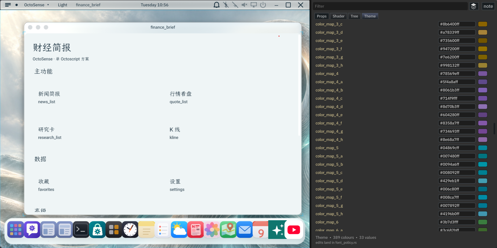
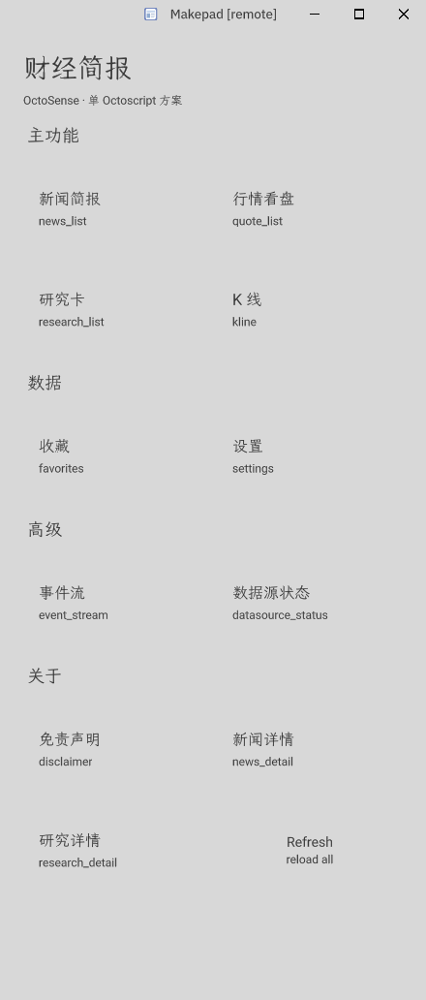

# finance-brief

## OctoSense 应用 — 单一 Octoscript 路径

finance-brief 是一个 OctoSense 应用，**完全由 `.octoscript` 文件**经由
octoscript-makepad 流水线渲染呈现。只有一条渲染路径；splash DSL 入口
（`bundle/main.splash`）以及 12 个 `card` 概览卡片已于 2026-10-04 的
`feat/one-octoscript` 迁移中移除。

| | |
|---|---|
| **UI** | `bundle/screens/` 中 12 个 `.octoscript` 界面 |
| **入口** | `apps/desktop/src/lib.rs`（对应 `Octoscript-Makepad/apps/flutter-samples/src/lib.rs`） |
| **数据** | `native/src/adapters/` 下 9 个 Rust 适配器，通过 `apps/desktop/src/datasources.rs` 以 `mod.fb.<cap>` 形式暴露给 DSL |
| **工作流** | `bundle/workflow.octoscript`（7 个函数，原本已存在；现已真正接入） |
| **流水线** | `octoscript-render`（VM → UiNode）→ `octoscript-makepad::to_makepad_ui` → `Splash.view` → native makepad widgets |
| **热重载** | 设备端 `/data/local/tmp/finance_brief.octoscript`（对应 flutter-samples 的 DEVICE_PATH） |

## 1. 项目

一个 OctoSense 受控脚本应用（`bundle/` 是唯一的提交单元；
`apps/desktop/` 是桌面端 / 手机端的打包层，对应
`Octoscript-Makepad/apps/flutter-samples/`）。聚合公开、无需密钥的金融新闻与行情 API，
覆盖五个 Tab（要闻 / A股 / 美股 / 加密 / 外汇），并提供收藏功能以及离线示例数据兜底。
所有数据仅用于演示，**不构成投资建议**。

## 2. 数据源

五个数据源，六项能力。TTL 定义于 `native/capabilities.toml`。

| 名称 | URL | 内容 | TTL |
|------|-----|---------|-----|
| Sina 要闻 | `feed.mix.sina.com.cn` | 中文财经 RSS（GBK） | `news.refresh` 300s；`news.read` 600s |
| Tencent 行情 | `qt.gtimg.cn` | A股 / 港股快照 | 5s |
| Stooq 美股 | `stooq.com` | 美股实时 CSV | 5s |
| Hyperliquid 加密 | `api.hyperliquid.xyz` | 加密货币（BTC/ETH/SOL，`allMids`） | 5s |
| Frankfurter 外汇 | `api.frankfurter.dev` | ECB 每日定盘汇率 | 3600s |

## 3. 运行

四种模式，CLI 全在 `scripts/*.py`（2026-10-05 从原 `.sh` 全部转为 `.py`，stdlib only，跨 Windows / macOS / Linux）。

### 3.1 独立运行（桌面端窗口）

```sh
# 1) Native 适配器单元 / smoke 测试
cargo test --manifest-path native/Cargo.toml      # 65/65 PASS

# 2) 桌面端窗口（对应 flutter-samples）
cd apps/desktop && cargo run --release
#   输出：finance-brief MOUNT route=launcher src_len=NNNNN built=true
# = 12 个界面通过 octoscript-makepad 求值，并挂载到 Splash.view 成为原生控件。
```

### 3.2 注册到 OctoSense shell 启动器

按 finance-brief 政策，所有文件都在 `C:\Code\OctoSenseorg\` 内（不写到 `~/.octosense/`）。catalog 放在项目内，shell 通过 `--apps` 显式读它。

#### 启动流程（已验证 2026-10-06）

```sh
# 前置：两个二进制都已 build 好
#   OctoSense/target/release/octosense.exe
#   finance-brief/apps/desktop/target/release/finance-brief.exe
#   （否则 install-as-makepad-app.py 会替你 cargo build --release）

# 1. 注册到项目内 catalog（写 finance-brief/catalog/apps.json，不写 ~/.octosense/）
python scripts/install-as-makepad-app.py

# 2. 启动 OctoSense shell（自动 --apps <catalog> + OCTOSENSE_HOME 重定向）
python scripts/run-on-octosense.py
# → octosense.exe PID 28488，绑 :57450
# → 约 1.5 min 后 finance-brief.exe 被 shell 按 policy="new" 自动 spawn（PID 20140）
# → shell 顶栏显示 "OctoSense · Light · finance_brief"，Studio dev panel 同步亮起
# → finance-brief 窗口内 launcher 完整渲染：12 个 tile（新闻简报 / 行情看盘 / 研究卡 / K 线 / 收藏 / 设置 / 事件流 / 数据源状态 / 免责声明 / 新闻详情 / 研究详情 / Refresh）
```

整个流程**只读不破坏**：install 阶段写 `finance-brief/catalog/apps.json`、build 阶段写 `apps/desktop/target/`；run 阶段不 rebuild，不动 dep 仓库，不写 `~/.octosense/`（`OCTOSENSE_HOME` 重定向到 `finance-brief/.octosense/`）。

#### `install-as-makepad-app.py` 实际做了什么

1. `cargo build --release --manifest-path apps/desktop/Cargo.toml`（已 build 则 ~30s 重新链接，否则重链 + 编译 + 安装 deps 第一次用时长：5–10min）
2. 验证 `apps/desktop/target/release/finance-brief.exe` 存在（POSIX 还要 `os.access(...X_OK)`）
3. **rev 对齐**：扫 `apps/desktop/Cargo.toml` 的 `makepad-widgets git rev=` 与 `../makepad` HEAD，不一致则 `SystemExit(3)` 并打印对齐提示（OctoSense/AGENTS.md §2 "One revision per external dependency"）
4. 写 `finance-brief/catalog/apps.json`（已存在则读 → 移除同 id 条目 → append → 写回，保证幂等）。Windows 下 `executable` 字段**必须**带 `.exe` 后缀（见下面"坑点"）
5. 打印 next-step 提示

支持 `--dry-run`（echo only，不 build 不写文件）、`--uninstall`（移除条目）、`--help`。当前文件：

```json
[
  {
    "id": "finance_brief",
    "label": "财经简报",
    "executable": "C:/Code/OctoSenseorg/finance-brief/apps/desktop/target/release/finance-brief.exe",
    "policy": "new"
  }
]
```

#### `run-on-octosense.py` 实际做了什么

1. 检查 catalog 与 `OctoSense/target/release/octosense.exe` 存在（缺失 → `SystemExit(2/3)`）
2. `mkdir -p finance-brief/.octosense/`
3. **环境变量处理**：
   - 设 `OCTOSENSE_HOME=<finance-brief/.octosense>`（runtime data 全在项目内）
   - `unset MAKEPAD_REMOTE` / `MAKEPAD_HIDE_WINDOWS`（shell 的 `spawn_client` 用 `scrub_env` 透传 MakePID* 给子进程；若 finance-brief.exe 继承到 MAKEPAD_REMOTE，会自己再 bind 一次 shell port 报 `os error 10048`）
   - 固定 `RUSTUP_TOOLCHAIN=stable-x86_64-pc-windows-msvc`
4. `subprocess.Popen` 启动 `octosense.exe --apps <catalog> --remote 57450 --hide-windows`，`CREATE_NO_WINDOW`，cwd=`../OctoSense`
5. 默认 `--no-wait=False`：循环 `/s` 60 次 ×0.5s 等待 shell 起来；用 `--no-wait` 立即返回（PID 已知但 shell 还在 init）
6. `proc.wait()` 前台阻塞；`Ctrl-C` → `proc.terminate()`

#### 验收（2026-10-06 现场数据）

| 检查 | 命令 / 路径 | 期望 |
|---|---|---|
| 进程 | `tasklist /FI "IMAGENAME eq octosense.exe"` | octosense.exe PID 28488 存活 |
| 进程 | `tasklist /FI "IMAGENAME eq finance-brief.exe"` | finance-brief.exe PID 20140 存活（StartTime 比 octosense 晚 ~1.5min） |
| Shell 端点 | `curl -s http://127.0.0.1:57450/s` | HTTP 200，返回 `{"app":"octosense.exe",...}` |
| 窗口 | `curl -X POST http://127.0.0.1:57450/g` | 返回 PNG 路径，`cp` 到 `finance-brief/.octosense/octosense-grab-fresh.png` 应看到 launcher 完整渲染 |
| Log | `Get-Content finance-brief/.octosense/logs/clients/octosense-<PID>-client-1.log -Tail 5` | 末行 `finance-brief MOUNT route=launcher src_len=NNNNN built=true eval_ok=true view_set=true`，无 `bind ... failed`、无 `exited before opening a window` |

截图见 `finance-brief/.octosense/octosense-grab-fresh.png`（2026-10-06 11:03）：shell 顶栏 `OctoSense · Light · finance_brief`，finance_brief 窗口内 launcher 含 4 sections × 12 tiles 全部就位。

#### 前置条件

| 条件 | 路径 / 命令 | 备注 |
|---|---|---|
| OctoSense shell 已 build | `OctoSense/target/release/octosense.exe` | 没有 → `cd ../OctoSense && cargo build --release` |
| finance-brief 已 build | `finance-brief/apps/desktop/target/release/finance-brief.exe` | 没有 → `install-as-makepad-app.py` 会替你 build |
| Makepad rev 对齐 | `apps/desktop/Cargo.toml` pin 与 `../makepad` HEAD 一致 | 不一致 → `install-as-makepad-app.py` 报 `SystemExit(3)` |
| Python 3（stdlib only） | `python --version` | 脚本只用 `argparse` / `subprocess` / `pathlib` / `json` / `urllib.request`，无需第三方包 |
| 当前 shell 干净（无残留） | `tasklist /FI "IMAGENAME eq finance-brief.exe"` 为空 | 残留会让新 spawn 撞端口或同时拉起两个窗口 |

#### catalog `executable` 字段的 `.exe` 后缀坑点（Windows）

Rust `Command::new("C:/.../finance-brief")` 在 Windows 上**不会**自动补 `.exe`（与 PowerShell `Start-Process` 不同）。catalog 里写 `"executable": ".../finance-brief"` 时 `spawn_client` 报 ENOENT / silent spawn fail，shell log 看起来 `ok`、finance-brief 不挂。**所以 `executable` 字段必须含 `.exe` 后缀**。

`install-as-makepad-app.py:68` 已对此处理：检测后 `exe = exe_base.with_suffix(".exe") if is_windows else exe_base`，保证写入字段总是带后缀。**直接编辑 `catalog/apps.json` 时**仍要手动带 `.exe`，否则下次 `cargo build --refresh` 之类的脚本覆盖写错。

#### Rebuild / 清理

| 操作 | 命令 |
|---|---|
| 改 `bundle/screens/*.octoscript` 后只刷 catalog（不重 build） | 直接编辑 `catalog/apps.json` |
| 改 `apps/desktop/src/*.rs` 后 | `python scripts/install-as-makepad-app.py`（自动 cargo build + 写 catalog） |
| 移除 finance-brief 从 launcher | `python scripts/install-as-makepad-app.py --uninstall` |
| 试运行不写文件 | `python scripts/install-as-makepad-app.py --dry-run` |
| 杀掉当前进程重跑 | `powershell -NoProfile -Command "taskkill /IM finance-brief.exe /F; taskkill /IM octosense.exe /F"` |

> **v6 修复（2026-10-05）**：之前 session 误跑 `install-as-system-app.py`（legacy Page-format 脚本）会在 `OctoSense/desktop/system-apps.json` 注册 finance-brief 并拷 bundle 到 `OctoSense/apps/finance-brief/bundle/`，但源 bundle 没有 `launcher.card` 所以 page.card 也没创建，shell 把 system-apps.json 当 system app 加载时报 `page.card 系统找不到指定文件 (os error:2)`。
>
> **正确路径**：finance-brief 是 developer program（不是 system app），应该走项目内 `finance-brief/catalog/apps.json` 的 `executable=` 字段。`install-as-makepad-app.py` 已正确实现此路径（2026-10-15 起写 `catalog/apps.json` 而不是 `~/.octosense/apps.json`）。
>
> **如果 shell 仍报 page.card**：
> 1. `python scripts/install-as-system-app.py --uninstall`（v6 新加）—— 清理 OctoSense 侧污染
> 2. 删 `~/.octosense/apps/.system/os.finance-brief/`（如果存在）—— 清理 shell 缓存
> 3. 重跑 `python scripts/install-as-makepad-app.py` —— 重新写 user catalog

> **为什么不直接写 `OctoSense/desktop/config/apps.json`?**  
> `config/apps.json` 是 `OctoSense` 仓文件，finance-brief 不是它的 owner。修改 dep 仓代码会引入同步负担（finance-brief 升级 → OctoSense 跟着改 → PR 流程）。改用项目内的 `finance-brief/catalog/apps.json`（`install-as-makepad-app.py` 写入），启动 shell 时由 `run-on-octosense.py` 传 `--apps <catalog>` 显式读；不依赖 `~/.octosense/` 或 dep 仓。

### 3.3 Headless 验证（remote bridge）

不需要窗口，远程验证 widget tree / 像素：

```sh
# 后台启动 finance-brief，绑 remote bridge
nohup ./apps/desktop/target/release/finance-brief.exe --remote=0 > /tmp/fb.log 2>&1 &
disown
sleep 5

# 从 log 提端口（--remote=0 = 桥派 ephemeral port）
PORT=$(grep -oE 'listening on 127.0.0.1:[0-9]+' /tmp/fb.log | grep -oE '[0-9]+$' | head -1)

curl http://127.0.0.1:$PORT/status     # 窗口状态 + 大小
curl http://127.0.0.1:$PORT/snap       # widget tree
curl http://127.0.0.1:$PORT/g          # 抓 PNG（capture_kind=backend_png）
```

或者用 `python scripts/drive-test.py <port>` 自动跑 launcher 5 个 tab 点击序列，或 `python scripts/verify.py <port>` 验证 5 个行情 tab + 刷新按钮的显示内容。

**v8 验证结果**：Splash widget r=[0,29,440,997]，11 个 OctoscriptTap tile r=[24,167,192,96]/[224,167,192,96]/...，`/g` PNG 抓到完整 launcher UI（标题 + 4 个 section + 12 个 tile）。详见 `.todo-finance-brief-splash-zero-rect-2026-10-05.md` §3 改动 5 + §6 验收。

### 3.4 手机端

```sh
cargo makepad android run -p finance-brief --release
```

`$OCTO` 指向 `OctoScript-App-Design-Flow/tools/octo`。本仓库在交互式 UI 上已不再依赖它。

## 4. 脚本（`scripts/*.py`）

2026-10-05 起脚本全部为 `.py`：stdlib only（argparse / subprocess / urllib.request / pathlib / shutil），Windows 不需 Git Bash / WSL 直接 `python foo.py` 即可跑。每个脚本支持 `--help`，参数错 exit 2，bridge 不可达 exit 7。详细使用见 [scripts/README.md](scripts/README.md)（目录表 + 30 秒决策表 + 退出码约定）。

| 脚本 | 用途 |
|------|------|
| `install-as-makepad-app.py` | **当前推荐**。Build + 写 `finance-brief/catalog/apps.json`（项目内，不写 dep 仓）。含 makepad rev 对齐检查 + UTF-8 + Python bool fix（Windows 中文 label 兼容）。 |
| `install-as-system-app.py` | **legacy**。把 bundle 拷到 `OctoSense/apps/finance-brief/bundle/`（写 dep 仓库），为老 Page-format bundle（`*.card` 文件）设计。已加防御式：找不到源文件就 warning 跳过不崩；当前 Path-1 bundle 下装到空 bundle，WARNING 提示用 `install-as-makepad-app.py`。（支持 `--uninstall`，v6 新增） |
| `run-on-octosense.py` | 启动 OctoSense shell，自动加 `--apps <catalog>` 与 `OCTOSENSE_HOME=finance-brief/.octosense/`。不 rebuild；前置步骤是 `install-as-makepad-app.py`。 |
| `migrate-octosense-home.py` | 一次性迁移：把 `~/.octosense/` 拷到 `finance-brief/.octosense/`。跑一次即完事。 |
| `drive-test.py <port>` | 通过 remote bridge 自动点 launcher 5 个 tab，验证屏幕 label 序列。 |
| `verify.py <port>` | 通过 remote bridge 验证 5 个行情 tab + 刷新按钮（坐标硬编码，对应 `quote_list` 屏幕布局）。 |
| `clean-shell-pollution.py` | 清理 finance-brief 在 OctoSense shell 留下的 3 处污染（误跑 `install-as-system-app.py` 后的产物）。 |
| `diagnose-shell-state.py` | 只读诊断：扫 5 处路径，输出 JSON，不写任何文件。 |

旧 `.sh` 文件已移到 [`scripts/legacy/`](scripts/legacy/README.md)（不删、查看记录用）。同目录下还有 3 个被取代的 `.py`（`run-octosense.py` / `register-with-shell.py` / `verify_swap.py`）+ 22 个调试探针（`_*.py` `_*.rs`，`_catalog_constants.py` 是依赖模块留下）。

## 5. 仓库结构

```
finance-brief/
├── apps/
│   └── desktop/                            # Rust 应用入口（对应 flutter-samples）
│       ├── Cargo.toml
│       └── src/{main.rs, lib.rs, datasources.rs}
├── bundle/                                 # 提交单元（对应 OctoSense 应用结构）
│   ├── screens/                            # 14 个 .octoscript 文件（kit + 12 个界面 + 索引）
│   ├── workflow.octoscript                 # 7 个工作流函数（原本已存在）
│   ├── capabilities.toml                   # 能力白名单（按 capabilities.toml）
│   ├── schema/                             # 17 个 JSON schema
│   ├── kit/                                # 144 个 palette / axis token 文件
│   ├── assets/  listing.json  screenshots/
│   └── manifest.json                       # 应用元数据
├── native/                                 # Rust 适配器（5 个数据源 + cache + 9 个模块）
│   ├── src/adapters/
│   └── capabilities.toml
├── scripts/                                # 启动 / 安装脚本
├── docs/                                   # 平台分层文档
├── .todo-*.md                              # 被 .gitignore 忽略的本地协调文档
└── README.md
```

## 6. 十二个启动器界面

依据 `bundle/workflow.octoscript` 中的映射，共 12 个界面。每个界面均为
`bundle/screens/` 下的一个独立 `.octoscript` 文件。路由逻辑位于
`bundle/screens/_index.octoscript`。

| # | 界面 | 文件 |
|---|--------|------|
| 1 | Launcher（主页） | `screens/launcher.octoscript` |
| 2 | 新闻简报 list | `screens/news_list.octoscript` |
| 3 | 新闻详情 | `screens/news_detail.octoscript` |
| 4 | 研究卡 list | `screens/research_list.octoscript` |
| 5 | 研究卡详情 | `screens/research_detail.octoscript` |
| 6 | K线看盘（`mod.plot.CandlestickChart`） | `screens/kline.octoscript` |
| 7 | 行情 list（4 个 Tab：A / US / crypto / FX） | `screens/quote_list.octoscript` |
| 8 | 收藏 | `screens/favorites.octoscript` |
| 9 | 设置 | `screens/settings.octoscript` |
| 10 | 免责声明 | `screens/disclaimer.octoscript` |
| 11 | 事件流 | `screens/event_stream.octoscript` |
| 12 | 数据源状态 | `screens/datasource_status.octoscript` |

依据 `docs/R-4-l0-cards.md §5`：9 个界面为纯 L0 声明式；3 个
（K线、event_stream、datasource_status）允许 L1 算术运算。

- 架构图
- 
- 
## 7. 测试

```sh
cargo test --manifest-path native/Cargo.toml
…
test result: ok. 62 passed; 0 failed   # unit
test result: ok.  3 passed; 0 failed   # smoke
                             ─────
                             65 / 65
```

应用级 smoke：执行 `cargo run -p finance-brief` 并验证启动器呈现 11 个卡片。
点击卡片会经由 `_index.octoscript` 路由到对应界面（已通过视觉 QA 验证；本 MVP
未接入自动化截图工具）。

## 8. 已知问题

| 项目 | 状态 |
|------|--------|
| 9 个 native 适配器尚未接入 `apps/desktop/src/datasources.rs` | `host.fetch` 桩函数仅打印日志；数据仍通过 `native/capabilities.toml` 走 MVP 路径 |
| `kline.octoscript` 中 `chart_candlestick` widget 注册 | 依赖于在 app VM 上调用 `octoscript_widgets::script_mod(vm)` 与 `makepad_plot::script_mod(vm)`；暂未接入 `datasources.rs` |
| `bundle/listing.json` 的 `publisher.privacy_policy_url` | 当前为仓库的 GitHub URL；公开提交前需要独立的隐私政策文档 |
| `screens/*.octoscript` 尚未在真机上经由 `octoscript_render::build` 完整跑通 | 在标记 v0.4.0 之前需在 Android / 桌面端验证 |
| Splash 子树在 headless `/snap?all=1` 里 rect 全 0×0 | **已修复 (v8, 2026-10-05)**。根因 `apps/desktop/src/app.rs:60` 的 `View{height:Fit, {ui}}` 包裹 + `view.walk = host.walk` walk 冻结 + 无 `WindowGeomChange` remount；flutter-samples 同样包裹 Fit 但其 kit content 用 plain View+像素高，与 finance-brief `fb_page` 的 `ScrollYView+fillh:1` 不同。5 处改动见 `.todo-finance-brief-splash-zero-rect-2026-10-05.md` §3。验证：`/snap?all=1` Splash r=[0,29,440,997]、11 个 tile r=[24,167,192,96]/[224,167,192,96]/...、`/g` PNG 抓到完整 launcher UI |
| `install-as-system-app.py` 是 legacy Page-format 脚本，对 Path-1 bundle 无效 | 不要运行；如果已经运行过污染了 OctoSense 状态，用 `python scripts/install-as-system-app.py --uninstall` 清理（v6 新增） |
| 点击 launcher tile 不切换屏幕 | **已知限制 (2026-10-05)，pending dep fix**。v13 DBG 确认 `mem::replace(&mut host.view, view)` 真的换了 view（每次 mount pre→post view_uid 都不同），但 `/d` 和 `/g` PNG 在 click 后仍显示 launcher。v14 加 `compact_dump` 诊断发现 click 时 graph 只多了 11 widgets（host shell）；v15 把 host 从 `Splash` 改成 `View` 后 graph 能正常累计（每 mount 100+ widgets），但 `/d` 仍 byte-identical before vs after click。v16 加 `cx.widget_tree().set_root_widget(host_ref.clone())` 在 `mem::replace` 之前——cargo test 11/11 pass，但运行时 `/d` before vs after click 仍 SHA256-identical，路由仍不切换。已尝试 v10 / v12 / v15 / v16 四种策略，全部在 dep 层 widget_tree.rs 上撞墙：`refresh_from_borrowed` 用 stale uid 调 `parent.placeholder=true` 节点（L1622-1626 early-return），新 route 的 View uid 永不被 graph 收录。已写 RFC `docs/rfc-splash-view-swap.md`（3 个候选修复方案 A1/B/C2 + 8 章节根因分析）+ issue 草稿 `docs/issue-splash-view-swap.md`，等待 makepad / Octoscript-Makepad 维护者决定方案后再合并 |

## 9. Git 信息

- Branch: `feat/one-octoscript`（基于 `b19656c`）
- Tracking: `origin/main`
- HEAD on main: `b19656c` "review, re-arch ,update docs"
- 迁移基线：2026-10-04

## 10. 许可证

Apache-2.0（见 `LICENSE`）。
