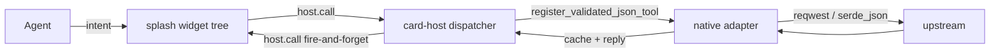

# Agent Integration Guide — finance-brief

> How an automation agent (Playwright, makepad accessibility, headless
>  test harness, or future GPT-style helper) drives the finance-brief
> UI. Covers (1) what the agent can do without screens, (2) how to
> drive the splash UI programmatically, (3) the data round-trip
> (splash → host.call → adapter → cache → splash), and (4) what is
> currently NOT exposed to the agent.
>
> Last verified: 2026-10-04, against `bundle/main.splash` at `de89355`
> and `native/capabilities.toml` at HEAD.

## 1. Three layers an agent must understand



| Layer | Role | Where |
|---|---|---|
| **splash** | widget tree + on_click handlers + nav state | `bundle/main.splash` |
| **card-host** | isolate sandbox + host.call dispatcher | `OctoSense-App-Hub/crates/card-host/` |
| **native** | fetch + parse + cache + state | `finance-brief/native/src/` |

The agent drives **only** the splash layer. It never directly calls
the native adapter. Data flow is always:
`splash widget click → host.call → native adapter → cache → next splash eval`.

## 2. Capability surface (what the agent can ask for)

Per `native/capabilities.toml` (15 capabilities, all of which are
accessible via `host.call("<name>", args)` from splash):

### 2.1 News
| Service | Args | Returns | TTL |
|---|---|---|---|
| `news.refresh` | `{limit: 30}` | `{items: NewsItem[]}` | 300s |
| `news.read` | `{key: "..."}` | `{items: NewsItem[]}` (1-element) | 600s |

### 2.2 Quotes
| Service | Args | Returns | TTL |
|---|---|---|---|
| `quote.snapshot` | `{tab: "a" \| "hk" \| "us" \| "crypto" \| "fx"}` | `{items: Quote[]}` | 5s (most) / 3600s (fx) |
| `quote.candles` | `{symbol: "...", period: "1d" \| "5d" \| "1mo"}` | `{candles: Candle[]}` | — |

### 2.3 Research (research cards / agent analysis stub)
| Service | Args | Returns | TTL |
|---|---|---|---|
| `research.list` | `{}` | `{items: ResearchCard[]}` | — |
| `research.read` | `{id: "..."}` | `{item: ResearchCard}` | — |

### 2.4 Stream (event stream stub)
| Service | Args | Returns |
|---|---|---|
| `stream.subscribe` | `{symbols: [...], freq_ms: 500}` | `{}` |
| `stream.unsubscribe` | `{symbols: [...]}` | `{}` |
| `stream.frequency.set` | `{freq_ms: 1000}` | `{}` |
| `stream.tick` | `{limit: 30}` | `{ticks: Tick[]}` |

### 2.5 Storage / settings / favorites
| Service | Args | Returns |
|---|---|---|
| `fav.list` | `{}` | `{items: Fav[]}` |
| `fav.toggle` | `{id: "..."}` | `{ok: bool}` |
| `settings.load` | `{}` | `{value: Settings}` |
| `settings.save` | `{value: {...}}` | `{ok: bool}` |
| `datasource.status` | `{}` | `{rows: DatasourceRow[]}` |

The agent invokes these via `host.call("name", args)` from splash.
**It does not call the native adapter directly** — that requires
modifying `native/src/host.rs` and re-compiling the host crate.

## 3. Driving the UI without a screen (headless mode)

The agent has three options depending on whether it has a real
display, a GPU, or only a network socket.

### 3.1 Headless GPU grab — `tools/octo shot` (PREFERRED for screenshots)

**Status**: does NOT work in current environment (see
`docs/WIDGET-COMPATIBILITY.md §6`; `MESA-LOADER / ZINK / GL Error 500`).

When working:
```bash
cd /home/lumina/octoOs/OctoSense-App-Hub
rm -rf /tmp/cardhost-X
LIBGL_ALWAYS_SOFTWARE=1 GALLIUM_DRIVER=softpipe \
  MESA_LOADER_DRIVER_OVERRIDE=softpipe \
  timeout 50 ./target/debug/card-host \
    --bundle /home/lumina/octoOs/finance-brief/bundle \
    --app-data /tmp/cardhost-X \
    --allow-unsigned --stamp --remote 8147 > /tmp/cardhost-X.log 2>&1
tools/octo shot <screen-name>.png   # uses the remote bridge
```

### 3.2 Network introspection — HTTP remote bridge (when GPU available)

card-host exposes a remote control bridge on `--remote 8147`:
- `GET /tree` — current widget tree JSON (post-admit)
- `GET /state` — current `let` state (after on_render eval)
- `POST /click` body `{id: "x.y"}` — programmatic click
- `POST /eval` body `{src: "ui.x.set_text(\"hi\")"}` — ad-hoc eval

The agent uses these to inspect and mutate UI without a real screen.

### 3.3 No-GPU smoke test — splash parser only

The cheapest verification: `card-host --admit` will parse and admit
the bundle without needing a GPU. Look for the log line
`[SPLASH] eval: 6912 bytes` — that's the byte count of
`bundle/main.splash` after parse (currently 6912 bytes, 178 lines).

```bash
cd /home/lumina/octoOs/OctoSense-App-Hub
./target/debug/card-host \
  --bundle /home/lumina/octoOs/finance-brief/bundle \
  --app-data /tmp/cardhost-admit-X \
  --admit 2>&1 | grep "SPLASH.*eval"
# expected: [SPLASH] eval: 6912 bytes
```

## 4. Driving the splash UI directly

### 4.1 Widget IDs are the agent's stable handle

Per `OctoScript-App-Design-Flow/docs/SCRIPT-API.md:49-50`, every
`name := Widget{…}` becomes accessible as `ui.<path>.<name>`. The
agent should rely on these ids rather than widget traversal.

Current IDs in `finance-brief/bundle/main.splash` (at `de89374`):
- **(none at root level)** — root SolidView is anonymous

### 4.2 Programmatic click — `ui.<id>.on_click()`

```splash
<!-- inside splash or via /eval HTTP bridge -->
ui.<button-id>.on_click()   <!-- fires the on_click handler -->
```

**Constraint**: works only on Button-family widgets
(`button.rs:548-583`). For GestureView, use `on_tap` instead.

### 4.3 Programmatic text change — `ui.<id>.set_text(s)`

```splash
ui.<label-id>.set_text("new value")
```

**Constraint**: `set_text` exists on every widget via `widget.rs`
default impl, but `text()` only returns what the widget stored. For a
Label, `text()` returns what you `set_text`'d (or the original `text:`
literal). For TextInput, `text()` returns the user-typed value.

### 4.4 Programmatic show / hide — `ui.<id>.set_visible(bool)`

```splash
ui.<screen>.set_visible(false)   <!-- hide -->
ui.<screen>.set_visible(true)    <!-- show -->
```

**Constraint**: works on every widget via `widget.rs:765-787` default
impl. View family specifically takes a bool
(`view.rs:877-892`).

### 4.5 Programmatic re-render — `ui.<id>.render()` (Path B for nav)

```splash
ui.<view-id>.render()    <!-- re-runs on_render closure -->
```

**Constraint**: ONLY works on View family (View, SolidView,
RoundedView, ScrollYView, ScrollXView, ScrollXYView). On any other
widget, hits `widget method render not found for uid <uid>`. This is
the **current P0 nav re-render mechanism** — see §6.

**Don't try**: `ui.<id>.render()` on the root wrapper — splash wraps
the script's root SolidView in a `Splash` widget wrapper that does
not forward `render` (the wrapper's uid is what reaches `ui.<id>`).

## 5. Data round-trip

A complete cycle from agent → splash → cache → splash:

```mermaid
sequenceDiagram
    participant Agent
    participant Splash
    participant CardHost
    participant Adapter
    participant Upstream
    Agent->>Splash: click "Refresh News"
    Splash->>Splash: nav.push("news_list")
    Splash->>Splash: render_screen_placeholder()
    Splash->>CardHost: host.call("news.refresh", {limit:30})
    CardHost->>Adapter: register_validated_json_tool
    Adapter->>Upstream: reqwest GET feed.mix.sina.com.cn
    Upstream-->>Adapter: 200 OK JSON
    Adapter->>Adapter: parse + cache
    Adapter-->>CardHost: NewsItem[]
    CardHost-->>Splash: (fire-and-forget; data in cache file)
    Note over Splash: next on_render closure reads cache<br/>(no inline callback)
    Splash-->>Agent: visible UI update on next eval
```

**Important**:
- `host.call` is **fire-and-forget** in splash. Reply data writes to
  the native cache file; splash reads it on the next `let` mutation
  (typically triggered by a timer or a subsequent `host.call`).
- There is **no `on_reply` callback**. To force a re-render, schedule
  a `start_interval(2.0, || { refresh_news(); ui.body.render() })`.
- Reply data is **not available inline** as `r.data`. If you need
  the response in the same function, use `net.http_request` instead
  (which has `on_response` callback; see `SCRIPT-API.md:155-170`).

## 6. Nav re-render (current P0)

The agent's biggest gap today: pushing a nav state does NOT re-render
the UI. Per `docs/WIDGET-COMPATIBILITY.md §7.2`:

> nav.push mutates state but nothing asks splash to re-run the
> on_render closure. The declarative on_render closure in the root
> SolidView re-evaluates on let-mutation without any ui.* call.

**Workaround for the agent**: after `nav.push("x")`, manually trigger
a re-render via one of:

### Path A (current): wait for next timer tick
A `start_interval` already in the splash will re-evaluate on_render.
For finance-brief, this means waiting up to one interval period
(currently no periodic timer; depends on next user action).

### Path B: `set_visible(false); set_visible(true)` on root wrapper
```splash
ui.<root-wrapper-id>.set_visible(false)
ui.<root-wrapper-id>.set_visible(true)
```
Forces the wrapper to re-layout, which re-runs `on_render`. Constraint:
needs the root wrapper to be ID'd (`root := SolidView{…}`). Splash
parser allows this; runtime behavior depends on whether the wrapper
exposes `set_visible` (it does via `widget.rs:765-787` default).

### Path C: `host.call("ui.redraw", {})` host-side redraw
Define a new capability `ui.redraw` in `native/capabilities.toml` +
handler in `native/src/host.rs` that triggers `cx.redraw_all()` on
the Splash wrapper. Splash invokes `host.call("ui.redraw", {})` to
trigger. This requires `native/src/host.rs` to hold a `CxRef` to the
isolate. **Currently not implemented**; proposed for Phase B-3.

### Path D (recommended for now): inject a `set_timeout` tick
```splash
start_timeout(0.05, || {
    nav.push("news_list")
    start_timeout(0.05, || ui.body.render())
})
```
Two-tick chain forces a re-render on the second tick after the
nav mutation. Splits the mutation from the render request.

## 7. What the agent CANNOT do today

- ❌ Read `r.data` inline from a `host.call` (fire-and-forget only)
- ❌ Programmatically re-render splash without `set_visible` hack
- ❌ Mutate splash `let` state from outside the isolate (host can
  inspect via `/state` HTTP if card-host is built with remote bridge)
- ❌ Subscribe to live splash state changes (no reactive bindings)
- ❌ Drive a `TextInput` via `set_text` and have `on_change` fire
  (set_text does not trigger on_change; use type / paste simulation)
- ❌ Open the app from outside the shell (must be running in
  card-host or in OctoSense shell)

## 8. Verification matrix

| Action | Headless CPU | Headless GPU | Real display |
|---|---|---|---|
| Splash parse | ✓ via card-host --admit | ✓ | ✓ |
| Card-host admit + isolate jail | ✓ | ✓ | ✓ |
| Splash eval (byte count) | ✓ via log line | ✓ | ✓ |
| Widget tree introspection | partial (no widgets drawn) | partial (draw tree) | ✓ |
| `set_text` / `set_visible` from /eval | ✗ (no draw) | ✓ | ✓ |
| `on_click()` programmatic | ✗ (no input) | ✓ | ✓ |
| Pixel screenshot | ✗ (MESA-ZINK fail) | ✓ | ✓ |
| Native adapter fetch + cache | ✓ via unit tests | ✓ | ✓ |

## 9. Smoke-test recipe

Quickest end-to-end smoke test the agent can run today:

```bash
# 1. Native unit tests (no UI)
cd /home/lumina/octoOs/finance-brief/native
cargo test                          # 65/65 pass

# 2. Card-host admit (parses splash, no UI)
cd /home/lumina/octoOs/OctoSense-App-Hub
./target/debug/card-host \
  --bundle /home/lumina/octoOs/finance-brief/bundle \
  --app-data /tmp/cardhost-admit \
  --admit 2>&1 | grep "SPLASH.*eval"
# expect: [SPLASH] eval: 6912 bytes

# 3. Card-host run + log analysis (no pixel out, but nav re-render
#    errors surface in log)
LIBGL_ALWAYS_SOFTWARE=1 GALLIUM_DRIVER=softpipe \
  MESA_LOADER_DRIVER_OVERRIDE=softpipe \
  timeout 50 ./target/debug/card-host \
    --bundle /home/lumina/octoOs/finance-brief/bundle \
    --app-data /tmp/cardhost-run \
    --allow-unsigned --stamp --remote 8147 > /tmp/cardhost-run.log 2>&1
grep -cE "SPLASH.*eval" /tmp/cardhost-run.log   # boot eval only
grep -cE "method render not found" /tmp/cardhost-run.log   # should be 0
```

## 10. References

- `OctoScript-App-Design-Flow/docs/SCRIPT-API.md` — splash DSL spec
- `OctoScript-App-Design-Flow/docs/CAPABILITIES.md` — capability
  contract definition
- `OctoScript-App-Design-Flow/docs/HOST-SERVICES.md` — `host.request`
  shape and limits
- `finance-brief/docs/SPLASH-STYLE.md` — splash writing rules
- `finance-brief/docs/WIDGET-COMPATIBILITY.md` — Layer -1 audit
- `finance-brief/.todo-re-arch-2026-10-04.md §6` — UI accessibility
  for agents
- `finance-brief/native/capabilities.toml` — 15 capabilities
- `finance-brief/native/src/adapters/*.rs` — adapter implementations