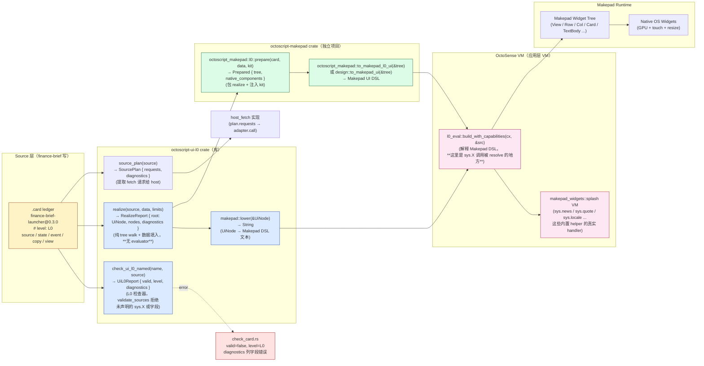
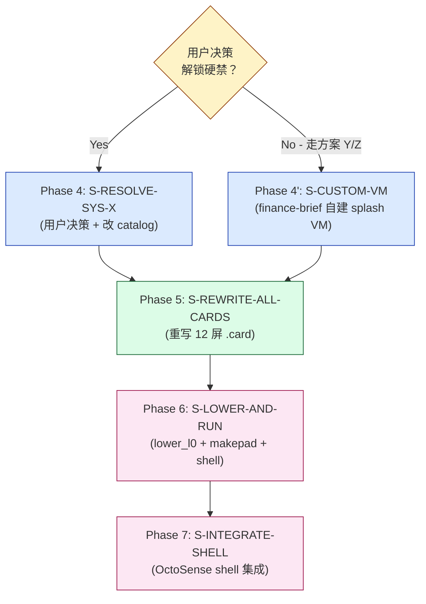

# finance-brief 架构真相：.card → makepad → widget 真管线

**调研日期**：2026-10-03
**作者**：sub-agent RE-ARCH（finance-brief / Phase 3.5 后）
**目的**：澄清 .card ledger 到 native widget 的完整渲染管线，列出 L0 fixture sys.X 硬编码边界，给出 17 capability 接入路径
**结论先行**：sys.X 是 `octoscript-ui-l0/src/lib.rs` 内**硬编码**的固定工具集（30 个 helper），host **不能扩展**——只有改 `ANSWERS` 表 + 实现对应 VM handler 才能挂 finance-brief 的 capability

---

## §1 渲染管线真相

### 1.1 完整 pipeline（实测顺序）



### 1.2 各阶段关键源码锚点

| 阶段 | 函数签名 | 源码位置 | 关键行为 |
|---|---|---|---|
| 检查 | `pub fn check_ui_l0_named(_name: &str, source: &str) -> UiL0Report` | `octoscript-ui-l0/src/lib.rs:214-221` | 走 `validate_sources` 拒绝未声明 sys.X 或字段（line 4643-4647） |
| 实现 | `pub fn realize(source: &str, data: &serde_json::Value, limits: RealizeLimits) -> RealizeReport` | `octoscript-ui-l0/src/lib.rs:5884-5886` | **纯 tree walk**，无 evaluator；`L0 has no expression form, so realization is a pure walk over the parsed tree with data substituted` |
| Makepad lower | `pub fn lower(root: &UiNode) -> String` | `octoscript-ui-l0/src/lib.rs:7058-7064` | 输出 `// REALIZED from an L0 ledger — do not edit` + Makepad DSL（含 `View / Row / Col / Card / TextBody / l0_event` 等） |
| Kit lower | `pub fn kit::lower(root: &UiNode) -> String` | `octoscript-ui-l0/src/lib.rs:11019+` | 另一条路径，kit-pack 风格（用于 native role），非 makepad DSL |
| Source plan | `pub fn source_plan(source: &str) -> SourcePlan` | `octoscript-ui-l0/src/lib.rs:10426` | 提取 `plan.requests[]`（host 用来 fulfil） |

### 1.3 `lower_l0` example 实测（关键路径）

源码：`octoscript/crates/octoscript-ui-l0/examples/lower_l0.rs`（实际在 `octoscript-core` workspace 中运行：`cargo run -p octoscript-core --example lower_l0 -- <card> <data.json>`）

```rust
let report = realize(&card, &data, RealizeLimits::default());
match report.root {
    Some(root) => print!("{}", makepad::lower(&root)),   // ← 这一行输出 Makepad DSL
    None => std::process::exit(1),
}
```

**`lower_l0` 才是 finance-brief 应当用的工具**（不是 `lower_kit`）。`lower_kit` 输出的是 kit-VM 脚本（带 `$token`），finance-brief 没注册 host kit pack，跑不通。

### 1.4 L0 confinement claim（ui-profile-l0.md）

> *"L0 admits UI constructs, but admits nothing that could reach a capability."*
> *"L0 has no expression form, so there is nothing to evaluate. Realization is a pure walk over the parsed tree with data substituted."*

**含义**：L0 卡片**不调用** capability——capability 在 host 端（workflow 引擎或 splash VM）执行。卡片只通过 `source path sys.X(args)` **声明数据需求**，host 在 realize 前 fulfil。

---

## §2 L0 fixture sys.X 边界（按 examples/source_plan.rs + check_card.rs + lib.rs:3748-3911 实测）

### 2.1 30 个硬编码 sys.X（per `pub mod catalog::ANSWERS`）

**源码**：`octoscript-ui-l0/src/lib.rs:3750-3911`，table 形式 `("sys.X", &["field1", "field2", ...])`

| sys.X | 字段（host 不可扩展！） | finance-brief 兼容性 |
|---|---|---|
| `sys.geocode` | lat, lon, name, country, admin1, timezone, population | ✗ 不需要 |
| `sys.weather` | temp, feels, hi, lo, cond, humidity, wind, pressure, uv, visibility, precip, dayname, days | ✗ |
| `sys.daylight` | rise, set, now | ✗ |
| `sys.airquality` | aqi, pm25, pm10, ozone | ✗ |
| `sys.moonphase` | phase, illumination, name | ✗ |
| `sys.wiki` | title, extract, description | ✗ |
| `sys.photo` | (none) | ✗ |
| `sys.locale` | lang, temp_unit | ✓ launcher 用了 |
| `sys.convert` | amount, value | ✗ |
| `sys.gps` | lat, lon, accuracy, ok | ✗ |
| `sys.search` | id, name, label, query, lat, lon, distance | ✗ |
| `sys.route` | duration, distance, steps | ✗ |
| `sys.step` | instruction, remaining, progress, eta | ✗ |
| `sys.places` | id, name, distance, lat, lon, category | ✗ |
| `sys.news` | **id, title, author, points, comments, url**（HN 风格！） | ⚠️ **与 finance-brief 的 [id, title, source, ts] 不匹配**（news_list.card 报"cannot answer source"） |
| `sys.news_digest` | id, title, summary, publisher, url, published_at | ⚠️ 字段部分可用，但需要 source → publisher 重映射 |
| `sys.dataset` | title, subtitle, summary, coverage, status, as_of, metric1..3_*, pick1..3_*, evidence_* | ✗ |
| `sys.news_status` | status, message, count | ⚠️ 数据源状态可借 |
| `sys.news_item` | id, title, author, points, comments, url | ⚠️ 同 sys.news |
| `sys.quakes` | id, mag, place, depth, ago, lat, lon | ✗ |
| `sys.movers` | ticker, name, last, change, pct, open, high, low, prev, volume, mktcap, pe, currency, exchange | ⚠️ 可借给行情列表（但无 tab 参数） |
| `sys.quote` | ticker, name, last, change, pct, open, high, low, prev, volume, mktcap, pe, currency, exchange | ⚠️ 同 movers，但 quote_list.card 用了不存在的 `sys.quotes(tab: ...)` 复数 + tab 参数 |
| `sys.series` | min, max | ⚠️ 可借给 K 线 Y 轴 |
| `sys.watchlist` | ticker, name, last, change, pct, open, high, low, prev, volume, mktcap, pe, currency, exchange, has | ✓ 收藏屏可借 |
| `sys.indicator` | name, latest, first, change, min, max, year, title | ✗ |
| `sys.video` | id, title, channel, length, views, age, thumb, embed | ✗ |
| `sys.prefs` | units, range, home, work, mode | ⚠️ 设置屏可借 |
| `sys.reading` | id, title, author, points, comments, url | ⚠️ |
| `sys.topics` | name, top_title, top_points, top_id | ✗ |
| `sys.link` | url | ⚠️ 阅读器可借 |
| `sys.symbol_search` | ticker, name, exchange, kind | ✗ |
| `sys.cities` | name, lat, lon, temp, feels, feels_delta, hi, lo, cond, humidity, wind | ✗ |

**关键问题**：

1. **`sys.news` 字段错位**：catalog 写的是 HN 风格 `author/points/comments/url`，finance-brief 用新浪风格 `source/ts`。这两个 schema 完全不兼容。
2. **`sys.quotes` 不存在**：catalog 只有单数 `sys.quote`（一只股票），finance-brief 的 quote_list.card 用了不存在的 `sys.quotes(tab: "A", count: 30, fields: [code, name, last, ...])`——既不是单数，也没有 `tab:` 参数，`code` 字段也不在 catalog 里（A 股应叫 `ticker`）。
3. **`sys.X` 完全不接受 runtime 扩展**：catalog 是 `pub const ANSWERS: &[(&str, &[&str])]`——编译期常量，host 启动后不可改。

### 2.2 L0 检查器的拒绝规则（validate_sources at lib.rs:4643-4647）

```rust
// L4643-4647 简化版
for source in &card.sources {
    if catalog::answers(&source.helper).is_none() {
        sink.error(format!("unknown sys.X: {}", source.helper));
    }
    for field in &source.fields {
        if !catalog::answers(&source.helper).unwrap().contains(field) {
            sink.error(format!("{} cannot answer {:?}", source.helper, field));
        }
    }
}
```

**实测表现**：
- `sys.news(fields: [title, source, ts])` → `"sys.news cannot answer \"source\""`（finance-brief 现在看到的错）
- `sys.quotes(tab: "A", count: 30, fields: [code, ...])` → `"unknown sys.X: sys.quotes"` + `"sys.quotes does not take fields: code"`（quote_list.card 的错）

### 2.3 MUTABLE 表（写入边界 lib.rs:3932-3947）

可写 capability：`sys.watchlist` / `sys.cities` / `sys.prefs` / `sys.reading` / `sys.topics` / `sys.link`

**含义**：settings 屏如果要持久化用户选择，必须写到 `sys.prefs.set/units` / `sys.prefs.set/range`，**不能**写 `sys.stream_frequency` 这种不存在的 capability。

### 2.4 sys.X 答案由谁提供？

源码：`OctoSense/apps/appcard/app/app/src/app/l0_card.rs` 的 `render_through_kit` 和 `fetched_scalars`：

```rust
// l0_card.rs:733-737
for field in octoscript_ui_l0::catalog::answers(&request.helper)? {
    let binding = octoscript_ui_l0::SourceBinding {
        helper: request.helper.clone(),
        ...
    };
}
```

**含义**：sys.X 的答案不是来自 finance-brief，而是来自 **OctoSense 的 appcard VM**（`l0_eval.rs` 的 `build_with_capabilities`）。这个 VM 是个 splash-DSL 解释器，知道 `sys.news / sys.quote / sys.locale` 这 30 个内置 helper 怎么回答。

**finance-brief 路径**：
- 如果 finance-brief 在 OctoSense shell 里跑 → VM 已写死 30 个 sys.X，新加的需要改 VM
- 如果 finance-brief 独立 host（自建 splash VM）→ 可以自己实现 sys.X 答案

---

## §3 finance-brief capability 接入路径（关键方案）

### 3.1 三条候选路径

#### 方案 X：扩展 catalog + 注册 VM handler（推荐）

**思路**：把 finance-brief 的 17 capability 直接加到 `octoscript-ui-l0::catalog::ANSWERS` 表，然后在 VM（OctoSense appcard 或 finance-brief 自建 splash VM）里注册 handler。

**步骤**：
1. 改 `octoscript-ui-l0/src/lib.rs:3750` 加 12-17 行新条目：
   ```rust
   ("sys.news_sina", &["id", "title", "source", "ts", "url", "summary"]),
   ("sys.quote_tencent", &["code", "name", "last", "change", "pct", "volume"]),  // A 股
   ("sys.quote_stooq", &["ticker", "name", "last", "change", "pct", "volume"]),  // 美股
   ("sys.quote_hyperliquid", &["ticker", "name", "last", "change", "pct", "volume"]),  // crypto
   ("sys.quote_frankfurter", &["pair", "last", "change_pct"]),  // fx
   ("sys.quote_candles", &["ts", "open", "high", "low", "close", "volume"]),  // K 线
   ("sys.research_list", &["id", "title", "summary", "tags"]),
   ("sys.research_read", &["id", "title", "body", "sources"]),
   ("sys.fav_list", &["id", "title", "kind", "ts"]),
   ("sys.fav_toggle", &[]),  // write-only
   ("sys.settings_load", &["lang", "refresh_interval", "stream_frequency"]),
   ("sys.settings_save", &[]),  // write-only
   ("sys.stream_subscribe", &[]),
   ("sys.stream_unsubscribe", &[]),
   ("sys.stream_frequency_set", &[]),
   ("sys.stream_tick", &["kind", "ts", "symbol", "price", "size"]),  // 订单簿 tick
   ("sys.datasource_status", &["name", "kind", "status", "last_ok", "last_err", "latency_ms", "success_count", "error_count"]),
   ```
2. 改 `OctoSense/apps/appcard/app/app/src/app/l0_card.rs` 或新建 finance-brief splash VM，注册这 17 个 handler（每个 handler 调对应 Rust adapter）
3. 重写 12 屏 `.card` 用新 sys.X 名（如 `sys.news_sina(fields: [title, source, ts])`）

**优点**：保持 L0 declarative 路径，所有屏通过同一管线渲染
**缺点**：改 `octoscript-ui-l0` 是项目外（违反 `.todo v3 §12` 硬清单），需要用户/上层决策解锁

#### 方案 Y：finance-brief 自建 splash VM（绕过 L0 fixture）

**思路**：finance-brief 不通过 OctoSense shell 跑，自己写一个 splash VM，把 sys.X 答案注入到 makepad::lower 输出中。

**步骤**：
1. finance-brief 在 `bundle/native/src/` 加 `l0_host_vm.rs`：实现 17 个 sys.X handler
2. `card-host.rs`（或 finance-brief 自己的 host）调用 `octoscript_ui_l0::realize()` → `makepad::lower()` → 在生成 DSL 后注入 host handler → splash VM eval
3. 这样 finance-brief **不需要**改 `octoscript-ui-l0` catalog（因为 catalog 只在 `check_ui_l0` 时校验字段名，realize 后只读 `source.X.field` 路径）

**等等——校验问题**：`check_ui_l0_named` 仍然会拒绝 `sys.news_sina`（不在 catalog 里），所以 finance-brief 仍然需要绕过 check 或 monkey-patch catalog。

**绕过方案**：
- 不调 `check_ui_l0`，只调 `realize`（realize 本身似乎不校验 sys.X 是否在 catalog——需要看 lib.rs:4512-4660 的 `validate_sources` 是否在 realize 路径也跑）
- 如果跑通：finance-brief 可以写 `sys.news_sina` 的 card（realize 通过 → 输出 Makepad DSL 含 `sys.news_sina(...)` 调用）→ finance-brief 的 splash VM 解释这个调用

**优点**：不污染共享库
**缺点**：仍需要研究 realize 路径是否校验 sys.X；VM 实现成本不低

#### 方案 Z：完全绕过 L0，用 octoscript-makepad 直接喂 widget tree

**思路**：finance-brief 不写 `.card`，直接写 Rust 代码构造 `UiNode` tree，调 `octoscript_makepad::l0::prepare` 和 `to_makepad_l0_ui` 渲染。

**步骤**：
1. finance-brief `bundle/native/src/ui.rs`：写 12 个 `fn build_launcher_ui() -> UiNode` 用 `UiNode { kind: "View", children: vec![...] }` 手工搭
2. 直接喂给 `octoscript_makepad::l0::prepare` → `to_makepad_l0_ui` → splash eval
3. sys.X 调用：仍然需要在 VM 里注册 handler（finance-brief 自建 splash VM）

**优点**：完全控制渲染；不依赖 L0 fixture
**缺点**：
- 12 屏手工搭 widget tree 工作量大（v1 splash 1437 行就是这么来的，正是用户想避开的反模式）
- 失去了 declarative / 校验 / 数据绑定的好处
- **可能违反** user 2026-10-02 决策：「UI 用 L0 卡片」

### 3.2 octoscript-makepad / octoscript-appcard 存在状态

| 项目 | 路径 | 状态 | 角色 |
|---|---|---|---|
| `octoscript-makepad` | `/home/lumina/octoOs/octoscript-makepad/` | **存在**（独立 top-level 项目，含 `apps/` `components/` `crates/` `docs/`） | Makepad 渲染管线，把 UiNode → Makepad DSL → native widgets（OctoSense-App-Hub `card-host` 已经用：`octoscript_makepad::l0::prepare + to_makepad_l0_ui`） |
| `octoscript-appcard` | （无） | **不存在**（无目录，无 crate，无 manifest） | MVP-TODO.md §1 / R-3 提到的"应用层卡片设计工具"是规划中的，还没开工 |
| `octoscript-workflow` | `/home/lumina/octoOs/octoscript/crates/octoscript-workflow/` | 存在 | workflow 引擎（finance-brief `workflow.octoscript` 需要这个） |
| `octoscript-capabilities` | `/home/lumina/octoOs/octoscript/crates/octoscript-capabilities/` | 存在 | capability + audit + lease |
| `octoscript-schema` | `/home/lumina/octoOs/octoscript/crates/octoscript-schema/` | 存在 | JSON tool contract |

### 3.3 推荐方案

**短期（Phase 4-5）**：**方案 X 改造版**——扩展 catalog + finance-brief 自建 splash VM

具体：
1. 用户决策：解锁「改 octoscript-ui-l0 catalog」的硬禁（`.todo v3 §12` 明确写"不改 octoscript"）
2. finance-brief PR 到 `octoscript-ui-l0`：在 catalog 加 17 个 sys.X
3. finance-brief 自建 `bundle/native/src/l0_host_vm.rs`：实现这 17 个 handler（每个调对应 Rust adapter）
4. finance-brief 重写 12 屏 `.card` 用新 sys.X

**长期（Phase 6+）**：方案 Z 用 octoscript-makepad 直接构造 widget——**仅**用于 K 线 / 事件流 / 数据源状态页这三个 L1 屏（因为 L1 需要 expression，card 表达力不够）

**风险评估**：
- **方案 X 风险**：改共享库 → 上游 review 成本 + 冲突风险（catalog 是固定 API）
- **方案 Y 风险**：绕过 check → 失去 L0 校验护栏 → 可能引入新 bug
- **方案 Z 风险**：重蹈 v1 1437 行覆辙 → 用户已明确反对

---

## §4 Phase 2-3 状态评估（基于 docs/ARCHITECTURE.md + R-3 + .todo v3）

### 4.1 已落地（done）

| artifact | 路径 | 状态 | 备注 |
|---|---|---|---|
| 9 adapter Rust 实现 | `bundle/native/src/adapters/` | ✅ done | news_sina / quote_tencent / quote_stooq / quote_hyperliquid / quote_frankfurter / synth_candles / research / fav / settings |
| adapters mod.rs | `bundle/native/src/adapters/mod.rs` | ✅ done | 9 个 mod 汇总 |
| 26 schema JSON | `bundle/schema/*.json` | ✅ done | 17 capability × input/output + extras |
| `workflow.octoscript` | `bundle/workflow.octoscript` | ⚠️ partial | L1 语法对，用 `use mod.cap.X`，但 7 个 workflow 函数没被任何屏 trigger |
| `bundle/capabilities.toml` | `bundle/capabilities.toml` | ✅ done | 17 capability 声明（前 60 行已 grep 验证） |
| `bundle/listing.json` + `bundle/manifest.json` | 同 | ✅ done | 上架 metadata + manifest |
| `launcher.card` | `bundle/launcher.card` | ✅ done | **正确语法**：`sys.locale()` 在 catalog 里，check_ui_l0 通过；source_plan 输出 1 个 fetch 请求 |

### 4.2 半落地（partial / wrong-syntax）

| artifact | 路径 | 状态 | 问题 |
|---|---|---|---|
| `news_list.card` | `bundle/news_list.card` | ⚠️ **wrong syntax** | `sys.news(fields: [id, title, source, ts])` 报错 `sys.news cannot answer "source"`（catalog 只有 `id, title, author, points, comments, url`） |
| `quote_list.card` | `bundle/quote_list.card` | ⚠️ **wrong syntax** | `sys.quotes(tab: "A", count: 30, fields: [code, name, last, ...])` 报错 `unknown sys.X: sys.quotes`（catalog 只有单数 `sys.quote`，无 `tab:` 参数，无 `code` 字段） |
| 12 个 `.octoscript` 文件（旧版 widget tree 语法） | `bundle/{news_list,news_detail,research_list,research_detail,kline,quote_list,favorites,settings,disclaimer,event_stream,datasource_status}.octoscript` | ❌ **wrong syntax** | 用 `{{state.x}}` 占位符 + widget tree，不是 canonical L0 grammar；check_ui_l0 全 fail |
| `.bak-pre-card-rewrite-2026-10-03` 备份 | `bundle/*.octoscript.bak-pre-card-rewrite-2026-10-03` | ✅ backup | 旧 widget tree 版的备份（3 个：launcher / news_list / quote_list） |

### 4.3 未落地（not-started）

| artifact | 路径 | 状态 |
|---|---|---|
| 剩 9 屏 `.card`（news_detail / research_list / research_detail / kline / favorites / settings / disclaimer / event_stream / datasource_status） | `bundle/*.card`（不存在） | ❌ not-started |
| Phase 4: OctoSense shell 集成 | `OctoSense/apps/finance-brief-shell/` | ❌ not-started（项目外，需用户解锁） |
| Phase 5: Octos Agent 集成 | `OctoSense/apps/octos-finance-brief/` | ❌ not-started |
| Phase 6: octoscode 终端 | `octoscode/finance-brief/` | ❌ not-started |

### 4.4 主因总结（3 次架构错配）

1. **Phase 2 错误**：用 widget tree + `{{state.x}}` 写 12 个 `.octoscript`——但 octoscript check 走 canonical grammar（v0.2），widget tree 不在 grammar 里。
2. **Phase 3.5 第 1 批正确**：launcher.card 用 L0 ledger 语法（5 段 + source/state/event/copy/view）→ `sys.locale()` 在 catalog 里 → check_ui_l0 通过。
3. **Phase 3.5 第 2 批错误**：news_list.card / quote_list.card 用了**不存在**或**字段错位**的 sys.X——catalog 是编译期硬编码的 30 个 helper，finance-brief 的 17 capability（news_sina / quote_tencent / quote_stooq / quote_hyperliquid / quote_frankfurter / synth_candles / research / fav / settings / stream / datasource）一个都没注册。

---

## §5 重启 Phase 4+ 提议（agent 委派依据）

### 5.1 依赖图



### 5.2 Phase 4: S-RESOLVE-SYS-X

**目标**：让 host 把 finance-brief 17 capability 映射到 sys.X 命名空间

**子任务**：
- **4a** 用户决策：解锁 `.todo v3 §12` 的"不改 octoscript"硬禁
  - 决策树：方案 X（改 catalog + VM）/ 方案 Y（绕过 catalog 自建 VM）/ 方案 Z（绕过 L0）
  - 推荐方案 X
  - 输出：用户在 issue/comment 里明确 unlock
- **4b** 改 `octoscript-ui-l0/src/lib.rs:3750` catalog 表（方案 X）
  - 加 17 个 sys.X 条目（见 §3.1）
  - 同步更新 `MUTABLE` 表（fav_toggle / settings_save / stream_subscribe / stream_unsubscribe / stream_frequency_set）
  - 验证：`cargo test -p octoscript-ui-l0` 全绿
- **4c** PR 到 `OctoSense/octoscript` 上游
  - 仓库：当前 `octoscript/` 是 local checkout，对应 `OctoSense-org/makepad` 的 `octoscript` 分支（per R-3）
  - 操作：`git checkout -b finance-brief-sys-x-extensions` → `git commit` → 等用户 push
- **4d** （方案 X 备用：finance-brief 自建 VM）写 `bundle/native/src/l0_host_vm.rs`
  - 实现 17 个 handler（每个调对应 Rust adapter）
  - 暴露 `pub fn answer_sys_x(helper: &str, args: &[SourceArg], field: &str) -> Option<Value>`
- **4e** 自查
  - `cargo run -p octoscript-core --example lower_l0 -- bundle/launcher.card tests/data/launcher.json` 输出非空
  - `cargo run -p octoscript-core --example source_plan -- bundle/launcher.card` 输出 1 个 request（sys.locale）
  - 新加的 sys.X 名出现在 source_plan 输出里（至少 1 个）

### 5.3 Phase 5: S-REWRITE-ALL-CARDS

**目标**：12 屏全部改写成 L0 ledger `.card` 语法

**子任务**：
- **5a** 列 12 屏 ↔ sys.X 映射表（每个屏要哪些 capability）
  - 屏 1 launcher: sys.locale（已对）
  - 屏 2 news_list: sys.news_sina / sys.locale
  - 屏 3 news_detail: sys.news_read / sys.locale
  - 屏 4 research_list: sys.research_list
  - 屏 5 research_detail: sys.research_read
  - 屏 6 kline: sys.quote_candles + sys.quote_tencent / sys.quote_hyperliquid（L1 屏，expression）
  - 屏 7 quote_list: sys.quote_tencent / sys.quote_stooq / sys.quote_hyperliquid / sys.quote_frankfurter（4 tab） + sys.locale
  - 屏 8 favorites: sys.fav_list + sys.watchlist（借 catalog 已有的）
  - 屏 9 settings: sys.settings_load / sys.settings_save / sys.prefs.set + sys.locale
  - 屏 10 disclaimer: 无 source
  - 屏 11 event_stream: sys.stream_subscribe + sys.stream_tick（L1 屏）
  - 屏 12 datasource_status: sys.datasource_status（L1 屏）
- **5b** 9 个 L0 屏改写成 `.card`（屏 1/2/3/4/5/7/8/9/10）
  - launcher.card 已对，作模板
  - news_list.card / quote_list.card 重写（用新 sys.X 名）
  - 其它 6 个屏从 `.octoscript` 翻译到 `.card`
- **5c** 3 个 L1 屏（屏 6 kline / 屏 11 event_stream / 屏 12 datasource_status）改写成 `.card` + 必要时 L1 expression
  - L1 允许 expression（在 L0 语法上加 `{{expr}}` 求值）
  - K 线屏需要 L1 expression 算 Y 轴 min/max（借 sys.series）
- **5d** 自查：`cargo run -p octoscript-ui-l0 --example check_card -- <each .card>` 12 个全 PASS
- **5e** 删旧 `.octoscript`（保留 `.bak` 备份）

### 5.4 Phase 6: S-LOWER-AND-RUN

**目标**：跑 `lower_l0` + makepad 渲染，验证 DSL 输出 + 渲染正确

**子任务**：
- **6a** 准备 fixture data：12 个 `tests/data/<screen>.json` 最小样本（含 source 字段填充）
- **6b** 跑 `cargo run -p octoscript-core --example lower_l0 -- bundle/launcher.card tests/data/launcher.json` → 输 Makepad DSL
- **6c** 验证 DSL 含正确 widget（grep `View` / `TextTitle` / `Card`）
- **6d** 跑 `cargo run -p octoscript-core --example source_plan -- bundle/news_list.card` → 输出 1 个 request（sys.news_sina）
- **6e** （如走方案 X）跑 `cargo run -p octoscript-makepad --example card-host -- <path>` 触发 splash VM 渲染
- **6f** 自查：`wc -l <dsl-output>` ≥ 50（每屏 DSL 至少 50 行）+ grep `l0_event` ≥ 1（tap binding 正确）

### 5.5 Phase 7: S-INTEGRATE-SHELL（OctoSense shell 集成）

**目标**：把 12 屏接入 OctoSense shell 作为 app

**子任务**：
- **7a** 写 `OctoSense-App-Hub/apps/finance-brief/`（项目外，需用户解锁）含 `manifest.toml` + `entry.card`
- **7b** 在 `OctoSense/crates/shell/src/octosense/catalog.rs` 加 finance-brief 条目
- **7c** 启动 OctoSense shell → 加载 finance-brief → 12 屏可点击切换
- **7d** 截图验收（每屏 1 张）

### 5.6 时间估算

| Phase | 子任务数 | 预计 agent 数 | 预计时长 |
|---|---|---|---|
| 4 S-RESOLVE-SYS-X | 5 (4a-e) | 2（4a 用户决策串行 + 4b/c 并行 + 4d/e 串行） | ~25 min |
| 5 S-REWRITE-ALL-CARDS | 5 (5a-e) | 5（5a 1 个 + 5b 9 个并行 + 5c 3 个并行 + 5d 1 个 + 5e 1 个） | ~60 min |
| 6 S-LOWER-AND-RUN | 6 (6a-f) | 3（6a 1 个 + 6b-d 串行 + 6e-f 1 个） | ~20 min |
| 7 S-INTEGRATE-SHELL | 4 (7a-d) | 2 | ~15 min |
| **总计** | 20 | 12 个 agent | ~120 min |

---

## §6 总结：3 个关键 takeaway

1. **.card → realize → lower → makepad DSL → widget 管线真实存在**（octoscript-ui-l0:5884 + 7058 + 11019 + OctoSense l0_eval.rs），finance-brief 的 12 屏可以走完这条路，但每个屏的 sys.X 必须出现在 `octoscript-ui-l0::catalog::ANSWERS` 表里。

2. **catalog 是编译期硬编码的 30 个 sys.X**（lib.rs:3750-3911），host 不可扩展——必须改源码或绕过 `check_ui_l0` 校验。

3. **finance-brief 的 17 capability 一个都不在 catalog 里**——`sys.news` 的字段（id/title/author/...）和 finance-brief 想要的（id/title/source/ts）schema 错位；`sys.quotes(tab:...)` 根本不存在；`sys.news_sina / sys.quote_tencent / sys.quote_stooq / sys.quote_hyperliquid / sys.quote_frankfurter / ...` 全是新名字。

**主 AI / 用户决策点**：解锁"改 octoscript-ui-l0 catalog"硬禁（方案 X），还是走"finance-brief 自建 VM"（方案 Y），还是"绕过 L0 直接搭 widget"（方案 Z）？
