# finance-brief 架构真相：.octoscript → makepad → widget 单一管线

**调研日期**：2026-10-03（首版）/ 2026-10-04（单一方案后更新）
**目的**：澄清 `.octoscript` 屏到原生 widget 的渲染管线，并归档
历史双路径比较。

**结论先行**：finance-brief v3（`feat/one-octoscript` 分支）走**单一**
octoscript-makepad 管线。Sys.X 不再是 finance-brief 的命名空间；host
capability 通过 `mod.fb.<cap>` 在 `apps/desktop/src/datasources.rs`
直接注册到主 VM。

---

## §1 渲染管线真相

### §1.1 完整 pipeline（v3 唯一路径）

```mermaid
flowchart LR
    subgraph S1["Source 层（finance-brief 写）"]
        A["bundle/screens/*.octoscript<br/>_kit + 12 屏 + _index"]
    end

    subgraph S2["octoscript-render crate（apps/desktop 直接用）"]
        B["build(&src, register_stub_capabilities)<br/>→ UiNode tree<br/>(make-script VM parse + walk)"]
    end

    subgraph S3["octoscript-makepad crate"]
        C["to_makepad_ui(&UiNode)<br/>→ Makepad DSL 文本<br/>(UiNode → Makepad dialect)"]
    end

    subgraph S4["App Main VM (finance_brief::App)"]
        D["cx.with_vm(eval_with_append_source)<br/>→ View"]
        E["host.view = View<br/>(Splash.view mount)"]
    end

    subgraph S5["Makepad Runtime"]
        F["Makepad Widget Tree"]
        G["Native OS Widgets (GPU + touch + resize)"]
    end

    A --> B
    B --> C
    C --> D
    D --> E
    E --> F
    F --> G

    style A fill:#fef3c7,stroke:#92400e
    style B fill:#dbeafe,stroke:#1e40af
    style C fill:#dcfce7,stroke:#166534
    style D fill:#fce7f3,stroke:#9d174d
    style E fill:#fce7f3,stroke:#9d174d
```



### §1.2 各阶段关键源码锚点

| 阶段 | 函数签名 | 源码位置 | 关键行为 |
|---|---|---|---|
| 评估 | `octoscript_render::build(&src, register)` | `Octoscript-Makepad/crates/octoscript-render/src/lib.rs` | 解析 token + 转 UiNode（VM 评估） |
| 翻译 | `octoscript_makepad::to_makepad_ui(&UiNode)` | `Octoscript-Makepad/crates/octoscript-makepad/src/lib.rs` | UiNode → makepad dialect string |
| Kit 状态注入 | `octoscript_makepad::kit::with_state_sized(route, dark, t, vw, vh, &src)` | `Octoscript-Makepad/crates/octoscript-makepad/src/kit.rs` | 把 st 注入源（route + 时钟 + viewport） |
| 主 VM 挂载 | `cx.with_vm(vm => vm.eval_with_append_source(...))` | `apps/desktop/src/lib.rs:268-273` | 评估 makepad dialect 到 View |
| Splash mount | `host.view = view` | `apps/desktop/src/lib.rs:275-277` | Splash.view 替换 |

### §1.3 finance-brief 入口（BAKED 拼接）

`apps/desktop/src/lib.rs:74-93`：

```rust
const BAKED: &str = kit![
    "_kit",
    "launcher",
    "news_list",
    "news_detail",
    "research_list",
    "research_detail",
    "quote_list",
    "kline",
    "favorites",
    "settings",
    "event_stream",
    "datasource_status",
    "disclaimer",
    "_index",
];
```

`kit!` 宏通过 `include_str!` 在编译期把 14 个文件按顺序拼成单字符串，
赋给 `BAKED`。运行期 `App::mount` 读 `BAKED`（或 `DEVICE_PATH` 上的
覆盖文件），调 `octoscript_render::build` → `octoscript_makepad::to_makepad_ui` → `cx.with_vm` 评估到 View。

### §1.4 数据回环（host.fetch → adapter → cache → re-render）

```mermaid
flowchart LR
    SCR[.octoscript screen<br/>sget(key, default)]
    HF[mod.fb.<cap> handler<br/>apps/desktop/src/datasources.rs]
    ADP[native/src/adapters/<x>.rs<br/>reqwest + JsonToolContract]
    CACHE[in-memory cache<br/>per capability]

    SCR -- sget read --> HF
    HF -- dispatch --> ADP
    ADP -- reply --> CACHE
    CACHE -- next sget --> SCR
```

详细 host.fetch 名称 → capability 名映射见 `apps/desktop/src/datasources.rs:23-58`。

---

## §2 L0 fixture sys.X 边界（历史）

> v3 单一方案下 finance-brief **不再使用** sys.X 命名空间。本节归档历史边界。

### §2.1 30 个硬编码 sys.X（per `pub mod catalog::ANSWERS`）

完整列表见 `docs/CATALOG-SYS-X.md`（保留作 history）。

### §2.2 L0 检查器的拒绝规则（v3 不适用）

`octoscript-ui-l0::check_ui_l0` 在 v3 单一方案中不调用 —— finance-brief
屏走 `octoscript_render::build`（VM 评估路径），不是 L0 ledger 路径。

### §2.3 sys.X 答案由谁提供？

v3 单一方案下：finance-brief 不依赖 sys.X。Capability 由 `mod.fb.<cap>`
直接在主 VM 注册，screen 通过 sget 读到 reply。

---

## §3 finance-brief capability 接入路径（v3 已收敛）

### §3.1 三条候选路径（历史）—— 全部不适用

| 方案 | 历史结论 | v3 状态 |
|------|---------|---------|
| X：扩展 catalog + 注册 VM handler | 推荐但需 PR 上游 | ❌ 不需要 |
| Y：finance-brief 自建 splash VM 绕过 L0 fixture | 不推荐 | ❌ 不需要 |
| Z：完全绕过 L0，用 octoscript-makepad 直接喂 widget tree | 复杂 | ✅ **采用** |

### §3.2 v3 实际采用（方案 Z 的"精简"）

`apps/desktop/src/datasources.rs`：

- 在 `App::script_mod` 钩子中调 `register_capability_handlers(vm)`
- 18 个 `mod.fb.<cap>` 注册到主 VM
- 屏通过 `host.fetch("fb.<cap>", args)`（实际是 `mod.fb.<cap>(args)`）调用
- adapter 桥接是 TODO（v3 当前 commit 仅放 stub log）

### §3.3 推荐方案（v3 已落地）

方案 Z 的精简版。无需改上游 catalog，无需自建 VM。

---

## §4 Phase 状态评估

### §4.1 已落地

- ✅ `apps/desktop/` Rust app 骨架
- ✅ `bundle/screens/*.octoscript` × 14
- ✅ `native/src/adapters/` 9 个 adapter（保留 v2）
- ✅ `bundle/workflow.octoscript` 7 fn（保留 v2，挂上 screens）
- ✅ `bundle/capabilities.toml` 17 capability（保留 v2）

### §4.2 半落地（partial）

- ⚠️ `apps/desktop/src/datasources.rs` 18 fn stub，未调 9 adapter
- ⚠️ `apps/desktop/src/lib.rs::script_mod` 未注册 `makepad_plot` widget

### §4.3 未落地

- ❌ OctoSense shell fullscreen launch（OctoScript#56 阻塞）
- ❌ host-service crate（workspace member 阻塞）
- ❌ `octoscode` CLI 集成（Phase 6）

### §4.4 主因总结（v2 → v3 演进）

v2 期间主因是"两条 DSL 路径并存"（Path 1 + Path 3 lite）。v3 收敛为单一
Octoscript 路径后，主因转为"上游 catalog 硬编码"、"shell host-service"
阻塞 —— 这些与 octoscript 方案**正交**，v3 不解决。

---

## §5 总结

1. **v3 唯一管线**：`.octoscript` → `octoscript-render::build` → `octoscript-makepad::to_makepad_ui` → 主 VM 评估 → `Splash.view` → native widget
2. **数据回环**：`mod.fb.<cap>` handler → 9 adapter → cache → sget re-render
3. **不再依赖 sys.X**：finance-brief 自有 `mod.fb.*` 命名空间，无需改上游 catalog
4. **host-service crate 不必建**：`apps/desktop/` 自身就是 host service 承载

---

## §6 与 docs/ARCHITECTURE.md 的关系

本文档 = 渲染管线 + 数据回环的"硬件级"真相（VHDL 级 truth）。
`docs/ARCHITECTURE.md` = 模块边界 + 平台分层的"软件级"真相（C-level truth）。
两者互补，前者讲"管道怎么流"，后者讲"模块怎么分"。