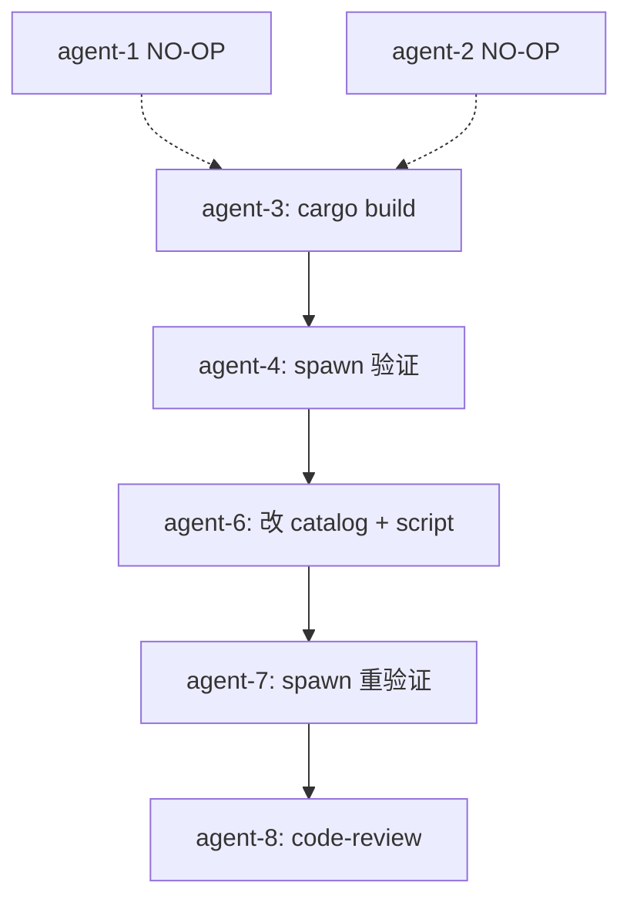
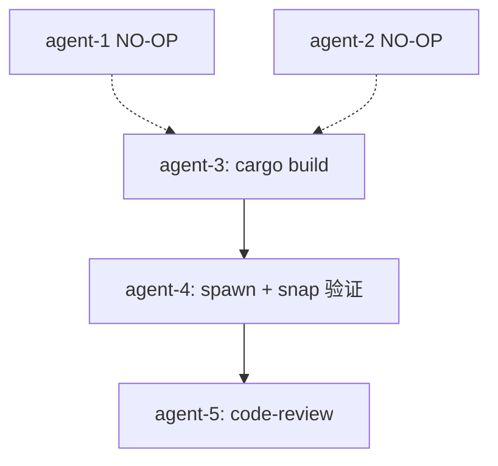

# B 路径 TODO — finance-brief 在 OctoSense shell 启动器 spawn 独立 .exe

日期: 2026-10-05
工作目录: `C:\Code\OctoSenseorg\`
finance-brief HEAD: `cca8cef`
OctoSense HEAD: `127ae4b`
DSL: 无 octoscript；本任务改 JSON 数据 + cargo build

## 决策纪要（Q1 已答）

| # | 问题 | 决策 |
|---|------|------|
| Q1 | finance-brief 在 OctoSense shell 里出现方式 | **B 路径**：从 `OctoSense/desktop/system-apps.json` 移除 `finance-brief`，删 `OctoSense/apps/finance-brief/`，rebuild octosense，让 shell 通过 catalog/apps.json 的 `executable: "finance-brief"` spawn 独立 .exe |

## 改动 1: 从 system-apps.json 移除 `finance-brief` — ✅ NO-OP

- 状态: **无需操作**
- 实测 (2026-10-05 16:24):
  - `git show HEAD:desktop/system-apps.json` → `["news", "photos", "maps", "mail", "calendar", "ai-providers", "youtube"]` (单行，不含 finance-brief)
  - `cat desktop/system-apps.json` (working tree) → multi-line 同样 7 个 app (不含 finance-brief)
  - `git diff desktop/system-apps.json` → 仅格式调整（multi-line + 末尾无换行），无内容差异
  - `ls OctoSense/apps/` → 只有 7 个 app 子目录（news/photos/maps/mail/calendar/ai-providers/youtube + appcard/camera/reference），`finance-brief/` 不存在
  - `git status` → working tree clean for apps/finance-brief/

## 改动 2: 删除 `OctoSense/apps/finance-brief/` — ✅ NO-OP

- 状态: **无需操作**
- 理由: 该目录本就不存在

## 改动 3: rebuild OctoSense shell — ⚠️ 关键步骤

- 位置: `C:\Code\OctoSenseorg\OctoSense\`
- 命令: `cargo build --release -p octosense`
- 输出: `target/release/octosense.exe` (≈176MB)
- 期望耗时: 5-15 分钟（增量 build，仅需重生成 system_apps.rs + 重 link）
- 真正理由: 当前 `target/release/octosense.exe` (mtime 16:01:06) 和 `target/release/build/octosense-app-hub-app-*/out/system-finance-brief.pack.json` (mtime 15:59:45) 是 **stale build artifact**——之前用含 `finance-brief` 的 source build 过。origin/main 当前 source 已不含 finance-brief，但 binary 仍是旧版（包含 `register_system_app("os.finance-brief", ...)`），spawn shell 时仍 unpack pack 到 `finance-brief/.octosense/apps/.system/os.finance-brief/`，触发出错。
- 修复: 让 build.rs 重读当前 system-apps.json（不含 finance-brief），新生成的 system_apps.rs 不含 `os.finance-brief` 行，新 spawn shell 时不再 unpack + mount 它。

## 改动 4: 验证 spawn shell + tile

- 工具: `python scripts/run-on-octosense.py --no-wait`
- 步骤:
  1. spawn shell (no-wait 立即返回，留 shell 后台)
  2. 等 8-12s 启动
  3. `curl /s` 看 HTTP 200
  4. `curl /snap?all=1` 看顶层 widget 是否含 `finance_brief` 或 `财经简报` label
  5. `curl '/k?key=Escape&modifiers=Ctrl'` 触发 launcher 抽屉
  6. 再 `/snap?all=1` 看抽屉内是否有 finance_brief tile
  7. `grep /tmp/oct.log -E "page\.card|os\.finance-brief"` 应无错
  8. `tasklist /FI "IMAGENAME eq finance-brief.exe"` 应无独立进程（因为还没点）
- 验收:
  - HTTP 200
  - log 无 page.card / os.finance-brief 报错
  - launcher 抽屉含 `finance_brief` 或 `财经简报`

## 改动 5: 验证点击 tile → spawn .exe

- 步骤:
  1. 从 `/snap` 找 finance_brief tile 的 x/y 坐标
  2. `curl '/click?x=<x>&y=<y>'`
  3. 等 3s
  4. `tasklist /FI "IMAGENAME eq finance-brief.exe"` 看是否独立 .exe 进程
  5. `grep /tmp/oct.log -E "spawn_client|launched finance-brief|process"` 看日志
- 验收:
  - finance-brief.exe 进程独立存在（不是 in-process card mount）
  - log 含 "launched finance-brief" + "(process)" 标识（不是 "(in-process, card)"）

## 不做的事

- [ ] 不修改 `OctoSense/crates/` `OctoSense-App-Hub/crates/` `Octoscript-Makepad/crates/` 下任何 Rust 源码
- [ ] 不修改 `OctoSense/.cargo/config.toml` `OctoSense/desktop/AGENTS.md` `OctoSense/AGENTS.md` 等 dep 仓配置/文档
- [ ] 不修改 `OctoSense/desktop/system-apps.json`（已正确）
- [ ] 不修改 `OctoSense/tools/setup.py`（无关的 encoding 修复，跟本任务无关）
- [ ] 不修改 `finance-brief/bundle/` 下任何 octoscript/manifest 文件
- [ ] 不修改 `finance-brief/native/` 下任何 Rust 源码
- [ ] 不写 `.ps1` / `.sh` 脚本（脚本语言限 `.py`）
- [ ] 不在 `C:\Code\OctoSenseorg\` 外放任何文件
- [ ] 不动 `finance-brief/.octosense/apps/.system/os.finance-brief/` 残留（用户上一轮明确自己删；rebuild 后再 spawn 不会再生成）
- [ ] 不 `git commit` / `git push` / `git add -A`
- [ ] 不跑 `find /` 全盘扫
- [ ] 不 `cargo clean`（保留 build cache，加速 rebuild；只跑 `cargo build`）

## 风险点

- **cargo build 长**：10-20 分钟；超时阈值设 30 分钟（finance-brief-skill §4 单文件 ≤30 行阈值不适用，多文件 + 完整 build 算"多文件 ≤100 行"按 §4 阈值 8 分钟；build 单步超出阈值，建议拆 build 与后续验证为两个 agent）
- **finance-brief.exe 在 OctoSense/target/release/ 已存在**：cargo build 不删 .exe（build step 不动），所以 finance-brief.exe 副本不会丢
- **MAKEPAD_HIDE_WINDOWS=1**：finance-brief.exe 独立窗口在 hide 模式下也起进程；不显示 UI 是预期的
- **launcher 默认折叠**：必须发 `Escape + Ctrl` 才打开抽屉
- **Git Bash 编码**：snap JSON 中文 label 在 Python `json.loads` 没问题，bash `cat` 会乱码

## 改动 6: catalog 改为绝对路径 (FINANCE-BRIEF_EXE 形式)

### 根因
agent-4 (2026-10-05 16:51) spawn shell 验证发现:
- shell HTTP /s 200, log 无 page.card / os.finance-brief 错误 (说明 agent-3 rebuild 生效)
- 但 launcher 抽屉含 Rinx/Terminal/News/Photos 四个 tile,不含 finance_brief
- catalog.rs:64 `path = |v| base.join(v).to_string_lossy()`: `executable` 拼到 catalog parent 目录 (`finance-brief/catalog/`)
- clients.rs:227 `resolve_bin(bin) = current_exe().parent().join(bin).set_extension("exe")`: 拼到 octosense.exe parent (`OctoSense/target/release/`)
- 两步拼后结果: `OctoSense/target/release/finance-brief/catalog/finance-brief.exe` — 不存在
- `AppDef::is_available()` 返回 false, `apps::is_launchable()` 返回 false, 静默过滤掉 launcher 行

### 修复方案: catalog 写绝对路径
- 位置: `finance-brief/catalog/apps.json`
- 当前: `"executable": "finance-brief"` (相对)
- 新: `"executable": "C:/Code/OctoSenseorg/finance-brief/apps/desktop/target/release/finance-brief"` (绝对, forward slash)
- 原理: Rust Path::join 对 absolute path 替换 base, 所以 `catalog.base.join(abs_path)` = abs_path, `octosense.parent.join(abs_path)` = abs_path, `.set_extension("exe")` 把 finance-brief 补成 finance-brief.exe, `.is_file()` true
- 平台: Windows-only 路径 (finance-brief 是 Windows-only 项目, scripts/ 全用 forward slash)

### 改动 7: install-as-makepad-app.py 写 forward slash 路径
- 位置: `finance-brief/scripts/install-as-makepad-app.py` 第 152 行
- 当前: `arr.append({..., "executable": os.path.abspath(str(exe)), ...})` (Windows backslash)
- 新: `arr.append({..., "executable": os.path.abspath(str(exe)).replace("\\", "/"), ...})` (forward slash)
- 理由: 跟 catalog 期望一致; 下次 install 重跑自动产生正确路径

## 子任务分派补充

- ✅ **[agent-1] 改动 1**: NO-OP
- ✅ **[agent-2] 改动 2**: NO-OP
- ✅ **[agent-3] 改动 3**: cargo build --release -p octosense (octosense.exe mtime 16:45:39, system_apps.rs 不含 os.finance-brief)
- ✅ **[agent-4] 改动 4+5**: spawn shell 验证 — **shell log 干净, 但 launcher 不显示 tile**
- **[agent-6, serial-after-4] 改动 6+7**: 修 catalog/apps.json + install-as-makepad-app.py
- **[agent-7, serial-after-6] 改动 4+5 重试**: spawn shell 验证 — 期望 launcher 含 finance_brief tile + click 拉起 finance-brief.exe
- **[agent-8, serial-after-7] code-review**: review agent-6 + agent-7 产出

## 编排图 (修正后)

## 验收清单

- [x] `OctoSense/desktop/system-apps.json` 不含 `finance-brief`
- [x] `OctoSense/apps/finance-brief/` 不存在
- [x] `cargo build --release -p octosense` 成功 (octosense.exe mtime 16:45:39)
- [x] spawn shell HTTP `/s` 200
- [x] shell log 无 `page.card` / `os.finance-brief` 报错
- [x] rebuild 后 `OctoSense/target/release/build/octosense-app-hub-app-*/out/system_apps.rs` 不含 `os.finance-brief`
- [ ] `finance-brief/catalog/apps.json` 用绝对路径 forward slash
- [ ] `finance-brief/scripts/install-as-makepad-app.py` 写 forward slash 绝对路径
- [ ] spawn shell 后 launcher 抽屉含 `finance_brief` / `财经简报` tile
- [ ] click tile 后 `tasklist` 出现 finance-brief.exe 独立进程
- [ ] shell log 含 `launched finance-brief as client N (process)` 或 process hosting 标识

## 子任务分派（编排结果）

- ✅ **[agent-1] 改动 1**: NO-OP（system-apps.json 已正确）
- ✅ **[agent-2] 改动 2**: NO-OP（apps/finance-brief/ 不存在）
- **[agent-3, serial-after-3] 改动 3**: `cargo build --release -p octosense`
- **[agent-4, serial-after-3] 改动 4+5**: spawn shell + /snap + click tile 验证
- **[agent-5, serial-after-4] code-review**: review agent-3+4 产出 + 主 AI 验证

## 编排图

## 子任务 prompt 模板

参见 finance-brief-skill 附录 B：每个 sub-agent prompt ≤2KB，结构 = 角色 + 上下文 + 文件 + 动作 + 代码草稿 + 硬约束 + 不做的事 + 验收 + 回报格式。

具体 prompt 见仓库 `.agents/prompts/b-path-2026-10-05/agent-{1..5}.md`（本任务不创建独立 prompt 文件，agent prompt 写在 spawn_agent 调用 message 里）。