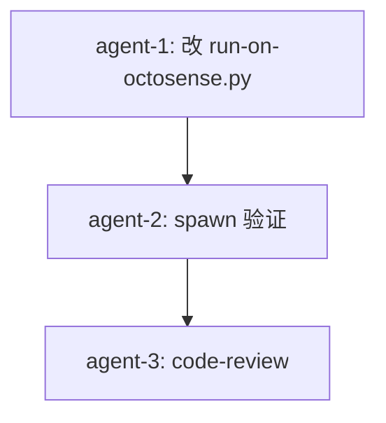

# B 路径子 TODO — finance-brief.exe spawn 端口冲突修复

日期: 2026-10-05
工作目录: `C:\Code\OctoSenseorg\`
finance-brief HEAD: `cca8cef`
OctoSense HEAD: `127ae4b`
DSL: 无 octoscript；本任务改 Python 脚本 + 验证

## 父 TODO

`.todo-b-path-spawn-finance-brief-2026-10-05.md`（B 路径：spawn 独立 .exe 模式）

## 当前阻塞（handoff spawn 2026-10-05）

finance-brief.exe 启动后**立即退出**（exit code 0），独立窗口从未出现：

```
[ERROR] [makepad-remote] bind 127.0.0.1:57450 failed:
        通常每个套接字地址(协议/网络地址/端口)只允许使用一次。 (os error 10048)
[INFO] octosense: 财经简报 exited before opening a window (exit code: 0).
```

## 根因（已核实，证据链）

1. **`OctoSense/crates/shell/src/sandbox/mod.rs:382-386`** — `scrub_env` 过滤 env 时**保留** `MAKEPAD_` 前缀变量
   ```rust
   const PREFIXES: &[&str] = &["LC_", "XDG_", "MAKEPAD_", "STUDIO_", ...];
   ```

2. **`OctoSense/crates/shell/src/clients.rs:1427`** — `spawn_client` 在构造 command 后调用 `scrub_env`，子进程 env 仍含 `MAKEPAD_REMOTE` / `MAKEPAD_HIDE_WINDOWS`

3. **`makepad/platform/src/remote.rs:438-453`** — 任何 makepad 进程扫 `MAKEPAD_REMOTE` env，发现 `57450` → bind `127.0.0.1:57450`

4. **`finance-brief/scripts/run-on-octosense.py:78`** — 当前 spawn octosense.exe 时 `env["MAKEPAD_REMOTE"] = str(port)`；env 透传给 octosense bind 57450 成功；octosense 再透传给 finance-brief.exe → finance-brief.exe 再 bind 57450 → port 10048

## 决策

| # | 问题 | 决策 |
|---|------|------|
| Q1 | 修复方案 | **A**：仅改 `run-on-octosense.py`，spawn octosense.exe 前 pop `MAKEPAD_REMOTE` / `MAKEPAD_HIDE_WINDOWS`，改用 argv `--remote <port>` / `--hide-windows` 传给 octosense。octosense 接受 argv 后自己 bind；subprocess child env 不再有 `MAKEPAD_REMOTE` → finance-brief.exe 不抢端口 |

## 改动 1: `finance-brief/scripts/run-on-octosense.py` 改 env 传递方式

- 位置: `finance-brief/scripts/run-on-octosense.py` 第 70-90 行
- 当前:
  ```python
  env = os.environ.copy()
  env["OCTOSENSE_HOME"] = str(runtime_home)
  env.pop("MAKEOS_HOME", None)
  env["MAKEPAD_HIDE_WINDOWS"] = "1"
  env["MAKEPAD_REMOTE"] = str(port)
  env["RUSTUP_TOOLCHAIN"] = "stable-x86_64-pc-windows-msvc"
  ...
  proc = subprocess.Popen(
      [str(shell_bin), "--apps", str(catalog)],
      cwd=str(workspace / "OctoSense"),
      env=env,
      creationflags=subprocess.CREATE_NO_WINDOW,
  )
  ```
- 新:
  ```python
  env = os.environ.copy()
  # Per finance-brief policy, every file lives under C:\Code\OctoSenseorg\.
  # OCTOSENSE_HOME redirects shell runtime data (approvals/, apps/, secrets/,
  # wm/) here; see OctoSense/desktop/README.md "OCTOSENSE_HOME override".
  env["OCTOSENSE_HOME"] = str(runtime_home)
  env.pop("MAKEOS_HOME", None)
  env["RUSTUP_TOOLCHAIN"] = "stable-x86_64-pc-windows-msvc"
  # MAKPAD_REMOTE / MAKEPAD_HIDE_WINDOWS MUST NOT be inherited by subprocess
  # children: OctoSense shell's spawn_client (clients.rs:1427 scrub_env)
  # preserves MAKEPAD_* prefixed env vars, so finance-brief.exe launched
  # from the launcher drawer would itself try to bind MAKEPAD_REMOTE's port
  # and collide with the shell — see os error 10048. Pass them via argv
  # instead so they reach only the shell process; children inherit a clean
  # env. See makepad/platform/src/remote.rs:413-426 (--remote accepts PORT).
  env.pop("MAKEPAD_REMOTE", None)
  env.pop("MAKEPAD_HIDE_WINDOWS", None)
  print(f"launching: {shell_bin}")
  print(f"  --apps {catalog}")
  print(f"  --remote {port} --hide-windows")
  print(f"  OCTOSENSE_HOME={runtime_home}")
  proc = subprocess.Popen(
      [str(shell_bin), "--apps", str(catalog),
       "--remote", str(port), "--hide-windows"],
      cwd=str(workspace / "OctoSense"),
      env=env,
      creationflags=subprocess.CREATE_NO_WINDOW,
  )
  ```
- 理由:
  - 父进程 env 清掉 `MAKEPAD_REMOTE` → spawn 子进程 fork 时不复制此 env → finance-brief.exe 启动时 env 无 MAKEPAD_REMOTE → bind 冲突从源头消失
  - octosense.exe 接受 `--remote <port>` argv 是 key 等价的（见 `remote.rs:413-426`）
  - **风险点**：octosense CLI 是否接受 `--hide-windows`？需要 verify。如果不接受，保留 `MAKEPAD_HIDE_WINDOWS` 在 env 中（因为 octosense 自己用即可，不会传给子进程 — **实际上 scrub_env 会传 MAKEPAD_* 给子进程**！所以**必须** pop）

  - 修正：risk analysis（必须 pop 两者），不能消除掉

## 改动 2: 验证脚本

- 步骤:
  1. `cd C:/Code/OctoSenseorg/finance-brief && python scripts/run-on-octosense.py --no-wait`
  2. 等 10s
  3. `curl -s http://127.0.0.1:57450/s | head -5` 确认 shell HTTP 200
  4. `curl -s "http://127.0.0.1:57450/k?key=Escape&modifiers=Ctrl"` 打开 launcher 抽屉
  5. `curl -s "http://127.0.0.1:57450/snap?all=1" | grep -o "财经简报\|finance_brief"` 确认 tile 出现
  6. 从 snap 找 finance_brief tile 的 x/y 坐标
  7. `curl -s "http://127.0.0.1:57450/click?x=<x>&y=<y>"` 点击
  8. 等 5s
  9. `tasklist /FI "IMAGENAME eq finance-brief.exe"` 确认独立进程存活
  10. `cat .octosense/logs/*.log 2>/dev/null | grep -E "finance-brief|spawn|launched|exited"` 检查无 bind 错误
  11. `netstat -ano | findstr ":57450"` 应该只看到 octosense.exe 一个进程持有

- 验收:
  - `tasklist` 看到 finance-brief.exe 独立进程
  - log 中无 `[makepad-remote] bind ... failed` 错误
  - log 中无 `exited before opening a window`
  - finance-brief.exe 占用的端口（应该 bind ephemeral 0 或一个不同于 57450 的端口）不与 octosense 冲突

## 硬约束（finance-brief-skill）

- [x] 不修改 `OctoSense/crates/` `Octoscript-Makepad/crates/` `makepad/` 下任何 Rust 源码
- [x] 不修改 `OctoSense/desktop/system-apps.json` / `OctoSense/AGENTS.md`
- [x] 不写 `.ps1` / `.sh` 脚本（仅 Python）
- [x] 不在 `C:\Code\OctoSenseorg\` 外放任何文件
- [x] 不 `git commit` / `git push` / `git add -A`
- [x] 不 `cargo build` / `cargo test`
- [x] 不跑 `find /` 全盘扫
- [x] 不动 `finance-brief/.octosense/apps/.system/os.finance-brief/` 残留（用户自己删）

## 不做的事

- [ ] 改 finance-brief 项目本体（native/ apps/desktop/）
- [ ] 改 OctoSense shell spawn_client（dep 库）
- [ ] 改 makepad remote.rs（dep 库）
- [ ] 删 finance-brief/.octosense/apps/.system/os.finance-brief/ 残留

## 子任务分派（编排结果）

- [agent-1, parallel] **改动 1**：改 `run-on-octosense.py` 第 70-90 行
- [agent-2, serial-after-1] **改动 2**：spawn 验证 + click tile + 检查 finance-brief.exe 独立进程 + log 无 bind 错误
- [agent-3, serial-after-2] **code-review**：review agent-1 改动 + agent-2 验证报告

## 编排图



## 验收清单

- [ ] `finance-brief/scripts/run-on-octosense.py` 第 70-90 行按本 TODO 改动
- [ ] `python scripts/run-on-octosense.py --no-wait` 启动后 `/s` 200
- [ ] launcher 抽屉含 `财经简报` tile
- [ ] click tile 后 `tasklist` 看到 finance-brief.exe 独立进程（不是 in-process card mount）
- [ ] log 无 `bind 127.0.0.1:57450 failed` / `exited before opening a window` 错误
- [ ] code-review 通过