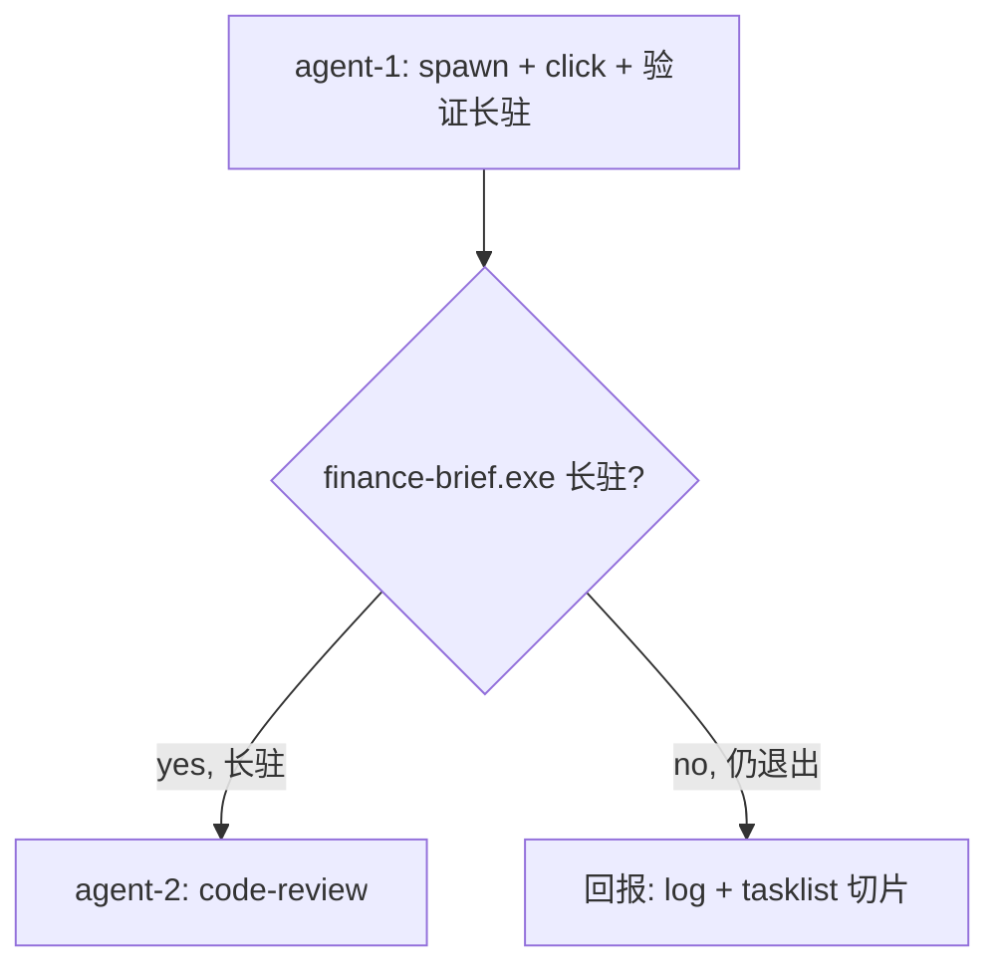

# B 路径 spawn 验证重跑 TODO

日期: 2026-10-06
工作目录: `C:\Code\OctoSenseorg\finance-brief\`
finance-brief HEAD: `cca8cef`
OctoSense HEAD: `127ae4b`
DSL: 无 octoscript；本任务重跑验证 spawn

## 父 TODO

- `.todo-b-path-spawn-finance-brief-2026-10-05.md`（B 路径主 TODO）
- `.todo-b-spawn-port-conflict-2026-10-05.md`（port 冲突已修复 + 验证发现 spawn 后仍立即退出）
- `.todo-b1-cargo-toml-git-link-2026-10-05.md`（B1 已完成 — finance-brief.exe 20.59 MB 用新 git rev 重编译）
- `.todo-direct-launch-finance-brief-exe-2026-10-06.md`（直接启动已验证 finance-brief.exe 长驻 + 弹窗）

## 目标

重跑 B 路径 spawn 全链路验证：
1. spawn OctoSense shell（`run-on-octosense.py` 已修复 env 透传）
2. launcher 抽屉含 `财经简报` tile
3. click tile → spawn `finance-brief.exe`（**期望**：进程**长驻**，**不**立即退出）
4. log 无 `bind 127.0.0.1:57450 failed` / `exited before opening a window` 错误
5. finance-brief.exe 进程在 click 后**持续存活**（不是 8s 后就没）

## 改动 1: spawn shell + 验证 launcher tile

### 步骤
```bash
cd C:/Code/OctoSenseorg/finance-brief
python scripts/run-on-octosense.py --no-wait
```
等 10s

```bash
curl -s http://127.0.0.1:57450/s | head -5
curl -s "http://127.0.0.1:57450/k?key=Escape&modifiers=Ctrl"  # 打开 launcher 抽屉
curl -s "http://127.0.0.1:57450/snap?all=1" > /tmp/snap.json
grep -oE "财经简报|finance_brief" /tmp/snap.json | head
```

从 `/tmp/snap.json` 找 finance_brief tile 的 (x, y) 坐标：
```bash
python3 -c "
import json
with open('/tmp/snap.json') as f: d = json.load(f)
print(json.dumps(d, ensure_ascii=False, indent=2)[:3000])
"
```
（找包含 `财经简报` 或 `finance_brief` label 的 widget 的 rect 中心点）

### 验收
- [ ] `/s` 200
- [ ] launcher 抽屉含 `财经简报` tile
- [ ] 找到 tile 中心 (x, y)

## 改动 2: click tile + 验证 spawn

### 步骤
```bash
curl -s "http://127.0.0.1:57450/click?x=<x>&y=<y>"
```

等 5s 后立刻 tasklist：
```bash
tasklist /FI "IMAGENAME eq finance-brief.exe" /FO CSV
```

等 8s 后**第二次** tasklist（确认持续存活）：
```bash
sleep 8
tasklist /FI "IMAGENAME eq finance-brief.exe" /FO CSV
```

检查 window：
```bash
powershell -NoProfile -Command "Get-Process finance-brief -ErrorAction SilentlyContinue | Select-Object Id,ProcessName,MainWindowTitle,MainWindowHandle,StartTime | Format-List"
```

检查 OctoSense shell log（看 spawn 链路）：
```bash
cat C:/Code/OctoSenseorg/finance-brief/.octosense/logs/clients/*.log 2>/dev/null | tail -50
```

### 验收
- [ ] click 后 5s：`tasklist` 看到 finance-brief.exe 进程
- [ ] click 后 13s（5+8）：`tasklist` **仍**看到 finance-brief.exe 进程（**关键**：长驻验证）
- [ ] `MainWindowTitle` 非空（窗口已弹）
- [ ] log 含 `launched finance_brief as client N` 或 `finance-brief MOUNT ... view_set=true`
- [ ] log 无 `[ERROR] bind 127.0.0.1:57450 failed`（port 冲突修复生效）
- [ ] log 无 `exited before opening a window`（进程不再立即退出）
- [ ] log 含 D3D11/DXGI adapter init 行（窗口真弹了）
- [ ] log 含 thread pool 周期 log（主循环在跑）

### 期望（成功）
所有验收项 ✅

### 期望（仍失败 — 兜底）
- 若 finance-brief.exe 仍在 5s 后消失 → log 末尾捕获
- 若仍有 bind 错误 → run-on-octosense.py 修复可能没生效，要复查

## 收尾（无论成功失败）

```bash
taskkill /IM finance-brief.exe /F 2>/dev/null
taskkill /IM octosense.exe /F 2>/dev/null
echo "cleanup done"
```

## 硬约束（finance-brief-skill）

- [x] 不修改任何代码
- [x] 不 git commit / push / add -A
- [x] 不 cargo build / test
- [x] 不在 `C:\Code\OctoSenseorg\` 外放文件
- [x] 不跑 `find /` 全盘扫
- [x] 不写 `.ps1` / `.sh` 脚本（仅 Python / curl）

## 子任务分派

- [agent-1, parallel] **改动 1+2**：spawn shell + 验证 tile + click + 验证 spawn 长驻 + 抓 log + cleanup
- [agent-2, serial-after-1] **code-review**：review agent-1 报告 + log 切片

## 编排图



## 验收清单

- [ ] shell `/s` 200
- [ ] launcher 含 `财经简报` tile
- [ ] click tile 后 finance-brief.exe spawn 成功
- [ ] **关键**：finance-brief.exe 持续存活 ≥ 13 秒
- [ ] window 已弹（MainWindowTitle 非空）
- [ ] log 无 port 10048 / `exited before opening a window` 错误
- [ ] log 含 D3D11 init + thread pool 周期 log
- [ ] agent-2 code-review 通过