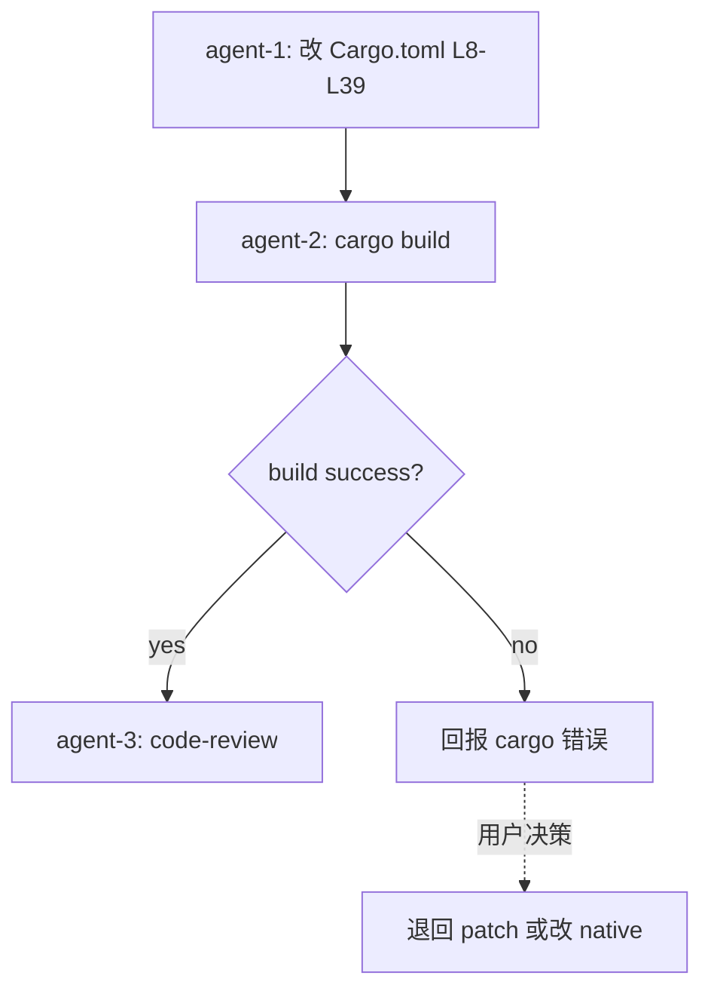

# B1 路径 TODO — finance-brief Cargo.toml 改 git 链接 + 删除 [patch] 段

日期: 2026-10-05
工作目录: `C:\Code\OctoSenseorg\finance-brief\`
finance-brief HEAD: `cca8cef`
DSL: 无 octoscript；本任务改 Cargo.toml + cargo build 验证

## 决策（Q1 已答）

| # | 问题 | 决策 |
|---|------|------|
| Q1 | Cargo.toml 改造方案 | **B1**：4 个 path 改 git 链接（注释保留原 path 形式）；删除全部 `[patch]` 段（注释保留）；3 个 git rev 升级到 origin 上存在且与 OctoSense workspace 一致：`makepad = c155f61d`、`Octoscript-Makepad = 2cc5ef37`、`Octoscript = 5991dfae` |

## 改动 1: 替换 `[dependencies]` 段 — path → git 链接

- 位置: `C:\Code\OctoSenseorg\finance-brief\apps\desktop\Cargo.toml` 第 12-21 行
- 当前（13-22 行）：
  ```toml
  makepad-widgets = { git = "https://github.com/OctoSense-org/makepad.git", rev = "975c5630e01b0f3f3ae16cafd2e0fce3c9a5f7d9" }
  octoscript-widgets = { path = "../../../Octoscript-Makepad/crates/octoscript-widgets" }
  octoscript-render = { path = "../../../Octoscript-Makepad/crates/octoscript-render" }
  octoscript-makepad = { path = "../../../Octoscript-Makepad/crates/octoscript-makepad" }
  makepad-plot = { path = "../../../Octoscript-Makepad/crates/makepad-plot" }
  octoscript-ui-l0 = { git = "https://github.com/OctoSense-org/Octoscript.git", rev = "68f6a9df55692b5d8ef8873a12721e279a3f40d6" }
  ```
- 新：
  ```toml
  # All external dependencies are now git links (no local path); the revs
  # MUST match OctoSense/Cargo.toml [workspace.dependencies] so the makepad
  # and Octoscript VMs unify across both workspaces — the desktop app
  # previously failed compile with mismatched revs (`makepad_widgets::ScriptVm`
  # and `octoscript_render`'s re-exported `makepad_script::ScriptVm` would
  # be distinct types). See OctoSense/AGENTS.md §2 "One revision per
  # external dependency". To match OctoSense: makepad c155f61d, Octoscript
  # 5991dfae, Octoscript-Makepad 2cc5ef37.
  makepad-widgets    = { git = "https://github.com/OctoSense-org/makepad.git",            rev = "c155f61d0e1600d2ec474209374444a38a09a470" }
  octoscript-widgets = { git = "https://github.com/OctoSense-org/Octoscript-Makepad.git", rev = "2cc5ef37d7d6a3d2992673389ce74488f7bb2d87" }
  octoscript-render  = { git = "https://github.com/OctoSense-org/Octoscript-Makepad.git", rev = "2cc5ef37d7d6a3d2992673389ce74488f7bb2d87" }
  octoscript-makepad = { git = "https://github.com/OctoSense-org/Octoscript-Makepad.git", rev = "2cc5ef37d7d6a3d2992673389ce74488f7bb2d87" }
  makepad-plot       = { git = "https://github.com/OctoSense-org/Octoscript-Makepad.git", rev = "2cc5ef37d7d6a3d2992673389ce74488f7bb2d87" }
  octoscript-ui-l0   = { git = "https://github.com/OctoSense-org/Octoscript.git",        rev = "5991dfae9344589e732b2605b530f788e8bbcd11" }
  # Original local-path references retained as comments for fall-back / history:
  # octoscript-widgets = { path = "../../../Octoscript-Makepad/crates/octoscript-widgets" }
  # octoscript-render  = { path = "../../../Octoscript-Makepad/crates/octoscript-render" }
  # octoscript-makepad = { path = "../../../Octoscript-Makepad/crates/octoscript-makepad" }
  # makepad-plot       = { path = "../../../Octoscript-Makepad/crates/makepad-plot" }
  ```

## 改动 2: 替换 `[patch]` 段 — 整段注释保留

- 位置: `apps/desktop/Cargo.toml` 第 30-39 行
- 当前：
  ```toml
  [patch."https://github.com/OctoSense-org/makepad.git"]
  makepad-widgets = { path = "../../../makepad/widgets" }
  makepad-script = { path = "../../../makepad/platform/script" }

  [patch."https://github.com/OctoSense-org/Octoscript.git"]
  octoscript-ui-l0 = { path = "../../../octoscript/crates/octoscript-ui-l0" }
  ```
- 新：
  ```toml
  # [patch] segments removed: with git links above the rev points at origin
  # directly. Original [patch] blocks retained as comments for fall-back.
  # The local checkout C:\Code\OctoSenseorg\Octoscript-Makepad\ is no longer
  # consulted by cargo — any framework edit must land on origin first.
  #
  # [patch."https://github.com/OctoSense-org/makepad.git"]
  # makepad-widgets = { path = "../../../makepad/widgets" }
  # makepad-script  = { path = "../../../makepad/platform/script" }
  #
  # [patch."https://github.com/OctoSense-org/Octoscript.git"]
  # octoscript-ui-l0 = { path = "../../../octoscript/crates/octoscript-ui-l0" }
  ```

## 改动 3: 更新顶部注释（"MUST match Octoscript-Makepad" → "MUST match OctoSense"）

- 位置: `apps/desktop/Cargo.toml` 第 8-12 行
- 当前：
  ```toml
  # finance-brief lives outside the Octoscript-Makepad workspace, so we declare
  # the makepad and octoscript deps explicitly rather than via `workspace = true`
  # (which only resolves inside the workspace at apps/flutter-samples). The
  # revs MUST match Octoscript-Makepad/Cargo.toml's [workspace.dependencies]
  # or `makepad_widgets::ScriptVm` (rev 975c5630) and `octoscript_render`'s
  # re-exported `makepad_script::ScriptVm` will be distinct types and won't
  # unify — the desktop app already failed compile with that mismatch.
  ```
- 新：
  ```toml
  # finance-brief lives outside both OctoSense and Octoscript-Makepad
  # workspaces, so we declare the makepad and octoscript deps explicitly
  # rather than via `workspace = true`. The revs MUST match
  # OctoSense/Cargo.toml's [workspace.dependencies] or `makepad_widgets::ScriptVm`
  # and `octoscript_render`'s re-exported `makepad_script::ScriptVm` will
  # be distinct types and won't unify — the desktop app previously failed
  # compile with that mismatch. To match OctoSense: makepad c155f61d,
  # Octoscript 5991dfae, Octoscript-Makepad 2cc5ef37.
  ```

## 改动 4: cargo build 验证

- 步骤:
  1. `cd C:/Code/OctoSenseorg/finance-brief/apps/desktop`
  2. `cargo build --release 2>&1 | tee C:/Code/OctoSenseorg/finance-brief/.octosense/logs/cargo-b1-build.log`
  3. 等 5-30 min（首次从 origin 拉 3 个 repo 到 `~/.cargo/git/db/`，需联网）
  4. 检查 exit code 0
  5. `ls -la C:/Code/OctoSenseorg/finance-brief/apps/desktop/target/release/finance-brief.exe` 确认存在
  6. 若失败：捕获 stderr 末尾 100 行 + Cargo.toml 当前内容回报

- 验收:
  - build exit code 0
  - finance-brief.exe 存在
  - log 无 `E0432` (type mismatch) / `error[E0xxx]` 致命错误
  - log 无 `failed to load source` / `failed to resolve` / `commit not found`

## 硬约束（finance-brief-skill）

- [x] 不修改 `OctoSense/` `Octoscript-Makepad/` `makepad/` `Octoscript/` `OctoSense-App-Hub/` 下任何 Rust 源码
- [x] 不修改 `OctoSense/Cargo.toml`
- [x] 不修改 `Octoscript-Makepad/Cargo.toml`
- [x] 不修改 `finance-brief/Cargo.toml` 根目录
- [x] 不修改 `finance-brief/native/Cargo.toml`
- [x] 不修改 `finance-brief/bundle/` 任何文件
- [x] 不写 `.ps1` / `.sh` 脚本
- [x] 不在 `C:\Code\OctoSenseorg\` 外放任何文件（注意：`~/.cargo/` 不在 `C:\Code\OctoSenseorg\` 下，但这是 cargo 默认 registry 路径，不可避免；明确接受）
- [x] 不 `git commit` / `git push` / `git add -A`
- [x] 不 `cargo clean`
- [x] 不 `cargo test` / `cargo install` / `cargo publish`
- [x] 不跑 `find /` 全盘扫
- [x] 不动 `finance-brief/.octosense/apps/.system/os.finance-brief/` 残留

## 不做的事

- [ ] 不 push 任何 commit 到 `OctoSense-org/{makepad,Octoscript,Octoscript-Makepad}` origin
- [ ] 不 fork makepad
- [ ] 不修改 finance-brief native/ 或 src/ 下的 Rust 代码（如 API 变化导致 build 失败，回报即可，不要擅自动 native/）

## 子任务分派（编排结果）

- [agent-1, parallel] **改动 1+2+3**：改 `apps/desktop/Cargo.toml` 第 8-39 行
- [agent-2, serial-after-1] **改动 4**：`cargo build --release` 验证
- [agent-3, serial-after-2] **code-review**：review agent-1 改动 + agent-2 build 报告

## 编排图



## 验收清单

- [ ] `apps/desktop/Cargo.toml` 第 8-39 行按本 TODO 改动
- [ ] 6 个 git 链接全部 rev 与 OctoSense Cargo.toml 一致
- [ ] 无活跃 path 形式（仅注释保留）
- [ ] 无活跃 [patch] 段（仅注释保留）
- [ ] cargo build --release 成功（exit 0）
- [ ] finance-brief.exe 生成（target/release/finance-brief.exe）
- [ ] log 无 E0xxx 致命错误
- [ ] code-review 通过