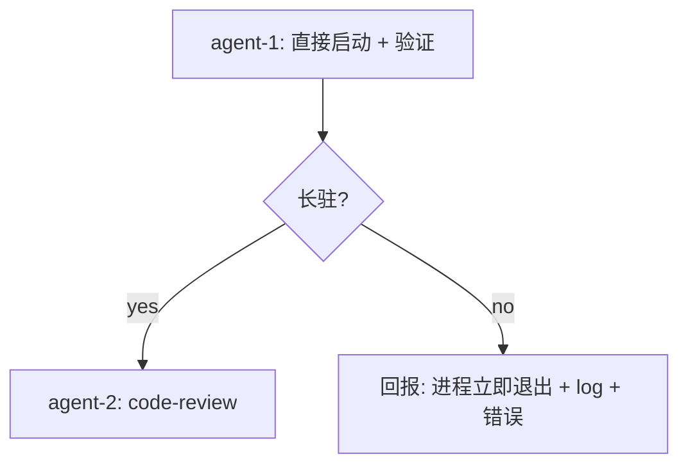

# finance-brief.exe 直接启动验证 TODO

日期: 2026-10-06
工作目录: `C:\Code\OctoSenseorg\finance-brief\`
finance-brief HEAD: `cca8cef`
DSL: 无 octoscript；本任务改测试启动 + 看 log

## 父 TODO

- `.todo-b1-cargo-toml-git-link-2026-10-05.md`（B1 已完成；finance-brief.exe 20.59 MB 已生成）
- `.todo-b-spawn-port-conflict-2026-10-05.md`（port 冲突修复已生效；但 spawn 后仍立即退出，未查清）

## 目标

直接启动 `apps/desktop/target/release/finance-brief.exe`（不带 shell spawn，无 env 干扰），验证：
1. 进程是否长驻（不立即退出）
2. 是否弹窗（Windows tasklist 看到 main window）
3. log 中 `finance-brief MOUNT` 是否包含 `view_set=true` 且有后续 redraw/walk 输出

## 上下文

`apps/desktop/src/main.rs` 只调 `finance_brief_desktop::app_main()`（用 `app_main!(App)` 宏注册 App struct）。`App::handle_event` 在 `Event::Startup` 时调 `mount()`，mount log 形如：

```
finance-brief MOUNT route=launcher src_len=NNNN built=true eval_ok=true view_set=true
```

之前 agent-2 验证（通过 OctoSense shell spawn）发现：
- MOUNT log 出现且 view_set=true
- 但进程**立即退出**，无后续 log
- 当时环境：被 shell 启动，env 含 `MAKEPAD_REMOTE` 等（已被修复 pop）

新编译的 finance-brief.exe 是否在**干净 env 下**长驻？是本任务要验的核心。

## 改动 1: 直接启动 finance-brief.exe（无 shell 干扰）

### 步骤
```bash
# 1) 清干净 env
env -i \
  PATH="$PATH" \
  USERPROFILE="$USERPROFILE" \
  SYSTEMROOT="$SYSTEMROOT" \
  LANG="$LANG" \
  /usr/bin/env python3 -c "
import subprocess, time, sys
from pathlib import Path
exe = Path(r'C:/Code/OctoSenseorg/finance-brief/apps/desktop/target/release/finance-brief.exe')
log = Path(r'C:/Code/OctoSenseorg/finance-brief/.octosense/logs/finance-brief-direct.log')
with log.open('wb') as f:
    proc = subprocess.Popen(
        [str(exe)],
        stdout=f, stderr=subprocess.STDOUT,
        creationflags=0x08000000,  # CREATE_NO_WINDOW
    )
print(f'spawned pid={proc.pid}')
time.sleep(8)
poll = proc.poll()
print(f'after 8s: poll={poll}')
if poll is None:
    proc.terminate()
    proc.wait(timeout=3)
    print(f'terminated; final code={proc.returncode}')
else:
    print(f'process exited early with code {poll}')
"

# 2) 任务列表
tasklist /FI "IMAGENAME eq finance-brief.exe" /FO CSV

# 3) 窗口列表（PowerShell，需 .NET）
powershell -NoProfile -Command "Get-Process finance-brief -ErrorAction SilentlyContinue | Select-Object Id,ProcessName,MainWindowTitle,MainWindowHandle,StartTime | Format-List"

# 4) 日志
cat C:/Code/OctoSenseorg/finance-brief/.octosense/logs/finance-brief-direct.log
```

### 验收
- [ ] 进程在 spawn 8 秒后**仍存活**（poll=None）
- [ ] `tasklist` 看到 finance-brief.exe 进程
- [ ] `MainWindowTitle` 非空（即有窗口）
- [ ] log 末尾出现至少 2 条 `finance-brief MOUNT`（一次 Startup + 一次 WindowGeomChange 触发）
- [ ] log 无 `[ERROR] bind 127.0.0.1:57450 failed`（直接启动不会有 MAKEPAD_REMOTE）
- [ ] log 无 `exited before opening a window`
- [ ] log 无 panic / FATAL

### 若失败（进程立即退出 / log 含错误）
- 捕获完整 log 输出
- `tasklist` 输出
- 不要重试

## 硬约束（finance-brief-skill）

- [x] 不修改任何 Rust 源码
- [x] 不修改 Cargo.toml / Cargo.lock
- [x] 不写 .ps1 / .sh 脚本（仅 Python）
- [x] 不在 `C:\Code\OctoSenseorg\` 外放文件
- [x] 不 `git commit` / `git push` / `git add -A`
- [x] 不 `cargo build` / `cargo test`
- [x] 不跑 `find /` 全盘扫

## 不做的事

- [ ] 不修改 finance-brief native/src/main.rs / src/lib.rs / src/app.rs（如启动失败，仅报告，不擅自动源码）
- [ ] 不 spawn OctoSense shell（不重跑 B 路径 spawn 测试；那是另一个 TODO 的事）

## 子任务分派

- [agent-1, parallel] **改动 1**：直接启动 finance-brief.exe + 8s 等待 + tasklist + window 查询 + log 捕获
- [agent-2, serial-after-1] **code-review**：review agent-1 报告 + log + window title

## 编排图



## 验收清单

- [ ] agent-1 完整执行改动 1
- [ ] 进程存活 OR 立即退出原因明确（log + tasklist）
- [ ] log 含 `finance-brief MOUNT` 行且带 `view_set=true`
- [ ] agent-2 code-review 通过（若长驻）OR 给出失败诊断（若退出）
