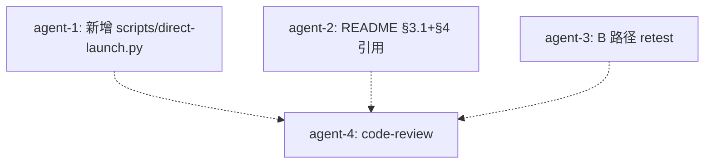

# finance-brief scripts/direct-launch.py + README 简短引用 + B 路径 retest TODO

日期: 2026-10-06
工作目录: `C:\Code\OctoSenseorg\finance-brief\`
finance-brief HEAD: `cca8cef`
DSL: 无 octoscript；本任务新增脚本 + README 简短引用 + 跑 B 路径 retest

## 父 TODO

- `.todo-readme-direct-launch-and-b-retest-2026-10-06.md`（上一版 TODO 误把 Python 写进 README；本版本纠正）
- `.todo-direct-launch-finance-brief-exe-2026-10-06.md`（已验证 finance-brief.exe 直启长驻）

## 决策（Q1 已答）

| # | 问题 | 决策 |
|---|------|------|
| Q1 | "README 写个启动示例"如何实现 | **正解**：把 Python 启动逻辑放到 `finance-brief/scripts/direct-launch.py`（**真实可用的脚本**，不是 README 文档化），README §3.1 之后只加 1-3 行引用 + 在 §4 脚本表加一行；不重复 Python 代码 |
| Q2 | 脚本位置 | `C:\Code\OctoSenseorg\finance-brief\scripts\direct-launch.py`（与其它 .py 脚本同目录）|
| Q3 | 脚本接口 | `python scripts/direct-launch.py [--exe PATH] [--wait SECS] [--no-wait]`；默认 exe = `apps/desktop/target/release/finance-brief.exe`，默认 wait = 8 |
| Q4 | README §3 改法 | §3.1 之后加 3 行说明 + 引用脚本命令；§4 脚本表加 direct-launch.py 行 |

## 改动 1: 新增 `scripts/direct-launch.py`

- 位置: `C:\Code\OctoSenseorg\finance-brief\scripts\direct-launch.py`
- 动作: **新增**（不是修改）
- 内容:

```python
#!/usr/bin/env python3
"""direct-launch.py — start finance-brief.exe with a clean env, verify it stays alive.

Bypasses `cargo run` (which forces a 5-15 min rebuild) and OctoSense shell's
spawn_client (which inherits MAKEPAD_REMOTE into the child env and triggers
makepad's remote bridge bind → os error 10048 with the shell on port 57450).
Spawns the .exe directly via subprocess.Popen with a minimal env, waits N
seconds, and reports whether the process is still alive.

Usage:
    python scripts/direct-launch.py                    # 8s wait, default exe
    python scripts/direct-launch.py --wait 3           # 3s wait
    python scripts/direct-launch.py --exe /path/x.exe  # override path
    python scripts/direct-launch.py --no-wait          # spawn + return immediately
"""
import argparse
import os
import subprocess
import sys
import time
from pathlib import Path

DEFAULT_EXE = Path(__file__).resolve().parent.parent / "apps" / "desktop" / "target" / "release" / "finance-brief.exe"
DEFAULT_WAIT = 8
LOG_PATH = Path(__file__).resolve().parent.parent / ".octosense" / "logs" / "finance-brief-direct.log"

# CREATE_NO_WINDOW on Windows; 0 on POSIX (signal default).
if sys.platform.startswith("win"):
    CREATE_NO_WINDOW = 0x08000000
else:
    CREATE_NO_WINDOW = 0


def parse_args():
    p = argparse.ArgumentParser(
        prog="direct-launch.py",
        description="Start finance-brief.exe with clean env and verify it stays alive.",
    )
    p.add_argument("--exe", type=Path, default=DEFAULT_EXE,
                   help=f"path to finance-brief.exe (default: {DEFAULT_EXE})")
    p.add_argument("--wait", type=int, default=DEFAULT_WAIT,
                   help=f"seconds to wait before checking survival (default {DEFAULT_WAIT})")
    p.add_argument("--no-wait", action="store_true",
                   help="spawn and return immediately, do not check survival")
    p.add_argument("--keep-running", action="store_true",
                   help="do not terminate the process at the end (default: terminate after --wait)")
    return p.parse_args()


def build_clean_env() -> dict:
    """env with only the keys makepad needs at startup; intentionally omit
    MAKEPAD_REMOTE / MAKEPAD_HIDE_WINDOWS / STUDIO_HOST / OCTOSENSE_HOME so
    the spawned finance-brief.exe does NOT bind the remote bridge (which
    would collide with the shell if it is also running)."""
    return {
        "PATH":        os.environ.get("PATH", ""),
        "USERPROFILE": os.environ.get("USERPROFILE", ""),
        "SYSTEMROOT":  os.environ.get("SYSTEMROOT", r"C:\Windows"),
        "LANG":        os.environ.get("LANG", "en_US.UTF-8"),
        "TEMP":        os.environ.get("TEMP", ""),
        "TMP":         os.environ.get("TMP", ""),
    }


def main() -> int:
    args = parse_args()
    exe = args.exe
    if not exe.is_file():
        print(f"missing exe: {exe}", file=sys.stderr)
        print("hint: run `python scripts/install-as-makepad-app.py` first to build it", file=sys.stderr)
        return 2

    log_path = LOG_PATH
    log_path.parent.mkdir(parents=True, exist_ok=True)

    env = build_clean_env()
    print(f"launching: {exe}")
    print(f"  log: {log_path}")
    print(f"  env keys: {list(env.keys())} (MAKEPAD_REMOTE not propagated)")
    print(f"  wait: {args.wait}s")

    with log_path.open("wb") as logf:
        proc = subprocess.Popen(
            [str(exe)],
            stdout=logf,
            stderr=subprocess.STDOUT,
            env=env,
            creationflags=CREATE_NO_WINDOW,
            cwd=str(exe.parent),
        )

    print(f"spawned pid={proc.pid}")

    if args.no_wait:
        print("returning immediately (--no-wait); process runs detached")
        return 0

    time.sleep(args.wait)
    poll = proc.poll()
    if poll is None:
        alive = True
        print(f"alive after {args.wait}s: True  (main loop running, window likely visible)")
        if not args.keep_running:
            proc.terminate()
            try:
                proc.wait(timeout=3)
            except subprocess.TimeoutExpired:
                proc.kill()
                proc.wait()
            print(f"terminated; final code {proc.returncode}")
    else:
        alive = False
        print(f"alive after {args.wait}s: False (exited with code {poll})")
        print(f"check log: {log_path}")

    return 0 if alive else 1


if __name__ == "__main__":
    sys.exit(main())
```

- 理由: 把"如何启动 + 验证存活"的命令固化成一个真实可用的脚本；用户和后续 agent 可以 `python scripts/direct-launch.py` 直接跑；脚本风格与现有 `drive-test.py` / `verify.py` 一致（argparse + stdlib only）。

## 改动 2: README.md §3.1 之后加简短引用

- 位置: `C:\Code\OctoSenseorg\finance-brief\README.md` §3.1 末尾代码围栏之后、§3.2 标题之前
- 动作: **插入**（不是替换）
- 内容（verbatim，紧跟 §3.1 围栏闭合后）:

````markdown
或者跳过 cargo 直接启动已编译的 `.exe`，最快验证窗口与 main loop 是否正常（详见 [scripts/direct-launch.py](scripts/direct-launch.py)）：

```sh
python scripts/direct-launch.py          # 等 8s 后检查存活（默认）
python scripts/direct-launch.py --wait 3 # 等 3s
python scripts/direct-launch.py --no-wait # 启动后立即返回
```

干净 env（脚本内部 `build_clean_env()`）：仅 `PATH/USERPROFILE/SYSTEMROOT/LANG/TEMP/TMP`，不传 `MAKEPAD_REMOTE` / `MAKEPAD_HIDE_WINDOWS` / `STUDIO_HOST` / `OCTOSENSE_HOME`。理由：makepad-platform 的 `remote.rs:438` 看到 `MAKEPAD_REMOTE` env 就自己 bind 端口，在 OctoSense shell 启动下会和 shell 抢 57450（os error 10048）；直启不要这个 env 即可绕开。stdout/stderr 抓 `finance-brief/.octosense/logs/finance-brief-direct.log`。

````

- 理由: README 不重复 Python 代码，只引用脚本 + 给一行解释。

## 改动 3: README.md §4 脚本表加一行

- 位置: `README.md` §4 脚本表（§4 现有表格）
- 动作: **插入** 一行
- 内容: 在 `migrate-octosense-home.py` 行之后加一行 `| direct-launch.py | ... |`
- 新行: `| \`direct-launch.py\` | 跳过 cargo，直接启动 `apps/desktop/target/release/finance-brief.exe`（干净 env），验证窗口与 main loop 是否正常。stdout/stderr 写到 `finance-brief/.octosense/logs/finance-brief-direct.log`。 |`

## 改动 4: B 路径 spawn retest

执行 `.todo-b-spawn-retest-2026-10-06.md` 步骤（同前次，本任务串行末尾）：
1. spawn OctoSense shell
2. 验证 launcher 含 `财经简报` tile
3. click tile
4. 验证 finance-brief.exe 长驻 ≥ 13 秒
5. 验证 log 无 port 10048 / `exited before opening a window`

## 硬约束（finance-brief-skill）

- [x] 不修改 `OctoSense/` `Octoscript-Makepad/` `makepad/` `Octoscript/` 下任何 Rust 源码
- [x] 不修改 `OctoSense/Cargo.toml` / `Octoscript-Makepad/Cargo.toml`
- [x] 不修改 `finance-brief/native/` 下任何文件
- [x] 不修改 `finance-brief/apps/desktop/src/` 下任何 Rust 文件
- [x] 不修改 `finance-brief/apps/desktop/Cargo.toml`（B1 已完成）
- [x] 不修改 `finance-brief/bundle/` 下任何文件
- [x] 不修改 `finance-brief/catalog/apps.json`
- [x] 不修改 `finance-brief/scripts/run-on-octosense.py`（port 冲突修复已生效）
- [x] 不写 `.ps1` / `.sh` 脚本（仅 Python）
- [x] 不在 `C:\Code\OctoSenseorg\` 外放任何文件
- [x] 不 `git commit` / `git push` / `git add -A`
- [x] 不 `cargo build` / `cargo test`
- [x] 不跑 `find /` 全盘扫

## 不做的事

- [ ] 不在 README 里贴 Python 代码全文（只引用脚本）
- [ ] 不改 §3.1 / §3.2 / §3.3 / §3.4 现有内容
- [ ] 不重写 §4 脚本表（仅插入 1 行）
- [ ] 不动 finance-brief/.octosense/apps/.system/os.finance-brief/ 残留
- [ ] 不修改 §1 / §2 / §5-§10

## 子任务分派（编排结果）

- [agent-1, parallel] **改动 1**：新增 `scripts/direct-launch.py`
- [agent-2, parallel] **改动 2+3**：README §3.1 后插引用段 + §4 脚本表插 1 行
- [agent-3, parallel] **改动 4**：B 路径 spawn retest
- [agent-4, serial-after-1+2+3] **code-review**：review 3 个 agent 产出

## 编排图



## 验收清单

- [ ] `scripts/direct-launch.py` 存在；`python scripts/direct-launch.py --help` 退出 0
- [ ] `python scripts/direct-launch.py --no-wait` 启动 finance-brief.exe 后立即返回 0
- [ ] README §3.1 之后有引用段（约 8 行）；§4 脚本表多 1 行 direct-launch.py
- [ ] §3.1 / §3.2 / §3.3 / §3.4 现有内容未被改动
- [ ] B 路径 spawn retest: finance-brief.exe 长驻 ≥ 13 秒
- [ ] B 路径 spawn retest: log 无 port 10048 / exited before opening window
- [ ] code-review 通过