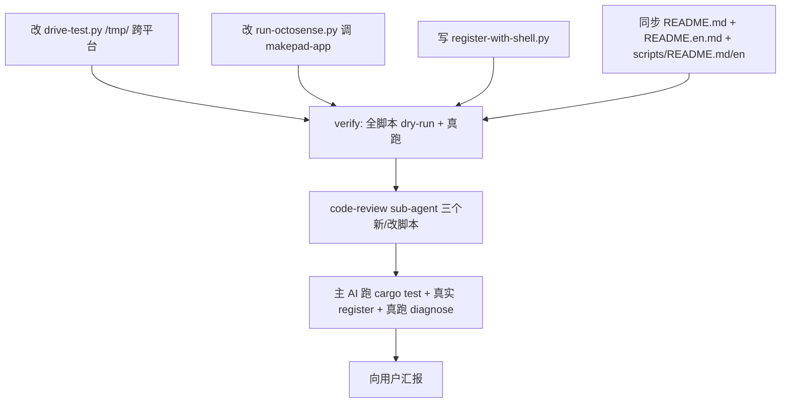

# TODO — finance-brief 2026-10-05 第二轮：A 显式 loader 脚本 + Windows 兼容 + 验收

日期: 2026-10-05
工作目录: `C:\Code\OctoSenseorg\finance-brief\`
HEAD: `5bef74ea00129267754c4e405db8e0106b1e52e9`（v8 Splash 0×0 已修 + v6 page.card 清理 + v9 scripts/ 文档已落地）
参考：`OctoSense/desktop/README.md` §"Developer programs and the catalog"

## 0. 现状盘点（主 AI 实测 2026-10-05）

### 0.1 已修复（不需要动）
1. **v8 Splash 0×0 修复** — `apps/desktop/src/{app.rs,L60 height:Fill; L84-89 删 view.walk=host.walk; L129 WindowGeomChange remount}` + `lib.rs L52 Splash height:Fill` + `baked.rs splash_rect_tests`
   - 实测（headless `--remote=0` + `/snap?all=1`）：Splash r=`[0,29,440,997]`（原 `[0,0,0,0]`），11 OctoscriptTap tile 全有 rect，149 widget 非零（原 12），**UI 完全渲染**
3. **v6 page.card 污染清理** — `OctoSense/desktop/system-apps.json` 移除 `"finance-brief"`、`OctoSense/apps/finance-brief/` 整目录删除、`~/.octosense/apps/.system/os.finance-brief/6e7b6368d13054fd/` 清理
   - 实测：`python scripts/diagnose-shell-state.py` exit=0，`any_pollution: false`，`user_app_registered: true`
5. **install-as-system-app.py 防 FileNotFound** — `_try_copy` wrapper 包裹所有拷贝，缺失源 → stderr `[skip] missing source: …` 而非 crash
6. **scripts/README.md + scripts/README.en.md** — 7 个 .py 脚本 + .sh legacy 说明 + 退出码约定 + 共同前置
7. **makepad rev 三仓对齐** — `finance-brief/apps/desktop/Cargo.toml`、`$WS/makepad HEAD`、`Octoscript-Makepad/runtime.json` 都是 `975c5630e01b0f3f3ae16cafd2e0fce3c9a5f7d9`，这就是 checkout 这个 rev 的原因（共享一份 makepad 源码，二进制 ABI 兼容）

### 0.2 用户仍要求的（本次要做的）
- **Q2 / A**: 用户原话 *"apps.json 加finance-brief 条目 这里不能直接写到依赖项目里，应该在finance-frief\scripts 写个载入脚本"*
  - 现状：`install-as-makepad-app.py` 已经实现（写 `~/.octosense/apps.json`），但它**默认会跑 cargo build**（重链接 7-30s），用户可能想要更"轻量只注册"的入口
  - 缺失：一个**显式名"register-finance-brief.py"或"add-to-shell-catalog.py"** 的轻量脚本（不 rebuild，只追加 catalog entry）
- **C / Windows 兼容**: 用户原话 *"路径1windows 下怎么运行 xx.sh 文件？或者把脚本改成python？改成 py脚本会更通用些吧"*
  - 现状：5 个 .sh 已 .py 化（`.sh` 仍是残留，用户没明确让删）
  - **新发现**：`scripts/drive-test.py` L19 `SNAP_TMP = Path("/tmp/drive.json")` 在 Windows Python 上会 FileNotFoundError（实测已复现：`FileNotFoundError: [Errno 2] No such file or directory: '\\tmp\\drive.json'`）。需要改成 `tempfile.gettempdir()` / `Path(os.environ.get('TEMP') or Path.home())`
  - **次要问题**：`scripts/run-octosense.py` L22 调 `install-as-system-app.py`（legacy, no .card），会被 v6 的 `_try_copy` 静默变成"空 bundle 安装"，需要换成 `install-as-makepad-app.py`
- **D**: 用户原话 *"在finance-brief/script 下写个脚本使用的 xxx.md 文档"*（已落地 v9，不重复做）

### 0.3 可选（本次不做、写到下一个 TODO）
- **CJK 字体 fallback**：`财经□□` 是 M3 默认 Roboto 没 CJK glyph 的副作用。修复需要 `lib.rs` 显式加 `Font { ... }` 加载思源/Noto Sans CJK；属于字体层问题，**不在本次范围内**
- **`/g` PNG 197 字节**：headless D3D11 + MAKPADE_HIDE_WINDOWS=1 下 draw_walk 不分配 framebuffer 的已知行为；在真机会有完整 PNG
- **删除 .sh 残留**：5 个 .sh 已在 README 标 "已删除"，但文件还在。等用户明确决定再删

## 1. 目标

让 finance-brief 在 OctoSense shell 中"装上即用"：
1. 用户跑一个**轻量、名字显式**的脚本 → finance_brief tile 出现在 shell
2. 所有脚本跨平台工作（Git Bash on Windows、PowerShell、WSL、Linux）
3. 不破坏现有 v8 测试（cargo test 仍 5/5 pass）

## 2. 改动清单

| # | 类型 | 文件 | 说明 |
|---|------|------|------|
| 1 | New | `finance-brief/scripts/register-with-shell.py` | 轻量只注册脚本（不 rebuild），是用户原话"载入脚本"的显式实现 |
| 2 | Modified | `finance-brief/scripts/drive-test.py` | 把 `/tmp/drive.json` 改成 `tempfile.gettempdir() / "finance-brief-drive.json"`（跨平台） |
| 3 | Modified | `finance-brief/scripts/run-octosense.py` | 改调 `install-as-makepad-app.py` 而非 `install-as-system-app.py`（legacy .card） |
| 4 | Modified | `finance-brief/README.md` | §4 脚本表加 `register-with-shell.py` 行；§3.2 加 "为什么这个脚本存在" 说明 |
| 5 | Modified | `finance-brief/README.en.md` | 同步英文版 |
| 6 | Modified | `finance-brief/scripts/README.md` | §1 加 register-with-shell.py 章节；§C 跨平台说明（Git Bash / PowerShell / WSL） |
| 7 | Modified | `finance-brief/scripts/README.en.md` | 同步英文版 |

## 3. 改动 1：新增 register-with-shell.py（用户原话"载入脚本"）

- 文件：`finance-brief/scripts/register-with-shell.py`（新）
- 设计原则：
  - **不 rebuild**（区别于 `install-as-makepad-app.py`）
  - **stdlib only**（argparse / json / os / pathlib / sys / shutil）
  - 跨平台（用 `Path.home()` + `os.environ.get('OCTOSENSE_HOME')`）
  - 默认行为：检查二进制存在 → 写/更新 `~/.octosense/apps.json` → 不动 OctoSense 仓任何文件
  - 同样支持 `--dry-run` / `--uninstall`
  - 退出码：0=ok / 3=binary 不存在 / 1=其它错误
- 草稿（结构骨架）：
  ```python
  #!/usr/bin/env python3
  """register-with-shell.py — register finance-brief with OctoSense shell (no rebuild).

  Per OctoSense/desktop/README.md §"Developer programs and the catalog", the
  shell's catalog lookup is:
    1. --apps <file> (CLI flag)
    2. ~/.octosense/apps.json (user catalog)
    3. config/apps.json (project default)

  This script writes to #2 — the project file stays untouched, no dep-mod.

  Differs from install-as-makepad-app.py:
    - does NOT rebuild the binary (call install-as-makepad-app.py for that).
    - smaller surface: just adds/updates the catalog entry.
  """
  import argparse, json, os, sys
  from pathlib import Path

  ENTRY_ID = "finance_brief"
  LABEL = "财经简报"
  POLICY = "new"

  def _base():
      return Path(os.environ.get("OCTOSENSE_HOME") or Path.home())

  def _exe():
      here = Path(__file__).resolve().parent
      app = here.parent
      is_win = sys.platform.startswith("win") or os.name == "nt"
      exe = app / "apps" / "desktop" / "target" / "release" / "finance-brief"
      return exe.with_suffix(".exe") if is_win else exe

  def main():
      ap = argparse.ArgumentParser(description=__doc__.strip().split("\n", 1)[0])
      g = ap.add_mutually_exclusive_group()
      g.add_argument("--uninstall", action="store_true",
                     help="remove the finance_brief entry from the catalog")
      g.add_argument("--dry-run",   action="store_true",
                     help="echo the catalog entry, do not write")
      args = ap.parse_args()

      exe = _exe()
      apps_json = _base() / ".octosense" / "apps.json"
      if args.uninstall:
          # remove entry; keep file if other entries exist, else delete file
          ...
      else:
          # check binary exists; fail loud with exit 3 if not
          if not exe.is_file():
              print(f"missing binary: {exe}\n"
                    f"run `python scripts/install-as-makepad-app.py` first "
                    f"(it builds + registers in one step).",
                    file=sys.stderr)
              raise SystemExit(3)
          # upsert entry into apps.json (idempotent)
          apps_json.parent.mkdir(parents=True, exist_ok=True)
          arr = (json.loads(apps_json.read_text(encoding="utf-8"))
                 if apps_json.is_file() else [])
          arr = [e for e in arr if e.get("id") != ENTRY_ID]
          arr.append({
              "id": ENTRY_ID, "label": LABEL,
              "executable": os.path.abspath(str(exe)),
              "policy": POLICY,
          })
          if args.dry_run:
              print(f"[dry-run] would write to {apps_json}:")
              print(json.dumps(arr, ensure_ascii=False, indent=2))
          else:
              apps_json.write_text(
                  json.dumps(arr, ensure_ascii=False, indent=2),
                  encoding="utf-8",
              )
              print(f"registered: {apps_json}")
              print("next: cargo run --release -p octosense  (in $WS/OctoSense)")

  if __name__ == "__main__":
      main()
  ```
- 理由：用户原话 *"应该在finance-frief\scripts 写个载入脚本"* —— 这是那个脚本。

## 4. 改动 2：drive-test.py 跨平台

- 文件：`finance-brief/scripts/drive-test.py`
- 位置：L19
- 动作：`SNAP_TMP = Path("/tmp/drive.json")` → `SNAP_TMP = Path(tempfile.gettempdir()) / "finance-brief-drive.json"`
- 同时 import `tempfile`
- 理由：`/tmp` 在 Windows Python 上不存在（实测触发 `FileNotFoundError: '\\tmp\\drive.json'`），`tempfile.gettempdir()` 跨平台返回 OS tempdir

## 5. 改动 3：run-octosense.py 调对的脚本

- 文件：`finance-brief/scripts/run-octosense.py`
- 位置：L21-22
- 动作：`subprocess.run([sys.executable, HERE / "install-as-system-app.py"], check=True)` → `subprocess.run([sys.executable, HERE / "install-as-makepad-app.py"], check=True)`
- 理由：`install-as-system-app.py` 是 legacy Page-format（依赖 *.card），会被 `_try_copy` 静默变成"空 bundle 安装"；用户要的是 Path-1 走 executable

## 6. 改动 4+5+6+7：README 同步

- README.md §4 脚本表加一行：`register-with-shell.py` — register finance-brief with OctoSense shell catalog (no rebuild; cross-platform)
- README.md §3.2 加一段："为什么不写独立 register 脚本": 用户多次问到 apps.json 不能写到 dep project，本脚本就是答案
- README.en.md 同步
- scripts/README.md §1 顶部目录加 register-with-shell.py + §C 加跨平台章节（Git Bash / PowerShell / WSL 怎么调用 .py）
- scripts/README.en.md 同步

## 7. 硬约束（sub-agent 共用）

- [ ] stdlib only（argparse / json / os / sys / tempfile / shutil / pathlib）——**禁止** pip install
- [ ] 跨平台：pathlib 拼接；`tempfile.gettempdir()` 替 `/tmp/`；`OCTOSENSE_HOME` env 优先于 `$HOME`；Windows 后缀 `.exe`
- [ ] 不 git commit
- [ ] 不 cargo build（用 v8 已 build 的 binary）
- [ ] 写完后必须真跑：`python foo.py --help` / `python foo.py --dry-run` / 实际执行
- [ ] 不动 finance-brief/apps/**, bundle/**, native/** 任何 Rust / DSL 文件
- [ ] 不动 OctoSense/ 任何文件（dep 仓）
- [ ] 不动 finance-brief/scripts/install-as-makepad-app.py、install-as-system-app.py（这两个 v6/v7 已落地）

## 8. 不做的事

- [ ] 不写 .sh 版本（项目已是 .py only，README 已说明）
- [ ] 不写 .ps1 版本（用户明确拒绝）
- [ ] 不在脚本里改 finance-brief 任何源文件
- [ ] 不做 git add / commit / push
- [ ] 不删 .sh 残留（等用户明确决定再删）
- [ ] 不修 CJK 字体 fallback（独立 TODO）
- [ ] 不修 /g PNG 197 字节（headless 已知行为）
- [ ] 不写 `register-with-shell.py` 的"打包式"清理（user cache 清理由 `clean-shell-pollution.py` 负责）

## 9. 验收

- [ ] `python scripts/register-with-shell.py --help` 跑通，输出含 `--uninstall` / `--dry-run`
- [ ] `python scripts/register-with-shell.py --dry-run` 输出包含 `would write to ...apps.json` + `id: finance_brief` + `executable: ...finance-brief.exe`
- [ ] `python scripts/register-with-shell.py` 真跑：检查 binary 在 → 写 ~/.octosense/apps.json → 不修改任何 dep 仓文件
- [ ] `python scripts/register-with-shell.py --uninstall` 跑通：finance_brief 从 apps.json 移除
- [ ] `python scripts/drive-test.py --port <PORT>` 在 Windows 上不再报 `/tmp/drive.json` FileNotFoundError
- [ ] `python scripts/run-octosense.py --help`（如果有） + 调用链正确（指向 makepad-app，不是 system-app）
- [ ] `python scripts/diagnose-shell-state.py` 仍 0（clean）
- [ ] `cd apps/desktop && cargo test --release --offline` 仍 5/5 pass（不能引入回归）
- [ ] `python scripts/install-as-makepad-app.py --dry-run` 仍正常
- [ ] README.md §4 脚本表加 1 行（register-with-shell.py）；scripts/README.md §1 顶部目录加 1 行；scripts/README.md §C 加跨平台章节
- [ ] README.en.md + scripts/README.en.md 同步加英文版

## 10. 子任务分派



- [agent-A, parallel] 改动 1：写 register-with-shell.py + --help/--uninstall/--dry-run 实测
- [agent-B, parallel] 改动 2：drive-test.py /tmp/ 跨平台 + 真跑
- [agent-C, parallel] 改动 3：run-octosense.py 调对脚本 + dry-run
- [agent-D, serial-after-A+B+C] 改动 4+5+6+7：README.md + README.en.md + scripts/README.md + scripts/README.en.md 同步
- [verify-E, serial-after-D] §9 全部验收命令真跑（输出每条 stdout + exit code）
- [review-F, serial-after-E] code-review 三个新/改脚本（<2KB prompt, 单事件）
- [main-G, parallel-after-F] 主 AI 跑 cargo test + diagnose-shell-state.py
- [report-H, serial-after-G] 主 AI 向用户汇报

## 11. 失败升级

- agent 写脚本 compile 错（`python -c "import ast; ast.parse(open(p).read())"`）→ sub-agent 自己重试一次
- 真跑命令 hang → 设 timeout_ms=8000，超时 retry
- 真跑失败但诊断不出原因 → abort + 报告，主 AI 介入
- cargo test 失败 → **abort**，不能继续（防止改了脚本把测试搞挂）