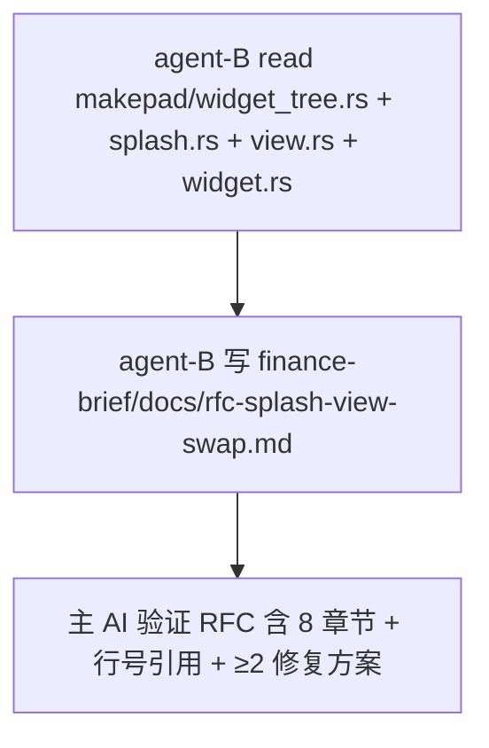

# TODO — finance-brief Q4: Splash/View swap RFC（外部 issue 草稿）

日期: 2026-10-05
工作目录: `C:\Code\OctoSenseorg\finance-brief\`
HEAD: `5bef74ea00129267754c4e405db8e0106b1e52e9`
DSL: bundle/main.splash（禁 find 全盘）

## 0. 目标

为"finance-brief 点击 launcher tile 不切换屏幕"这个 dep 层 bug 撰写一份 **RFC / issue-ready 草稿**，输出到 `finance-brief/docs/rfc-splash-view-swap.md`。

约束（来自 finance-brief-skill）：
- **不允许修改**任何 dep 仓库代码（OctoSense / Octoscript-Makepad / makepad / Octoscript-App-Design-Flow / octoscript）
- **允许 read** dep 库源码（这是调研）
- **不跑 cargo build / cargo test**（主 AI 验证）
- **不 git commit**

## 1. 调研范围（sub-agent 必须读）

来自 `Octoscript-Makepad/` 同级目录的 `makepad/widgets/src/`（runtime.json 锁定的 makepad rev `975c5630`）：

| 文件 | 必读内容 |
|------|----------|
| `widget_tree.rs` | `insert_child` / `insert_child_deep` / `set_root_widget` / `refresh_from_borrowed` / `refresh_node_children` / `refresh_node_children_from_discovered` / `rebuild_dense` / `compact_dump` |
| `splash.rs` | `Splash` struct 字段（`uid` / `view` / `body` / `source` / `allow_net`），`draw_walk`，`set_text`，`WidgetNode` impl（children / walk 委托给 self.view） |
| `view.rs` | `View` struct（`#[uid]` 字段位置），`WidgetNode::children` impl，`View::set_inner` 等 |
| `widget.rs` | `WidgetUid`、`WidgetRef::widget_uid` 实现、`WidgetWeakRef`、`#[uid]` 宏语义 |
| `widget_tree.rs` flush_dirty / mark_dirty / sync_dense 部分 | `flush_dirty` 走 refresh_node_children 的路径，placeholder early-return 逻辑 |

建议直接 grep 关键符号（不要 find 全盘）：
- `grep -n "fn refresh_from_borrowed\|fn refresh_node_children\|fn rebuild_dense\|fn set_root_widget" -r widgets/src/widget_tree.rs`
- `grep -n "placeholder" widgets/src/widget_tree.rs`
- `grep -n "fn widget_uid\|widget_uid\b" widgets/src/widget.rs widgets/src/widget_ref.rs`
- `grep -n "fn children\b\|impl WidgetNode for Splash\|impl WidgetNode for View" widgets/src/splash.rs widgets/src/view.rs`

## 2. RFC 必含章节（sub-agent 严格遵守）

输出到 `finance-brief/docs/rfc-splash-view-swap.md`，结构：

### 2.1 标题 + Metadata
```
# RFC: Stable uid for Splash/View host slot when swap-and-reroute

- Status: Draft
- Date: 2026-10-05
- Reporter: finance-brief (OctoSense app)
- Affected crates: octoscript-widgets, makepad (widget_tree.rs / splash.rs / view.rs)
- Severity: Blocker for any application that swaps the root view per route
```

### 2.2 问题摘要（≤ 200 字）
- 复现条件：app spawns host widget (Splash or View), mount route A; later, mount route B by `mem::replace(&mut *host, view)`. The graph's host_uid (from `WidgetRef::widget_uid()`) is either stable (Splash's `#[uid]` field) but maps to a `placeholder=true` GraphNode, or unstable (View's per-instance `#[uid]`) but doesn't track the active slot.
- 期望行为：`refresh_from_borrowed(host_uid, ...)` 后 widget tree graph 应该反映新 route 的 children，且下次 `flush_dirty` 能 re-walk 新 children。
- 实际行为：graph.children[host_uid] 仍是 route A 的 children（或 host_uid 指向 retired struct），`/d` 和 `/g` 仍显示 route A 的 UI。

### 2.3 已尝试的 workarounds（在 finance-brief 侧）

列 v10 / v12 / v15：
- v10 `widget_tree_insert_child_deep`：manual=true 永久保留旧 widgets
- v12 `refresh_from_borrowed`：mark_structure_dirty hardcoded false，placeholder 节点被 early-return
- v15 `Splash` → `View` + `mem::replace(&mut *host, view)` + `refresh_from_borrowed`：View uid 是 per-instance，refresh_from_borrowed 走的是 retired slot

每条列：cargo test 通过 / 运行时路由失败。

### 2.4 根因分析（sub-agent 必填）

阅读 `widget_tree.rs:refresh_node_children_from_discovered`（L1656-1870）和 `widget_tree.rs:set_root_widget`（L957-1014）后填写：
- placeholder 节点为何被 flush_dirty 跳过（具体行号 + early-return 代码）
- `WidgetRef::widget_uid()` 在不同 widget 上的语义差异（stable struct uid vs per-instance uid）
- 为什么 `mem::replace(&mut *host, view)` 不会更新 graph 中 host_uid 指向的 widget ref

### 2.5 建议修复（sub-agent 必填，给 dep 维护者）

至少给出 2 个候选修复（让 dep 维护者挑选）：

**方案 A：stable slot uid for host View**
- 在 `View` struct 添加一个 `slot_uid: WidgetUid` 字段（或 thread-local 计数器）
- `WidgetRef::widget_uid()` 优先返回 slot_uid（如果存在）
- 这样 `mem::replace` 后 host_uid 稳定，refresh_from_borrowed 能正确更新

**方案 B：refresh_from_borrowed 按 widget_ref 解析**
- 改 API 为 `refresh_from_borrowed(widget_ref: WidgetRef, ...)`（不是 uid）
- 内部 `widget_tree().get_or_insert_graph_node(widget_ref)` 自动用 widget_ref 当前的 widget uid
- uid 不稳定的问题自动解决

**方案 C：让 Splash 的 GraphNode 跟随 host slot**
- Splash 已经是 stable uid，但 graph 是 placeholder
- 给 Splash 加一个 API：mount 时强制 set_root_widget(host_splash_ref) 把 placeholder 关掉
- 但 Splash 在 isolate VM 上，host slot 在 main VM，跨 VM 的 widget ref 不好传——这个方案的可行性 sub-agent 评估

### 2.6 影响范围（sub-agent 必填）

列出所有受影响的应用类型：
- 任何 SPA / 多 route 应用（Splash 是 host）—— flutter-samples / finance-brief 都中招
- 任何需要 swap root content 的应用（View host）—— finance-brief v15 中招
- 单 page / static 应用不受影响

### 2.7 复现脚本路径

引用 finance-brief 仓库的可复现路径：
- `apps/desktop/src/app.rs` mount 函数
- `bundle/screens/launcher.octoscript` 11 个 tile 路由触发
- `scripts/_dump_widget_tree.py` + `scripts/_capture_g.py` 验证 SHA256 diff

### 2.8 验证建议（给 dep 维护者）

提供 cargo test 模板（不要求 sub-agent 跑）：
```rust
#[test]
fn host_view_swap_refreshes_graph() {
    let app = ...;
    let host_ref = app.ui.widget(cx, ids!(host));
    let initial_uid = host_ref.widget_uid();
    mount_route_a(&mut app, cx);
    mount_route_b(&mut app, cx);
    let final_uid = host_ref.widget_uid();
    assert_eq!(initial_uid, final_uid, "host slot uid must be stable");
    let tree = cx.widget_tree().compact_dump(cx);
    assert!(tree.contains("route_b_widget"));
}
```

## 3. 硬约束（只列 sub-agent 相关）

- [ ] **不修改任何 dep 库文件**（OctoSense / Octoscript-Makepad / makepad / Octoscript-App-Design-Flow / octoscript）
- [ ] **不 cargo build / cargo test**（留给主 AI）
- [ ] **不 git commit / push**
- [ ] **不修改 finance-brief 代码**（只看 + 写 docs/）
- [ ] 只 read 上述 dep 库的 5 个文件（不要 grep 全盘）

## 4. 不做的事

- [ ] 不写 finance-brief 代码
- [ ] 不写 scripts/
- [ ] 不动 README.md
- [ ] 不创建 PR（RFC 是 issue 草稿，不发 PR）

## 5. 验收（主 AI 真跑）

- [ ] `finance-brief/docs/rfc-splash-view-swap.md` 存在
- [ ] RFC 含 §2.1 - §2.8 全部 8 个章节
- [ ] §2.4 根因分析含具体行号引用
- [ ] §2.5 至少 2 个候选修复方案
- [ ] §2.7 含 finance-brief 可复现脚本路径

## 6. 子任务分派



- [agent-B] read dep 库 5 个文件 + 写 RFC 到 `docs/rfc-splash-view-swap.md`

## 7. 报告格式（sub-agent 严格遵守）

```
=== Step 1: 调研 ===
files_read: <5 个文件路径列表>
key_findings: <3-5 行，每行带行号引用>

=== Step 2: 写 RFC ===
file_written: <docs/rfc-splash-view-swap.md 路径>
sections_completed: <§2.1 - §2.8 列表>
line_references: <RFC 内引用的 widget_tree.rs 行号列表>

=== Summary ===
verify: PASS / FAIL + 原因
```

可以执行：read_file / grep（限定 5 个文件）/ write_file（只到 docs/）
禁止执行：edit_file（任何位置）/ cargo / git / 修改 dep 仓库任何文件
