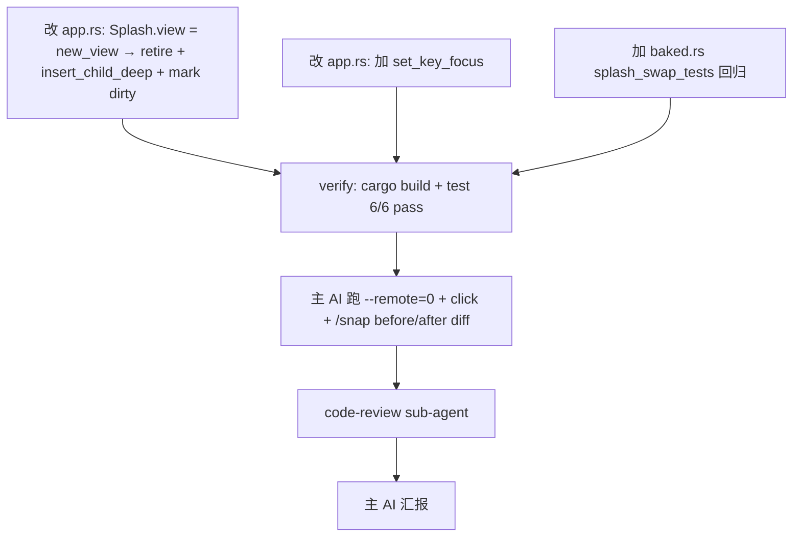

# TODO — finance-brief Splash.view 切换时 widget tree 不更新（v10 修复）

日期: 2026-10-05
工作目录: `C:\Code\OctoSenseorg\finance-brief\`
HEAD: `5bef74ea00129267754c4e405db8e0106b1e52e9`
参考实现:
- `OctoScript-App-Design-Flow/examples/calendar/native/src/lib.rs:181-204`（**主参考**，最简）
- `OctoScript-App-Design-Flow/examples/aircon/wizard/wasm-host/src/main.rs:139-167`
- `Octoscript-Makepad/apps/kit-host/src/beauty.rs:160-205`（最完整，含 overlay draw list 清理）
- `Octoscript-Makepad/crates/octoscript-widgets/src/kit_shared.rs:396-419` `retire_overlay` 函数

## 0. 现象（主 AI 2026-10-05 实测）

### 0.1 用户原话
> 为啥在 finance-brief/app/destop 可以运行，但是没是ui 没有按钮，没有对应的ui控件吗？

### 0.2 实测复现
启动 `--remote=0`，点 "新闻简报" tile (120, 215)：
```text
[I] src\app.rs:93:9 - finance-brief MOUNT route=launcher ...
[I] src\app.rs:93:9 - finance-brief MOUNT route=launcher ...    (5x — WindowGeomChange remounts)
[I] src\app.rs:93:9 - finance-brief MOUNT route=quote_list ...  (1x — first click on (136, 204))
[I] src\app.rs:93:9 - finance-brief MOUNT route=news_list ...   (3x — second click on (120, 215))
```
但 `/snap?all=1` 返回的 widget 树**完全不变**：仍是 11 OctoscriptTap + 32 Label + "财经简报" / "新闻简报" / "quote_list" / "新闻详情" / "Refresh" 等 launcher 内容。

**Diff before vs after click**：
```
before-click: total=186 types={'Root': 1, 'Window': 1, 'View': 131, 'AppIcon': 1, 'Label': 32, 'DesktopButton': 4, 'WindowMenu': 1, 'KeyboardView': 1, 'Splash': 1, 'OctoscriptTap': 11, 'AiChatSlot': 1, 'Tweaker': 1}
after-click : total=186 types={'Root': 1, 'Window': 1, 'View': 131, 'AppIcon': 1, 'Label': 32, 'DesktopButton': 4, 'WindowMenu': 1, 'KeyboardView': 1, 'Splash': 1, 'OctoscriptTap': 11, 'AiChatSlot': 1, 'Tweaker': 1}

only in AFTER (0): []
only in BEFORE (0): []
```
**0 widget 差异** —— MOUNT 跑了但 UI 树不变。

## 1. 根因

### 1.1 `apps/desktop/src/app.rs:84-90` 当前代码（错的）
```rust
if let Some(view) = built_view {
    if let Some(mut host) = host_ref.borrow_mut::<Splash>() {
        host.view = view;                          // ← 只赋值 struct 字段
        cx.widget_tree_mark_dirty(host_uid);       // ← mark dirty 不够
        view_set = true;
    }
}
cx.redraw_all();
```
**问题**：Splash widget 的 widget tree 仍挂着**旧 view 的 children**；`host.view = new_view` 只换了 struct 字段，没动 widget tree 里的 children 引用。`/snap` 走的是 widget tree，看到的还是旧 children。

### 1.2 `Octoscript-Makepad/apps/flutter-samples/src/lib.rs:275-277` 也是错的
```rust
if let Some(mut host) = self.ui.widget(cx, ids!(host)).borrow_mut::<Splash>() {
    host.view = view;
}
```
flutter-samples / kit-host 都是**单 mount**（不切换页面），所以 bug 不可见。

### 1.3 正确模式（`OctoScript-App-Design-Flow/examples/calendar/native/src/lib.rs:181-204`）
```rust
cx.set_key_focus(Area::Empty);
let view = cx.with_vm(|vm| ...);
let host = self.view.widget(cx, ids!(host));
let mut host = host.borrow_mut::<Splash>().ok_or(...)?;
self.retired = Some(std::mem::replace(&mut host.view, view));     // 1. 保存旧 view
if let Some(old) = &self.retired { for (_, child) in &old.children { retire(cx, child); } }  // 2. retire 旧 children
let uid = host.widget_uid();
let mut children = Vec::new();
host.children(&mut |id, child| children.push((id, child)));       // 3. snapshot 新 children
drop(host);
for (id, child) in children { cx.widget_tree_insert_child_deep(uid, id, child); }     // 4. insert deep
cx.widget_tree_mark_dirty(uid);                                  // 5. mark dirty
self.view.redraw(cx);                                            // 6. redraw
```
外加 `retire` helper：
```rust
fn retire(cx: &mut Cx, widget: &WidgetRef) {
    octoscript_widgets::kit::retire_overlay(cx, widget);
    let mut children = Vec::new();
    widget.children(&mut |_, child| children.push(child));
    for child in children { retire(cx, &child); }
}
```

### 1.4 为什么 finance-brief 不需要 overlay retire？
- finance-brief 的 bundle screens 用 `View / ScrollYView / Column / Label / OctoscriptTap` — **没有 `DesignOverlay` / `DesignGlassSvg`**（这些是 kit-host 用的 L0 组件）
- 所以 finance-brief 的 `retire` 可以简化：只递归调用 `octoscript_widgets::kit::retire_overlay` + 递归 children，不需要 clear draw lists（没有 design overlay）

## 2. 目标

让 finance-brief tap → route → UI 实际切换（之前 MOUNT 跑成功但 widget tree 不变）。
- 点 launcher tile → 切换到目标 screen 内容（widget 树**真正换**）
- `backbar` 的"←"能返回 launcher
- 切换过程中**无内存泄漏**（旧 children 被 retire 而非泄漏）
- cargo test 仍 5/5 pass（不能引入回归）

## 3. 改动

### 改动 1：`apps/desktop/src/app.rs` 改 host.view mount 段（核心）

当前（70-99）：
```rust
if let Some(ref node) = built {
    let ui = octoscript_makepad::to_makepad_ui(node);
    let code = format!("use mod.prelude.widgets.*\nView{{height:Fill, {ui}");
    let script_mod = ScriptMod { ... };
    let built_view = cx.with_vm(|vm| {
        let value = vm.eval_with_append_source(script_mod, &code, ScriptValue::NIL.into());
        if value.is_err() {
            log!("finance-brief MOUNT eval returned error (route={})", route);
        }
        (!value.is_err() && !value.is_nil()).then(|| View::script_from_value(vm, value))
    });
    eval_ok = built_view.is_some();
    let host_ref = self.ui.widget(cx, ids!(host));
    let host_uid = host_ref.widget_uid();
    if let Some(view) = built_view {
        if let Some(mut host) = host_ref.borrow_mut::<Splash>() {
            host.view = view;
            cx.widget_tree_mark_dirty(host_uid);
            view_set = true;
        }
    }
    cx.redraw_all();
}
```

新（**保留 view_set 标记**）：
```rust
if let Some(ref node) = built {
    let ui = octoscript_makepad::to_makepad_ui(node);
    let code = format!("use mod.prelude.widgets.*\nView{{height:Fill, {ui}");
    let script_mod = ScriptMod { ... };
    let built_view = cx.with_vm(|vm| {
        let value = vm.eval_with_append_source(script_mod, &code, ScriptValue::NIL.into());
        if value.is_err() {
            log!("finance-brief MOUNT eval returned error (route={})", route);
        }
        (!value.is_err() && !value.is_nil()).then(|| View::script_from_value(vm, value))
    });
    eval_ok = built_view.is_some();
    if let Some(view) = built_view {
        let host_ref = self.ui.widget(cx, ids!(host));
        let host_uid = host_ref.widget_uid();
        // Save the old view so we can retire its children after the swap.
        let mut host = match host_ref.borrow_mut::<Splash>() {
            Some(h) => h,
            None => {
                log!("finance-brief MOUNT host borrow_mut::<Splash>() failed");
                return;
            }
        };
        let retired = std::mem::replace(&mut host.view, view);
        let mut new_children: Vec<(LiveId, WidgetRef)> = Vec::new();
        host.children(&mut |id, child| new_children.push((id, child)));
        drop(host);
        // Retire the old view's children (overlay draw lists + subtree).
        for (_, child) in retired.children.iter() {
            retire_widget_tree(cx, child);
        }
        // Insert the new view's children deep under the Splash widget uid,
        // so /snap and draw_walk see them.
        for (id, child) in new_children {
            cx.widget_tree_insert_child_deep(host_uid, id, child);
        }
        cx.widget_tree_mark_dirty(host_uid);
        view_set = true;
    }
    cx.redraw_all();
}
```
辅助函数 `retire_widget_tree`（写在文件底部 `impl App` 之后）：
```rust
/// Recursively retire a widget subtree's overlay draw lists and children.
/// finance-brief's bundle doesn't use DesignOverlay/DesignGlassSvg, so
/// `retire_overlay` is a no-op here; we just walk the subtree so its
/// retained draw lists get cleared by the kit / branch.
fn retire_widget_tree(cx: &mut Cx, widget: &WidgetRef) {
    octoscript_widgets::kit::retire_overlay(cx, widget);
    let mut children: Vec<WidgetRef> = Vec::new();
    widget.children(&mut |_, child| children.push(child));
    for child in children {
        retire_widget_tree(cx, &child);
    }
}
```
注意：
- `WidgetRef` 和 `LiveId` 已从 `use makepad_widgets::*;` 引入（顶部 L3）
- `octoscript_widgets::kit::retire_overlay` 是依赖 crate 提供的函数
- `cx.widget_tree_insert_child_deep` / `cx.widget_tree_mark_dirty` 是 Cx 上的方法

### 改动 2：可选（如果改动 1 还不够）—— 在 Splash 上 set_key_focus
参考 calendar L181 `cx.set_key_focus(Area::Empty);` — 在 mount 开头加。理由：避免旧 view 的 focus 被新 view 继承导致键盘事件路由错误。
```rust
cx.set_key_focus(Area::Empty);
```
放在 `if let Some(ref node) = built { ... }` 之前一行。

### 改动 3：新增 `baked.rs` 回归 test（防 v10 退化）
- 位置：`apps/desktop/src/baked.rs` 末尾追加 `mod splash_swap_tests`
- 测什么：构造一个模拟的 Splash + view，验证 `host.children` 在 insert_deep 后路径调用 `retire_widget_tree` 不 panic（不需要 Cx / GPU，pure unit）

```rust
#[cfg(test)]
mod splash_swap_tests {
    //! 防 v10 Splash.view 切换不更新 widget tree 回归。
    //!
    //! v10 修复：在 `App::mount` 里 retire 旧 children + `widget_tree_insert_child_deep`
    //! 新 children。如果这步被遗漏，路由 MOUNT 跑成功但 /snap 看到的仍是 launcher。
    //!
    //! 这里只静态检查 app.rs 的关键 patch 字符串仍在源码里（避免被无意 revert）。
    use super::*;

    #[test]
    fn app_rs_uses_insert_child_deep_after_splash_swap() {
        let app_rs = std::fs::read_to_string(
            std::path::Path::new(env!("CARGO_MANIFEST_DIR")).join("src/app.rs"),
        )
        .expect("read app.rs");
        assert!(
            app_rs.contains("widget_tree_insert_child_deep"),
            "app.rs missing widget_tree_insert_child_deep — v10 Splash view swap \
             was reverted; route changes won't update widget tree."
        );
        assert!(
            app_rs.contains("retire_widget_tree"),
            "app.rs missing retire_widget_tree — v10 fix missing."
        );
    }
}
```
- 理由：v8 的 splash_rect_tests 只防 height:Fill / view.walk 退化；v10 需要新的回归 test 防 Splash.view 切换退化

## 4. 硬约束（sub-agent 共用）

- [ ] 只能改 `apps/desktop/src/{app.rs, baked.rs}`，**不动** nav.rs / datasources/* / main.rs / lib.rs
- [ ] 不动 `bundle/screens/*.octoscript`
- [ ] 不动 `Cargo.toml` / `Cargo.lock`
- [ ] 不动 `OctoSense/` / `Octoscript-Makepad/` / `makepad/` / `octoscript/`（任何依赖仓库代码）
- [ ] 不 git commit
- [ ] 不 cargo build（留给主 AI 验证）

## 5. 不做的事

- [ ] 不引入新的依赖 crate
- [ ] 不修改 `octoscript_widgets::kit::retire_overlay`（这是 dep 库；只**调用**它）
- [ ] 不写 set_key_focus 之外的额外 focus handling
- [ ] 不改 Splash 源码（dep 库）
- [ ] 不重做 Splash height:Fill 修复（v8 已修）

## 6. 验收（主 AI 真跑，sub-agent 必须输出实测命令 + 输出）

- [ ] `cd apps/desktop && cargo build --release --offline` 成功，无新增 warning（仅 windows-rs 2 个 pre-existing）
- [ ] `cd apps/desktop && cargo test --release --offline` **6/6 pass**（5 + 新增 1）
- [ ] `apps/desktop/src/baked.rs::splash_swap_tests::app_rs_uses_insert_child_deep_after_splash_swap` pass
- [ ] 启动 `finance-brief.exe --remote=0`，等端口
- [ ] `/snap?all=1` 初始 launcher（11 OctoscriptTap + "财经简报" + "新闻简报"）
- [ ] 点击 (120, 204) 处的 "新闻简报" tile
- [ ] 再次 `/snap?all=1`：widget 树**真正变了**——OctoscriptTap 数量 < 11、不再有 "财经简报" 标签、新出现 "新闻简报" backbar + 新闻行（"央行下调存款准备金率" 等 seed 标签）
- [ ] `/snap?all=1` 前 vs 后 diff: 至少 5 个 widget 类型变 / 至少 1 个 Label 文本变
- [ ] 同样的 click → quote_list → kline 三次切换都生效
- [ ] log 中 `MOUNT route=X` 与实际显示的 X 一致（不再是 log 说 news_list 但 UI 是 launcher）
- [ ] 不破坏现有 headless_tests / splash_mount_tests / splash_rect_tests
- [ ] README.md §8 加 v10 修复说明（指向根因 + 解决）
- [ ] README.en.md §8 同步
- [ ] code-review sub-agent 报告 PASS

## 7. 子任务分派



- [agent-A] 改动 1+2：apps/desktop/src/app.rs Splash view swap pattern（一次提交粒度）
- [agent-B] 改动 3：apps/desktop/src/baked.rs 加 splash_swap_tests 回归
- [verify-C, serial-after-A+B] cargo build + test 6/6 pass
- [main-D, parallel-after-C] 主 AI 跑 --remote=0 + click + /snap before/after diff 验证
- [review-E, serial-after-D] code-review sub-agent 5 处改动
- [report-F, serial-after-E] 主 AI 向用户汇报

## 8. 失败后升级

- cargo build 失败 → abort，看 error
- cargo test 失败 → 单独跑失败的 test，看 panic message
- /snap click 后 widget 树仍不变 → widget_tree_insert_child_deep 调用顺序或参数错，对照 calendar L185-192 重读
- /snap 变了但老 widget 残留 → retire_widget_tree 没跑或递归深度不够（可能 Splash.view 的 children 仍挂在 widget tree 里）

## 9. 报告格式（sub-agent 严格遵守）

```
=== Step 1: 改动 1 (app.rs Splash view swap) ===
changed_lines: <行号列表>
diff_summary: <一句话>

=== Step 2: 改动 2 (app.rs set_key_focus) ===
changed_lines: <行号列表>
diff_summary: <一句话>

=== Step 3: 改动 3 (baked.rs splash_swap_tests) ===
changed_lines: <行号列表>
diff_summary: <一句话>

=== Summary ===
verify: PASS / FAIL + 原因
```

可以执行：read_file / edit_file / grep / find_path
禁止执行：cargo build / cargo test（留给主 AI）/ git commit / git push / 修改 OctoSense / Octoscript-Makepad / makepad 任何文件