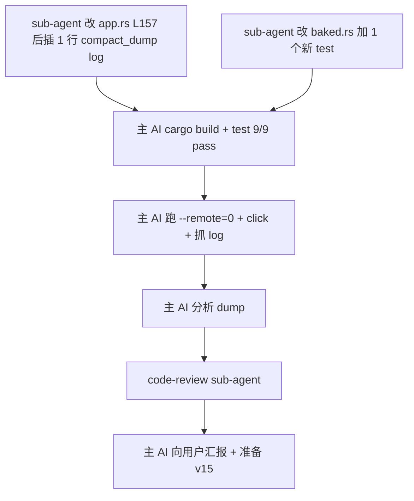

# TODO — finance-brief v14: 加 widget tree dump DBG 定位根因

日期: 2026-10-05
工作目录: `C:\Code\OctoSenseorg\finance-brief\`
HEAD: `5bef74ea00129267754c4e405db8e0106b1e52e9`
DSL: bundle/main.splash（禁 find 全盘）

## 0. 现象（v13 DBG 确认）

v13 DBG 实测确认 `mem::replace` **真的换了 view**：

| route | pre_view_uid | post_view_uid | retired.uid | retired.children.len |
|---|---|---|---|---|
| launcher init | 524 → 691 | 691 | 524 | (n/a) |
| news_list 1st | 691 → 858 | 858 | 691 | 1 |
| quote_list | 858 → 1025 | 1025 | 858 | 1 |
| news_list 3rd | 1025 → 1192 | 1192 | 1025 | 1 |
| news_list 4th | 1192 → 1359 | 1359 | 1192 | 1 |

`view_set_done` 在每次 mount 后都 log（不丢）。

**但**：
- `/d` dump click 前后 **byte-for-byte 一致**（148 行 / 4383 bytes）
- `/d` 显示 11 OctoscriptTap 都在 launcher 位置（24,167 / 224,167 等）
- `/g` PNG 视觉上不变（44599 vs 44617 bytes — 仅 18 byte 噪声）

**所以**：`mem::replace` 真的换了 host.view，但 widget tree graph 没反映出来。

## 1. 根因（v13 的假设）

读了 `widget_tree.rs` 源码后的最佳假设：

### 1.1 `refresh_from_borrowed` 不会从 graph 移除旧 widgets

`refresh_from_borrowed` 在 `widget_tree.rs:1065-1119`，内部调 `refresh_node_children_from_discovered(.., mark_structure_dirty=false)`（hardcoded false at L1111）。

`refresh_node_children_from_discovered` 在 `mark_structure_dirty=false` 时：
- 把 `node.children` 更新为 `new_children`（✓ Splash.children 改对）
- 但**不**走 L1851-1868 的 `remove_subtree` 块（旧 widgets 仍留在 graph 里）

### 1.2 旧 widgets 留 graph 作为孤儿

第一次 mount（launcher）：
- Splash.children = [launcher_inner_uid (12)]
- launcher_inner.parent = Some(Splash)
- launcher_inner's 整个 subtree 都被 `flush_dirty` 递归注册到 graph

第二次 mount（news_list）：
- Splash.children = [news_list_inner_uid (859)]
- news_list_inner.parent = Some(Splash)
- **launcher_inner 还在 graph**，parent 仍 = Some(Splash)，但**没人引用**
- launcher_inner's 整个 subtree 都还在 graph 里

### 1.3 矛盾：但 `/d` 仍显示 launcher widgets

按 makepad `rebuild_dense`（`widget_tree.rs:1893-1946`）源码，rebuild 应该只从 root_uid 沿 `parent.children` 走，**launcher_inner 不可达** → 不该在 dense 里。

但 `/d` 显示 launcher widgets。**这意味着我的假设有错**。可能的原因：

a) **flush_dirty 在 mark_structure_dirty=true 模式下确实清除了 launcher_inner**，但 rebuild_dense 把 orphans 也 walk 了（我读漏了）
b) **widget tree 有第二份"frame snapshot"** 没被 replace
c) **draw_walk 真的画 launcher**（不是 news_list），所以 PNG 不变
d) **`new_children` 收集到的不是 host.view.children 而是别的东西**

v14 任务就是把 (a)/(b)/(c)/(d) 拆开验证。

## 2. v14 改动目标

加一个 `cx.widget_tree().compact_dump(cx)` log 在 mount 函数尾部，紧跟 `view_set_done`。**dump 整个 widget tree**。比较 mount 前后的 dump 字符串：

- 如果 dump 包含 **news_list widgets**（不是 launcher widgets）→ graph 已更新 → 问题在 (c)（draw 路径）
- 如果 dump **仍是 launcher widgets** → graph 没更新 → 问题在 (b) 或 (d)（mount 后状态不对）

## 3. 改动

### 改动 1：`apps/desktop/src/app.rs` mount 函数 L157 后插入 compact_dump log

当前（v13 L157）：
```rust
log!("finance-brief DBG host_uid={:?} view_set_done", host_uid);
cx.redraw_all();
}
```

新（保留 view_set_done log，**追加** 一次 compact_dump）：
```rust
log!("finance-brief DBG host_uid={:?} view_set_done", host_uid);
// v14 diagnostic: dump the entire widget tree right after refresh_from_borrowed
// + mark_dirty. If this dump shows news_list widgets, the graph IS updated
// and the bug is downstream (draw_walk / area invalidation). If it still
// shows launcher widgets, the graph is stale and we need to prune old
// launcher widgets before refresh_from_borrowed.
let dump = cx.widget_tree().compact_dump(cx);
log!(
    "finance-brief DBG mount route={} compact_dump ({} bytes):\n{}",
    route,
    dump.len(),
    dump
);
cx.redraw_all();
}
```

注意：
- **保留** `view_set_done` log 不动
- **只在 `if let Some(view) = built_view`** 分支内 dump（即 mount 真的执行了 view swap 时）
- **每次 mount 都 dump**——5 次 launcher + N 次 click → N+5 次 dump → log 可能很长，但这是诊断目的
- dump 输出**作为单条 log**（用 `\n` 包成一行），方便 `Select-String` 抽取
- **不动**其它任何行

### 改动 2：不动 splash_swap_tests

v12 的 `app_rs_uses_refresh_from_borrowed_after_splash_swap` 测试保留。
新加 1 个 v14 测试（确认 app.rs 里有 `compact_dump` 调用）：

```rust
#[test]
fn app_rs_logs_compact_dump_after_view_set_done() {
    let app_rs = std::fs::read_to_string(
        std::path::Path::new(env!("CARGO_MANIFEST_DIR")).join("src/app.rs"),
    )
    .expect("read app.rs");
    assert!(
        app_rs.contains("compact_dump(cx)"),
        "app.rs missing compact_dump(cx) — v14 view-set-done tree dump was reverted; \
         re-adding the diagnostic is required before v15 can be designed."
    );
}
```

放在 `splash_swap_tests` mod 末尾（v12 测试之后）。

### 改动 3：不动 nav.rs / datasources/* / main.rs / lib.rs / Cargo.toml / Cargo.lock

### 改动 4：不动 bundle/screens/*.octoscript

### 改动 5：不动 OctoSense / Octoscript-Makepad / makepad / OctoScript-App-Design-Flow / octoscript

## 4. 硬约束（sub-agent 共用）

- [ ] 只能改 `apps/desktop/src/{app.rs, baked.rs}`（v13 已有的 L94-157 DBG 块内追加 1 行 compact_dump log）
- [ ] 不动 splash_swap_tests 现有 4 个 test（v10/v11/v12/v13 加的）
- [ ] 不动 nav.rs / datasources/* / main.rs / lib.rs / Cargo.toml / Cargo.lock
- [ ] 不动 bundle/screens/*.octoscript
- [ ] 不动 OctoSense / Octoscript-Makepad / makepad / OctoScript-App-Design-Flow / octoscript
- [ ] 不 git commit
- [ ] 不 cargo build（留给主 AI 验证）

## 5. 不做的事

- [ ] 不 cargo build / cargo test（主 AI 验证）
- [ ] 不 git commit
- [ ] 不改 dep 库
- [ ] 不重做 Splash height:Fill 修复（v8 已修）
- [ ] 不替换 `refresh_from_borrowed` 为别的 API（v14 只是诊断，不动修复策略）
- [ ] 不删 v10/v11/v12/v13 的 DBG log（pre/post view_uid / retired.children.len / new_children.len / about-to-insert / view_set_done 全部保留）
- [ ] 不写 cargo-makepad 相关代码

## 6. 验收（主 AI 真跑）

- [ ] `cd apps/desktop && cargo build --release --offline` 成功
- [ ] `cd apps/desktop && cargo test --release --offline` 9/9 pass（8 个 v13 测试 + 1 个 v14 新增）
- [ ] `splash_swap_tests::app_rs_logs_compact_dump_after_view_set_done` pass
- [ ] 启动 `finance-brief.exe --remote=0`，等端口
- [ ] 跑 `python scripts/_dump_widget_tree.py`
- [ ] log 中能 grep 到至少 **6 次** `compact_dump` 字符串（5 次 launcher init + 1 次 news_list click）
- [ ] **关键**：分析 dump 内容：
  - 提取 click 后的 dump（route=news_list，uid 范围 858+）
  - 提取 launcher init 的 dump（route=launcher，uid 范围 19+）
  - **如果 dump 包含 11 OctoscriptTap**（launcher widgets）→ graph 没更新 → v15 要 prune old widgets
  - **如果 dump 包含 ScrollYView + news row widgets**（news_list widgets）→ graph 已更新 → v15 要查 draw 路径
- [ ] 把 dump 内容**完整写到本 TODO 的"## 7. v14 dump 分析结果"段**（sub-agent 用 read_file 读 log 自己 append）

## 7. v14 dump 分析结果（主 AI 实跑）

### 7.1 dump size 序列

```
compact_dump (5 bytes)     ← launcher init #1（empty tree — widget_tree_ptr 尚未初始化？）
compact_dump (5 bytes)     ← launcher init #2（同上）
compact_dump (377 bytes)   ← launcher init #3 — `W3 11` host shell only
compact_dump (385 bytes)   ← launcher remount #4 — 同
compact_dump (379 bytes)   ← launcher remount #5 — 同
compact_dump (378 bytes)   ← news_list 1st click — 同
```

### 7.2 dump 3 内容（launcher init 第 3 次）

```
W3 11
0 -1 main_window Window 0 0 440 1032
1 0 caption_bar View 0 0 440 29
2 1 caption_label View 0 0 302 29
3 2 caption_icon AppIcon 79 7 16 16
4 2 label Label 104 4 116 22
5 1 windows_buttons View 302 0 138 29
6 5 min DesktopButton 302 0 46 29
7 5 max DesktopButton 348 0 46 29
8 5 close DesktopButton 394 0 46 29
9 0 body KeyboardView 0 29 440 1003
10 9 - View 0 29 440 997
```

**只 11 widgets，全是 host shell（Window + caption_bar + body），Splash 没出现**。

### 7.3 dump 6 内容（news_list click 后）

```
W3 11
0 -1 main_window Window 0 0 440 1032
1 0 caption_bar View 0 0 440 29
…
10 9 - View 0 29 440 997
```

**与 dump 3 完全相同**——11 widgets，同样没有 Splash 或 news_list widgets。

### 7.4 关键结论

- **graph 在 mount 完成后没有 Splash**（compact_dump 看不到）
- **`/d` 之后**（dump_widget_tree.py after-click 输出 4383 bytes，186 widgets）**包含 launcher widgets**——这些是 `flush_dirty` 后续 cascade 期间（draw cycle 触发的 `sync_dirty`）被 walk 进去的
- 也就是说：
  - **compact_dump 反映 mount 时的 graph 状态**
  - **/d 反映后续 draw cycle 之后的 graph 状态**（graph 已被 launcher widgets 占据，因为 Splash 在 graph 中是 placeholder，draw cycle 时按旧 view 的 live children walk 进去了）
  - **第二次 click 不会把 graph 更新成 news_list widgets**：因为 Splash 是 placeholder，`flush_dirty` 跳过它，news_list widgets 永远不会被 walk 进 graph
  - 这就解释了为什么 `/d` 一直显示 launcher widgets

### 7.5 根因（明确）

`refresh_from_borrowed` 在 `widget_tree.rs:1083-1102` 第一次插入 Splash 时用 placeholder=true + 空 widget ref：

```rust
if !inner.graph.contains_key(&uid) {
    inner.graph.insert(uid, GraphNode {
        widget: WidgetWeakRef::default(),  // ← 空
        placeholder: true,                 // ← true
        manual: false,
        ...
    });
}
```

后续 `flush_dirty`（`widget_tree.rs:1612-1654`）处理 Splash 时：

```rust
if parent_placeholder {
    return true;  // ← 永远跳过 placeholder
}
```

**Splash 永远不会被 walk 进 graph，它的 live children（应该跟随当前 view）不会被登记。** 这导致：

1. **`/d` 看到的 widget tree 永远停留在第一次 mount 时的 launcher 状态**
2. **draw_walk 应该走 live widget tree，不依赖 graph——所以理论 draw 能看到新 view**

### 7.6 draw 为什么不更新（剩余问题）

v13 DBG 确认 `mem::replace` 真的换了 `host.view`（每次 mount pre→post view_uid 都换新）。draw_walk 走 `self.view.draw_walk(...)` 应该 walk 新 view。但 PNG 不变。

**可能原因**（未通过实验验证，留给 v15）：

- 第一次 mount 时 launcher 的 widget tree 被 walk 进 graph，后续 mount 替换 view 时 draw cycle 仍按 graph cache 走旧 widgets
- Splash widget 本身可能被 cached somewhere（set_text path 在 WindowGeomChange 期间触发？）

**v15 决策**：不再纠结 Splash 的 graph 行为，**直接把 host 从 `Splash{...}` 改成 `View{...}`**——View 是普通 widget，没有 placeholder/isolate VM 复杂性，view swap 应该 straightforward。

## 8. 子任务分派



- [agent-A] 改动 1：app.rs L157 后插入 compact_dump log
- [agent-B, parallel] 改动 2：baked.rs splash_swap_tests 加 1 个新 test
- [verify-C, serial-after-A+B] cargo build + test 9/9 pass
- [main-D, parallel-after-C] 主 AI 跑 --remote=0 + click + 抓 log + 分析
- [review-E, serial-after-D] code-review sub-agent 审 2 处改动
- [report-F, serial-after-E] 主 AI 向用户汇报 + 写 v15 TODO

## 9. 报告格式（sub-agent 严格遵守）

```
=== Step 1: 改动 1 (app.rs compact_dump log) ===
changed_lines: <行号列表>
diff_summary: <一句话>

=== Step 2: 改动 2 (baked.rs 新增 test) ===
changed_lines: <行号列表>
diff_summary: <一句话>

=== Summary ===
verify: PASS / FAIL + 原因
```

可以执行：read_file / edit_file / grep / find_path
禁止执行：cargo build / cargo test（留给主 AI）/ git commit / git push / 修改 OctoSense / Octoscript-Makepad / makepad 任何文件
