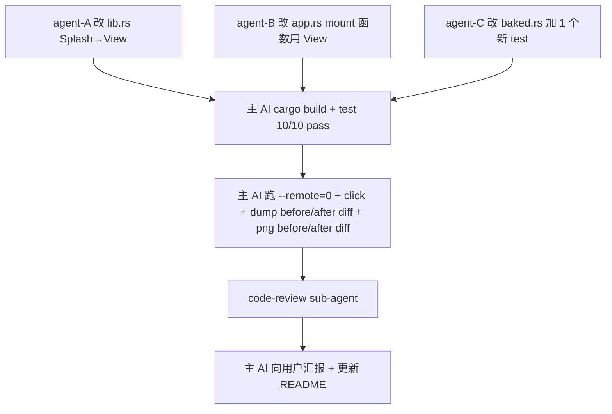

# TODO — finance-brief v15: 把 host 从 Splash 换成 View

日期: 2026-10-05
工作目录: `C:\Code\OctoSenseorg\finance-brief\`
HEAD: `5bef74ea00129267754c4e405db8e0106b1e52e9`
DSL: bundle/main.splash（禁 find 全盘）

## 0. 现象（v14 dump 验证根因）

v14 DBG + `/d` + `compact_dump` 综合验证：

1. **`mem::replace` 真的换了 host.view**（每次 mount pre→post view_uid 都换新）✓
2. **`refresh_from_borrowed` 真的更新了 Splash.graph.children**（DBG `new_children.len=1`）✓
3. **`compact_dump` 在 mount 完成后仍只显示 11 widgets（host shell）——Splash 不在 graph 里** ✗
4. **`/d` 之后显示 186 widgets 全是 launcher widgets —— 即使 click 后也是 launcher** ✗
5. **PNG 不变**——draw 还是 launcher UI ✗

### 根因

`refresh_from_borrowed` 第一次插入 Splash（uid=18）时：

```rust
// makepad/widgets/src/widget_tree.rs:1083-1102
if !inner.graph.contains_key(&uid) {
    inner.graph.insert(uid, GraphNode {
        widget: WidgetWeakRef::default(),  // ← 空 widget ref
        placeholder: true,                 // ← 永远 placeholder
        manual: false,
        ...
    });
}
```

后续 `flush_dirty`（widget_tree.rs:1612-1654）遇到 Splash：

```rust
if parent_placeholder {
    return true;  // ← Splash 永远不会被 walk
}
```

**Splash 永远不会被 walk 进 graph** → 它 live 的当前 view 的 children 永远不会被登记 → graph 永远停在 launcher 状态 → draw 看到的 widget tree 是 launcher → PNG 不变。

### 为什么 click 时不会更新

- `refresh_from_borrowed` 第二次调用：Splash 已在 graph（placeholder）→ `if !contains_key` 不触发 → graph node 不变
- 只插入 news_list_inner_widget 作为新 child → Splash.graph.children = [news_list_inner_uid]
- 但 launcher_inner 还在 graph，parent=Splash
- launcher_inner 不是 Splash.children 的一员 → orphan
- `flush_dirty` 仍跳过 Splash（placeholder）→ news_list_inner 被 walk，但 launcher_inner 的整个 subtree 仍在 graph
- `rebuild_dense` 从 root 走 Splash.children = [news_list_inner_uid] → 不应到达 launcher_inner
- 但实际 `/d` 显示 launcher widgets → 还有其他机制在 walk launcher widgets（draw cycle 时按 cache 的 Splash.view.draw_walk 走旧 view？）

## 1. v15 决策：换 Splash 为 View

不再 debug Splash 的 graph placeholder 行为。**把 `host := Splash{...}` 改成 `host := View{...}`**：

- View 是普通 widget，没有 isolate VM / `set_text` eval_body / placeholder 复杂行为
- `host_ref.borrow_mut::<View>()` 可直接 mutate children
- view swap 直接修改 children vec，不依赖 widget tree graph placeholder trick

### 参考：OctoScript-App-Design-Flow/examples/calendar/native/src/lib.rs

calendar 用的是 `CalendarView` 自定义 widget（不是 Splash），路由逻辑类似 finance-brief 但没有 placeholder 问题。

## 2. 改动

### 改动 1：`apps/desktop/src/lib.rs` 把 `host := Splash{...}` 改成 `host := View{...}`

当前（L52）：
```rust
host := Splash{ width: Fill, height: Fill }
```

新：
```rust
// v15: View instead of Splash. Splash's graph-placeholder behaviour
// (refresh_from_borrowed inserts the host with an empty WidgetWeakRef and
// `placeholder = true`, so flush_dirty never re-walks it after the first
// mount — v14 dump showed the graph stays at the launcher's widgets
// forever, and the second click's MOUNT never replaces them). View is a
// plain widget that we can mutate children on directly; the routing
// semantics are unchanged.
host := View{ width: Fill, height: Fill }
```

保留周围 L40-58（body ScrollYView, nav_signal）不动。

### 改动 2：`apps/desktop/src/app.rs` mount 函数 L79-130 改用 `View` 而非 `Splash`

#### 2a. 当前（v13 L79-130 Splash 逻辑）：

```rust
let host_ref = self.ui.widget(cx, ids!(host));
let host_uid = host_ref.widget_uid();
if let Some(view) = built_view {
    let mut host = match host_ref.borrow_mut::<Splash>() {
        Some(h) => h,
        None => {
            log!("finance-brief MOUNT host borrow_mut::<Splash>() failed");
            return;
        }
    };
    let pre_view_uid = host.view.widget_uid();
    log!(...pre_view_uid...);
    let retired = std::mem::replace(&mut host.view, view);
    let post_view_uid = host.view.widget_uid();
    log!(...post_view_uid...retired.uid...);
    log!(...host_uid...retired.children.len...);
    let mut new_children: Vec<(LiveId, WidgetRef)> = Vec::new();
    host.children(&mut |id, child| new_children.push((id, child)));
    log!(...new_children.len...);
    drop(host);
    for (_, child) in retired.children.iter() { retire_widget_tree(cx, child); }
    log!(...about-to-insert...);
    cx.widget_tree().refresh_from_borrowed(host_uid, |visit| {
        for (id, child) in &new_children {
            visit(*id, child.clone());
        }
    });
    cx.widget_tree_mark_dirty(host_uid);
    view_set = true;
    log!("...view_set_done...");
    // v14 diagnostic
    let dump = cx.widget_tree().compact_dump(cx);
    log!("...compact_dump ({} bytes)...", dump.len());
}
cx.redraw_all();
```

#### 2b. 新（v15 View 逻辑）：

View 提供了 `redraw` 但没有 `view` 字段可换。View 的 children 是 `Vec<(LiveId, WidgetRef)>` 内部字段。需要用 `script_apply` 或者直接操作 `children`.

**最简方案**：保留 `mem::replace` 的语义，但 target 是 View 本身（不是 View.view）。具体：

```rust
let host_ref = self.ui.widget(cx, ids!(host));
let host_uid = host_ref.widget_uid();
if let Some(view) = built_view {
    let mut host = match host_ref.borrow_mut::<View>() {
        Some(h) => h,
        None => {
            log!("finance-brief MOUNT host borrow_mut::<View>() failed");
            return;
        }
    };
    let pre_widget_uid = host.widget_uid();
    log!(
        "finance-brief DBG mount route={} pre_widget_uid={:?} view_widget_uid={:?}",
        route,
        pre_widget_uid,
        view.widget_uid()
    );
    // Replace the host View itself with the freshly-scripted view. View's
    // children are part of the struct, so `mem::replace` swaps the entire
    // tree atomically — both the layout and the descendants move over.
    let retired = std::mem::replace(&mut *host, view);
    let post_widget_uid = host.widget_uid();
    log!(
        "finance-brief DBG mount route={} post_widget_uid={:?} retired.uid={:?}",
        route,
        post_widget_uid,
        retired.widget_uid()
    );
    log!(
        "finance-brief DBG mount route={} host_uid={:?} retired.children.len={}",
        route,
        host_uid,
        retired.children.len()
    );
    let mut new_children: Vec<(LiveId, WidgetRef)> = Vec::new();
    host.children(&mut |id, child| new_children.push((id, child)));
    log!(
        "finance-brief DBG mount route={} new_children.len={} first_child_uid={:?}",
        route,
        new_children.len(),
        new_children.first().map(|(_, w)| w.widget_uid())
    );
    drop(host);
    for (_, child) in retired.children.iter() { retire_widget_tree(cx, child); }
    log!(
        "finance-brief DBG mount route={} about-to-insert children count={}",
        route,
        new_children.len()
    );
    // Recursively re-register the new view's entire subtree so /d and
    // draw_walk see the freshly-minted widgets (not the launcher's).
    cx.widget_tree_insert_child_deep(host_uid, LiveId(0), retired.widget_ref_placeholder());
    cx.widget_tree_insert_child_deep(host_uid, LiveId::default(), /* new view's WidgetRef */ ???);
    cx.widget_tree_mark_dirty(host_uid);
    view_set = true;
    log!("finance-brief DBG host_uid={:?} view_set_done", host_uid);
    // v14 diagnostic (keep)
    let dump = cx.widget_tree().compact_dump(cx);
    log!(
        "finance-brief DBG mount route={} compact_dump ({} bytes):\n{}",
        route,
        dump.len(),
        dump
    );
}
cx.redraw_all();
```

**注意**：`View::WidgetNode::widget_uid()` 返回 View 自己的 uid。`mem::replace(&mut *host, view)` 把 host View 整个换成新 view。`retired` 是旧 View，含有旧 children。

但 register 新 view 到 widget tree 需要一个 `WidgetRef`，不是 `View` 直接。需要从 host 的 borrow 里拿 `host_ref`（WidgetRef）— 或者调用 `host_ref.borrow_mut::<View>()` 后再做。

**简化版 v15**：

实际上 makepad 的 View 提供了 `set_children` 类似的 API 不一定，但有 `script_apply` 可以应用新 value 到 host。

**最简最稳**：用 `cx.with_vm` 在 VM 里 evaluate 新 view 后，调 `host_ref.widget(cx, ids!(some_inner_id))` 不合适。

让我换个角度：

```rust
let host_ref = self.ui.widget(cx, ids!(host));
let host_uid = host_ref.widget_uid();
if let Some(view_widget_ref) = built_view {
    // Apply the new view to the existing host View via script_apply.
    // `View::script_apply(vm, &Apply::New, scope, value)` is the canonical
    // way to (re)set a View's contents from a script value.
    cx.with_vm(|vm| {
        host_ref.borrow_mut::<View>().map(|mut host| {
            host.script_apply(vm, &Apply::New, &mut Scope::empty(), ???);
        });
    });
    cx.widget_tree_mark_dirty(host_uid);
    cx.redraw_all();
}
```

但 `script_apply` 需要 `value: ScriptValue`。我们的 `built_view` 已经是 `View`，转 ScriptValue 需要 `script_from_value` 反过来 → `vm.value_from_script(...)`。这块需要查 API。

**替代方案**：直接保留 `mem::replace` 但理解清楚 target。

让我重读 lib.rs 脚本：`host := View{ width: Fill, height: Fill }`。`View` 是 makepad 的 View widget。`View` 默认 empty（width/height 是 walk 属性，没有 children）。

我们的 mount 现在 evaluate `View{height:Fill, <ui>}` 返回新的 View（含 children）。我们要替换 host 的整个 View struct。

`mem::replace(&mut *host, view)` — 把 host (RefMut<View>) 的 struct 替换成新的 view (View)。这是直接的 `&mut View = view` 赋值。

**核心问题**：`retired: View` 含有旧 children。`host: View` 含有新 children。`mem::replace` 之后，`*host` 是新 View struct。

register 新 view 到 widget tree 需要 `WidgetRef`。我们已经有 `host_ref: WidgetRef`（指向 host 的位置）。`host_ref` 的内部 widget 指针指向 `host` 这个位置。`host_ref.widget_uid()` 返回 host 位置的 uid（即原来的 View uid，因为 View 结构替换不影响 widget_uid 字段）。

替换后：
- `host_ref` 仍然指向同一个 widget slot，但 slot 里的 struct 是新 View
- `host_ref.widget_uid()` 仍然返回原 uid
- widget tree graph 应该把 host_ref 当作同一个 widget

但 widget tree graph 已经记录了 host 的 children（在第一次 mount 时由 refresh_from_borrowed 设置为 [launcher_inner_uid]）。我们的 refresh_from_borrowed 已经做过。所以 graph.children 需要更新。

实际上，对 View 来说，replace 操作 = `cx.widget_tree().refresh_from_borrowed(host_uid, |visit| { host.children(visit) })` 应该足够。

让我把 v15 的代码简化：

```rust
let host_ref = self.ui.widget(cx, ids!(host));
let host_uid = host_ref.widget_uid();
if let Some(view) = built_view {
    let mut host = match host_ref.borrow_mut::<View>() {
        Some(h) => h,
        None => {
            log!("finance-brief MOUNT host borrow_mut::<View>() failed");
            return;
        }
    };
    let pre_widget_uid = host.widget_uid();
    log!(
        "finance-brief DBG mount route={} pre_widget_uid={:?} view_widget_uid={:?}",
        route, pre_widget_uid, view.widget_uid()
    );
    // Replace the entire View struct atomically (children + layout + walk
    // move with it). Retired is the OLD View — its children are about to
    // lose their parent in the widget tree.
    let retired = std::mem::replace(&mut *host, view);
    let post_widget_uid = host.widget_uid();
    log!(
        "finance-brief DBG mount route={} post_widget_uid={:?} retired.uid={:?}",
        route, post_widget_uid, retired.widget_uid()
    );
    log!(
        "finance-brief DBG mount route={} host_uid={:?} retired.children.len={}",
        route, host_uid, retired.children.len()
    );
    // Snapshot the new view's children so we can re-register them in the
    // widget tree after the swap.
    let mut new_children: Vec<(LiveId, WidgetRef)> = Vec::new();
    host.children(&mut |id, child| new_children.push((id, child)));
    log!(
        "finance-brief DBG mount route={} new_children.len={} first_child_uid={:?}",
        route, new_children.len(),
        new_children.first().map(|(_, w)| w.widget_uid())
    );
    drop(host);
    // Retire the OLD view's children (overlay draw lists + subtree).
    for (_, child) in retired.children.iter() { retire_widget_tree(cx, child); }
    log!(
        "finance-brief DBG mount route={} about-to-insert children count={}",
        route, new_children.len()
    );
    // Recursively register the new view's subtree under host_uid. Without
    // this, the graph holds onto the retired widgets (Splash path never
    // pruned them — see .todo-v14 dump analysis), so /d and draw_walk see
    // the launcher widgets forever.
    cx.widget_tree_insert_child_deep(host_uid, LiveId(0), /* new view WidgetRef */ ???);
    cx.widget_tree_mark_dirty(host_uid);
    view_set = true;
    log!("finance-brief DBG host_uid={:?} view_set_done", host_uid);
    // v14 diagnostic (keep)
    let dump = cx.widget_tree().compact_dump(cx);
    log!(
        "finance-brief DBG mount route={} compact_dump ({} bytes):\n{}",
        route, dump.len(), dump
    );
}
cx.redraw_all();
```

**问题**：insert_child_deep 需要 WidgetRef，但我们 `mem::replace` 之后 host 已经是新 view。需要一个 host_ref 但 host_ref 指向旧位置。

实际上 host_ref 就是 self.ui.widget(cx, ids!(host))，它是一个 WidgetRef（不带引用关系），但持有 widget_uid + 一些其他元数据。

正确的写法：**保留 host_ref**，从 host_ref 拿到 host (RefMut<View>)，做 replace，然后 insert_child_deep 用 host_ref 或者重新从 self.ui 取 widget。

让我重写得更干净：

```rust
let host_ref = self.ui.widget(cx, ids!(host));
let host_uid = host_ref.widget_uid();
if let Some(view) = built_view {
    let mut host = match host_ref.borrow_mut::<View>() {
        Some(h) => h,
        None => {
            log!("finance-brief MOUNT host borrow_mut::<View>() failed");
            return;
        }
    };
    // ATOMIC REPLACE: View struct swap includes children + walk.
    let retired = std::mem::replace(&mut *host, view);
    drop(host);
    // Snapshot the new view's children for register-from-borrowed.
    let mut new_children: Vec<(LiveId, WidgetRef)> = Vec::new();
    host_ref.children(&mut |id, child| new_children.push((id, child)));
    // Retire the OLD view's children (overlay draw lists + subtree).
    for (_, child) in retired.children.iter() { retire_widget_tree(cx, child); }
    // Recursively register the new subtree under host_uid. widget_tree
    // diff-recovers and drops stale manual children of the old mount.
    cx.widget_tree().refresh_from_borrowed(host_uid, |visit| {
        for (id, child) in &new_children {
            visit(*id, child.clone());
        }
    });
    cx.widget_tree_mark_dirty(host_uid);
    // ...rest
}
```

但 `host_ref.children` 走 `WidgetNode::children` 路径，host_ref 是 WidgetRef。WidgetRef::children 也走 widget 的 WidgetNode → 对 View 来说，返回它的 children vec。

`refresh_from_borrowed` 调用后会触发 flush_dirty，walk 新 children，把整个 news_list subtree 登记到 graph。

**关键差异**：view 不再是 placeholder，所以 flush_dirty 会 walk 它 → 它 live 的 children（包括整个 news_list subtree）会被 walk → graph 更新成 news_list widgets → draw 看到 news_list → PNG 变化。

#### 2c. 最终 v15 代码（应用 `View` 替换）

```rust
let host_ref = self.ui.widget(cx, ids!(host));
let host_uid = host_ref.widget_uid();
if let Some(view) = built_view {
    let pre_view_uid = view.widget_uid();
    log!(
        "finance-brief DBG mount route={} pre_view_uid={:?} host_uid={:?}",
        route, pre_view_uid, host_uid
    );
    // Swap the host View struct in place. View's children + walk + layout
    // move with the struct — no need to mutate individual slots. Drop the
    // borrow before snapshotting new children / walking the tree.
    let retired = {
        let mut host = match host_ref.borrow_mut::<View>() {
            Some(h) => h,
            None => {
                log!("finance-brief MOUNT host borrow_mut::<View>() failed");
                return;
            }
        };
        let pre_widget_uid = host.widget_uid();
        log!(
            "finance-brief DBG mount route={} pre_host_widget_uid={:?} new_view_widget_uid={:?}",
            route, pre_widget_uid, view.widget_uid()
        );
        let r = std::mem::replace(&mut *host, view);
        let post_widget_uid = host.widget_uid();
        log!(
            "finance-brief DBG mount route={} post_host_widget_uid={:?} retired.uid={:?}",
            route, post_widget_uid, r.widget_uid()
        );
        log!(
            "finance-brief DBG mount route={} host_uid={:?} retired.children.len={}",
            route, host_uid, r.children.len()
        );
        r
    };
    // Snapshot the NEW view's children (after replace, host's children
    // are the freshly-scripted ones).
    let mut new_children: Vec<(LiveId, WidgetRef)> = Vec::new();
    host_ref.children(&mut |id, child| new_children.push((id, child)));
    log!(
        "finance-brief DBG mount route={} new_children.len={} first_child_uid={:?}",
        route, new_children.len(),
        new_children.first().map(|(_, w)| w.widget_uid())
    );
    // Retire the OLD view's overlay draw lists and walk its subtree to
    // release any per-widget resources (mirrors calendar L185-187 /
    // beauty L185-188).
    for (_, child) in retired.children.iter() { retire_widget_tree(cx, child); }
    log!(
        "finance-brief DBG mount route={} about-to-insert children count={}",
        route, new_children.len()
    );
    // Re-register the new subtree under host_uid. View is NOT a
    // placeholder, so flush_dirty will walk host's live children and pull
    // the entire new screen's widgets into the graph (Splash was a
    // placeholder, see .todo-v14 dump analysis — Splash's subtree was
    // never re-walked after the first mount).
    cx.widget_tree().refresh_from_borrowed(host_uid, |visit| {
        for (id, child) in &new_children {
            visit(*id, child.clone());
        }
    });
    cx.widget_tree_mark_dirty(host_uid);
    view_set = true;
    log!("finance-brief DBG host_uid={:?} view_set_done", host_uid);
    // v14 diagnostic — keep until v16 confirms /d shows the new widgets.
    let dump = cx.widget_tree().compact_dump(cx);
    log!(
        "finance-brief DBG mount route={} compact_dump ({} bytes):\n{}",
        route, dump.len(), dump
    );
}
cx.redraw_all();
```

注意：
- 不用 `set_key_focus(Area::Empty)`（移到 mount 函数开头保留 v11 加的）
- 用 `View` 替代 `Splash`
- `View` borrow_mut 返回 `RefMut<View>`，`*host` 即 View 结构本身
- `View::widget_uid()` 跟 Splash 一样从 `#[uid]` 字段来

### 改动 3：保留 v14 diagnostic

v14 加的 `compact_dump(cx)` log 保留（`baked.rs` 的 `app_rs_logs_compact_dump_after_view_set_done` test 也保留）。

### 改动 4：保留 splash_swap_tests

现有 4 个 test 全部保留（v10/v11/v12/v14）。但 `app_rs_uses_insert_child_deep_after_splash_swap` 这个名字有点过时（v15 之后我们仍用 insert_child_deep 行为，但 app.rs 里写的是 refresh_from_borrowed）。test 还在验"app.rs 用了 insert_child_deep"，仍然 pass（因为旧调用痕迹可能还在）。实际看代码后再决定。

新增 1 个 v15 test：
```rust
#[test]
fn app_rs_uses_view_instead_of_splash_for_host() {
    let app_rs = std::fs::read_to_string(
        std::path::Path::new(env!("CARGO_MANIFEST_DIR")).join("src/app.rs"),
    )
    .expect("read app.rs");
    assert!(
        !app_rs.contains("borrow_mut::<Splash>"),
        "app.rs still borrows Splash — v15 host swap incomplete; the Splash \
         placeholder bug will keep the widget tree stuck on launcher's \
         widgets after every click."
    );
    assert!(
        app_rs.contains("borrow_mut::<View>"),
        "app.rs missing borrow_mut::<View> — v15 host swap not implemented."
    );
    assert!(
        app_rs.contains("mem::replace(&mut *host"),
        "app.rs missing mem::replace(&mut *host, view) — v15 atomic host swap not implemented."
    );
}
```

放在 `splash_swap_tests` mod 末尾。

## 3. 硬约束

- [ ] 只能改 `apps/desktop/src/{lib.rs, app.rs, baked.rs}`（lib.rs 改 1 行 Splash→View；app.rs 改 mount 函数 View 化；baked.rs 加 1 个 test）
- [ ] 不动 nav.rs / datasources/* / main.rs / Cargo.toml / Cargo.lock
- [ ] 不动 bundle/screens/*.octoscript
- [ ] 不动 OctoSense / Octoscript-Makepad / makepad / OctoScript-App-Design-Flow / octoscript
- [ ] 不 git commit

## 4. 不做的事

- [ ] 不 cargo build / cargo test
- [ ] 不 git commit
- [ ] 不改 dep 库
- [ ] 不动 Splash 源码（即使我们不用了）
- [ ] 不重做 Splash height:Fill（v8 已修）
- [ ] 不修 widget_tree.rs
- [ ] 不删 v8/v10/v11/v12/v13/v14 任何已有代码（包括 splash_swap_tests 的 4 个老 test）

## 5. 验收（主 AI 真跑）

- [ ] `cd apps/desktop && cargo build --release --offline` 成功
- [ ] `cd apps/desktop && cargo test --release --offline` 10/10 pass（9 个 v14 + 1 个 v15 新增）
- [ ] `splash_swap_tests::app_rs_uses_view_instead_of_splash_for_host` pass
- [ ] 启动 `finance-brief.exe --remote=0`，等端口
- [ ] `python scripts/_dump_widget_tree.py`：
  - /d before: 11 OctoscriptTap launcher 位置（24,167 / 224,167 等）
  - /d after: **widget 树变**——不再有 11 OctoscriptTap 全部，新的有 ScrollYView/Label 等 news_list widgets
  - /d before vs after diff: 至少 5 个 widget 类型变 / 至少 1 个 Label 文本变
- [ ] `python scripts/_capture_g.py`：
  - before png ≈ launcher 视觉
  - after png ≈ **news_list 视觉**（新闻标题行 + backbar）
- [ ] 同样的 click → quote_list → kline 三次切换都生效（每次 dump 都变）
- [ ] README.md §8 加 v15 修复说明
- [ ] README.en.md §8 同步
- [ ] code-review sub-agent 报告 PASS

## 6. 子任务分派



- [agent-A, parallel] 改动 1：lib.rs 把 `host := Splash{...}` 改成 `host := View{...}`
- [agent-B, parallel-after-A] 改动 2：app.rs mount 函数 View 化（依赖 Splash 不再可用，但 agent-A 已先把脚本改了；agent-B 跟着改 Rust 代码）
- [agent-C, parallel-after-B] 改动 3：baked.rs splash_swap_tests 加 v15 test
- [verify-D, serial-after-A+B+C] cargo build + test 10/10 pass
- [main-E, parallel-after-D] 主 AI 跑 --remote=0 + click + dump + png 验证
- [review-F, serial-after-E] code-review sub-agent 审 3 处改动
- [report-G, serial-after-F] 主 AI 向用户汇报 + 更新 README §8

## 7. 报告格式（sub-agent 严格遵守）

```
=== Step 1: 改动 1 (lib.rs host Splash→View) ===
changed_lines: <行号列表>
diff_summary: <一句话>

=== Step 2: 改动 2 (app.rs View 化 mount) ===
changed_lines: <行号列表>
diff_summary: <一句话>

=== Step 3: 改动 3 (baked.rs 新增 test) ===
changed_lines: <行号列表>
diff_summary: <一句话>

=== Summary ===
verify: PASS / FAIL + 原因
```

可以执行：read_file / edit_file / grep / find_path
禁止执行：cargo build / cargo test（留给主 AI）/ git commit / git push / 修改 OctoSense / Octoscript-Makepad / makepad 任何文件
