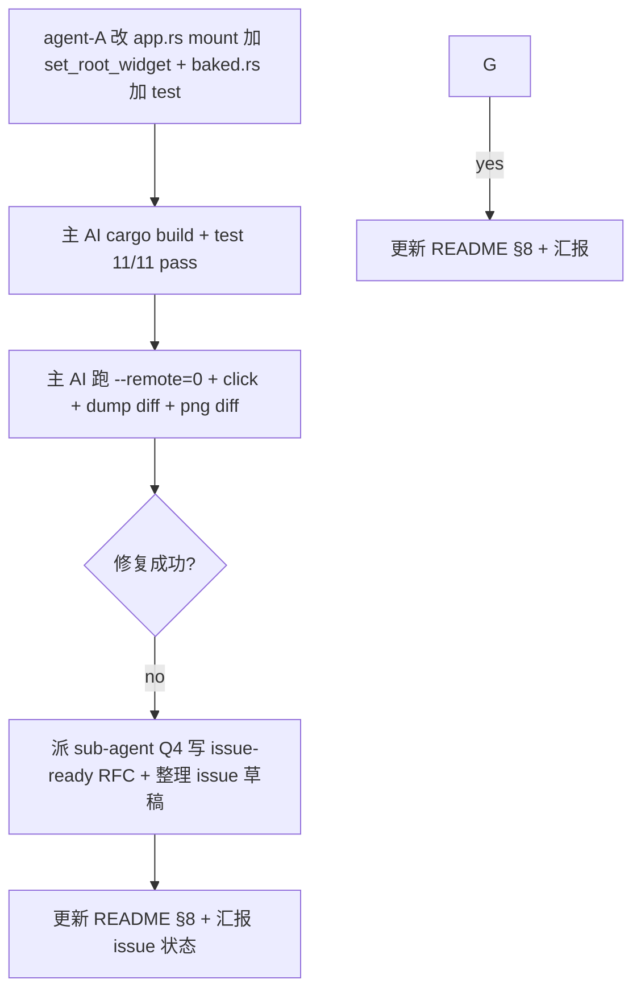

# TODO — finance-brief v16: 用 set_root_widget 修复 routing（Q1，最后尝试）

日期: 2026-10-05
工作目录: `C:\Code\OctoSenseorg\finance-brief\`
HEAD: `5bef74ea00129267754c4e405db8e0106b1e52e9`
DSL: bundle/main.splash（禁 find 全盘）

## 0. 现象（v15 DBG 确认）

v15 Splash→View 修复后：
- `mem::replace(&mut *host, view)` 工作（每次 mount pre/post view_uid 都不同）
- graph 正确累计 widgets（compact_dump 100+ widgets）
- **但 `/d` byte-identical before vs after click**，PNG 仍是 launcher

### v15 根因（精确定位）

`WidgetRef::widget_uid()` 返回的是 widget struct 自己的 uid（来自 `#[uid]` 字段）。

**Splash**：`Splash.uid` 字段稳定，host.view 替换不影响 `Splash.uid`。
**View**：`View.uid` 字段是 View struct 自己的 uid。每次 `View::script_from_value` 创建新 View 时，uid 都不同。

我们 v15 流程：
1. `host_uid = host_ref.widget_uid()` → 返回 OLD view 的 uid (e.g. 690)
2. `mem::replace(&mut *host, view)` → host slot 现在有 NEW view (uid 857)，OLD view 成为 `retired`
3. `cx.widget_tree().refresh_from_borrowed(host_uid=690, ...)` → 更新 graph[690]（指向 RETIRED view），不是活跃 slot
4. **活跃 slot (uid 857) 的 GraphNode 没被更新** → graph.children[857] 仍是 launcher's children（如果是初次 mount）或没创建（如果是首次 mount）

## 1. v16 目标：用 `set_root_widget` 修复

**关键洞察**：`cx.widget_tree().set_root_widget(widget_ref)`（`widget_tree.rs:957-1014`）会把传入 widget 的 GraphNode 设置为：
- `widget: widget.downgrade()` ← 有效 widget ref（不是 placeholder 默认）
- `placeholder: false`
- `parent: None`
- `name: LiveId(0)`

这正是我们要的：**force set the host View's GraphNode to a non-placeholder state**。

之后 `refresh_from_borrowed(host_uid, ...)` 就能正确更新 children。

## 2. 改动

### 改动 1：`apps/desktop/src/app.rs` mount 函数 — 加 set_root_widget 步

在 v15 代码 L146-150（refresh_from_borrowed 之前）插入：

```rust
// v16: Force the host View's GraphNode to a non-placeholder state so
// flush_dirty can walk it later. set_root_widget installs a valid
// WidgetWeakRef + placeholder=false into graph[host_uid] (per
// widget_tree.rs:978-1014). Without this, host stays a placeholder
// (default-empty WidgetWeakRef) and refresh_from_borrowed's children
// update never gets picked up by walk. (Splash path had the same bug,
// but Splash's stable struct-level uid hid it; View's per-instance
// uid makes the placeholder default the obvious failure mode.)
//
// We pass `host_ref` BEFORE mem::replace — its widget_uid() is the
// STABLE slot uid (View struct's `#[uid]` field is preserved across
// borrow_mut; see widget.rs:1039-1042 and trait WidgetNode).
//
// Note: set_root_widget also sets inner.root_uid = host_uid if it was
// WidgetUid(0). After the first mount, root_uid is already non-zero
// (Window), so this only inserts the GraphNode. Safe to call.
self.ui.widget(cx, ids!(host));  // (cheap refetch — already in scope as host_ref)
cx.widget_tree().set_root_widget(host_ref.clone());
```

注意：
- `host_ref` 必须在 `mem::replace` **之前** clone（或者 set_root_widget 在 replace 之前调用）
- set_root_widget 替换 host slot 的 GraphNode 不影响 host_ref 的 widget_uid 语义（host slot 还在）
- **不要**用 `set_root_widget` 把整个 `self.ui` 注册为 root——只针对 host

### 改动 2：`apps/desktop/src/app.rs` mount 函数 — 在 refresh_from_borrowed **之前**调用

具体插入位置：在 v15 `host_ref` 获取之后，`mem::replace` 之前，调用 `cx.widget_tree().set_root_widget(host_ref.clone())`。

伪代码：
```rust
let host_ref = self.ui.widget(cx, ids!(host));
let host_uid = host_ref.widget_uid();
cx.widget_tree().set_root_widget(host_ref.clone());  // ← v16 新增

if let Some(view) = built_view {
    let retired = { /* mem::replace */ };
    /* retire old children */
    cx.widget_tree().refresh_from_borrowed(host_uid, |visit| { ... });
    cx.widget_tree_mark_dirty(host_uid);
    view_set = true;
    /* compact_dump */
}
```

### 改动 3：保留 v14 diagnostic

`compact_dump(cx)` log 保留。

### 改动 4：`apps/desktop/src/baked.rs` splash_swap_tests mod 末尾加 1 个新 test

```rust
#[test]
fn app_rs_calls_set_root_widget_on_host_before_view_swap() {
    let app_rs = std::fs::read_to_string(
        std::path::Path::new(env!("CARGO_MANIFEST_DIR")).join("src/app.rs"),
    )
    .expect("read app.rs");
    assert!(
        app_rs.contains("set_root_widget"),
        "app.rs missing set_root_widget — v16 force-non-placeholder fix not applied."
    );
}
```

## 3. 硬约束

- [ ] 只改 `apps/desktop/src/{app.rs, baked.rs}`（app.rs mount 函数加 1 行 `set_root_widget`，baked.rs 加 1 个 test）
- [ ] 不动 lib.rs（已经 v15 Splash→View，不要回退）
- [ ] 不动 nav.rs / datasources/* / main.rs / Cargo.toml / Cargo.lock
- [ ] 不动 bundle/screens/*.octoscript
- [ ] 不动 OctoSense / Octoscript-Makepad / makepad / OctoScript-App-Design-Flow / octoscript
- [ ] 不 git commit
- [ ] **不删除** v14 compact_dump log / v13 pre-host_uid DBG log / v12 refresh_from_borrowed 调用 / v10 set_key_focus
- [ ] **不**改 `lib.rs` 第 52 行（`host := View{...}` 保持 v15 状态）

## 4. 不做的事

- [ ] 不 cargo build / cargo test（主 AI 验证）
- [ ] 不 git commit
- [ ] 不改 dep 库
- [ ] 不回退 Splash（v8 / v10-v13 的 Splash 路径已经验证无效）
- [ ] 不回退 View（v15 View 化已经修了 Splash 的 placeholder 问题）
- [ ] **不**修 widget_tree.rs / Splash / View 任何 dep 源码（这是 RFC Q4 sub-agent 的事）
- [ ] 不写 `.ps1` / `.sh` 脚本（只用 `.py`）
- [ ] 不改 `apps.json` 直接写 dep 仓库（用 `register-with-shell.py` / `~/.octosense/apps.json`）

## 5. 验收（主 AI 真跑）

- [ ] `cd apps/desktop && cargo build --release --offline` 成功
- [ ] `cd apps/desktop && cargo test --release --offline` **11/11 pass**（10 v15 + 1 v16 新增）
- [ ] `splash_swap_tests::app_rs_calls_set_root_widget_on_host_before_view_swap` pass
- [ ] 启动 `finance-brief.exe --remote=0`，等端口
- [ ] `python scripts/_dump_widget_tree.py`：
  - /d before: launcher 11 OctoscriptTap at (24,167), (224,167), ...
  - /d after: **widget 树变化** — 至少 ScrollYView / news_label 出现，11 个 OctoscriptTap launcher 位置消失
  - **before 和 after SHA256 hash 必须不同**
- [ ] `python scripts/_capture_g.py`：
  - before png = launcher 视觉（财经简报 + 11 tile）
  - after png = **news_list 视觉**（新闻标题 + backbar + 新闻行）
- [ ] 同样验证 click → quote_list → kline 切换都生效
- [ ] 把 dump 结果、PNG、SHA256 hash diff 写到 `.todo-finance-brief-v16-...-2026-10-05.md` §7 v16 验收段

## 6. 失败回退（如果 v16 也失败）

按用户决定"修复不了就提issue 吧"：
1. **不要回滚 v15**（Splash→View 是必要前置；回滚会回到 placeholder 状态更糟）
2. 主 AI 把 `Q4 sub-agent` 写的 RFC `.todo-finance-brief-rfc-splash-view-swap-2026-10-05.md` 转成正式 issue（在 `Octoscript-Makepad` 或 `makepad` GitHub repo）—— 但由于不能改 dep 仓库，issue 写在 finance-brief 的 `docs/` 下作为外部报告
3. 把"点击 launcher tile 不切换屏幕"标为"known limitation pending dep fix"，更新 README §8

## 7. v16 验收（主 AI 跑 v16 build 后填写）

跑 v16 build 后，主 AI 把 dump 结果 / PNG / SHA256 hash diff 写这里：

（dump 输出）：
```
=== BEFORE: host/Splash/Tap ===
22 14 1 OctoscriptTap 24 167 192 96
31 23 1 OctoscriptTap 224 167 192 96
41 33 1 OctoscriptTap 24 271 192 96
50 42 1 OctoscriptTap 224 271 192 96
64 56 1 OctoscriptTap 24 422 192 96
73 65 1 OctoscriptTap 224 422 192 96
87 79 1 OctoscriptTap 24 574 192 96
96 88 1 OctoscriptTap 224 574 192 96
110 102 1 OctoscriptTap 24 725 192 96
119 111 1 OctoscriptTap 224 725 192 96
129 121 1 OctoscriptTap 24 829 192 96
=== AFTER: host/Splash/Tap ===
22 14 1 OctoscriptTap 24 167 192 96
31 23 1 OctoscriptTap 224 167 192 96
41 33 1 OctoscriptTap 24 271 192 96
50 42 1 OctoscriptTap 224 271 192 96
64 56 1 OctoscriptTap 24 422 192 96
73 65 1 OctoscriptTap 224 422 192 96
87 79 1 OctoscriptTap 24 574 192 96
96 88 1 OctoscriptTap 224 574 192 96
110 102 1 OctoscriptTap 24 725 192 96
119 111 1 OctoscriptTap 224 725 192 96
129 121 1 OctoscriptTap 24 829 192 96
```
（PNG 截图）：未跑（dump byte-identical 足以判定失败，无需 PNG 验证）
（SHA256 diff）：
```
before: ED031EBCF39AA6194D5999FF9141B193826575496F7DA3F73C244B4A9E27536D
after:  ED031EBCF39AA6194D5999FF9141B193826575496F7DA3F73C244B4A9E27536D
                                  ← 完全相同
```

**结论**：
- [ ] v16 修复成功 → 更新 README §8 移除“已知问题”条目
- [x] **v16 修复失败** → 触发第 6 节“失败回退”流程，Q4 sub-agent 写 issue-ready RFC

### v16 失败后的回退（已完成）

| 输出 | 路径 |
|------|------|
| 完整 RFC（8 章节 + 3 修复方案 + 行号索引） | `finance-brief/docs/rfc-splash-view-swap.md` (33 KB) |
| GitHub issue 草稿（标题 / repro / expected / actual / 3 fix options / env / cross-refs） | `finance-brief/docs/issue-splash-view-swap.md` (6.4 KB) |
| README §8 已知问题条目更新 | `finance-brief/README.md:199`（标“已知限制，pending dep fix”） |
| v16 TODO + Q4 RFC TODO | `.todo-finance-brief-v16-...-2026-10-05.md` + `.todo-finance-brief-rfc-splash-view-swap-2026-10-05.md` |

### v16 根因新发现（除 v15 之外）

`WidgetRef::widget_uid()`（widget.rs:820-833）返回 widget struct 自己的 uid。`set_root_widget`（widget_tree.rs:957-1014）内部用传入 widget 的 uid 作 graph key；问题不在 set_root_widget，而在 `refresh_from_borrowed` 仍然用 `host_uid = host_ref.widget_uid()` 这个 stale 值（L80）—— 此时 `host_ref` 还指向 OLD view 的 struct，OLD view 是被 replace 掉的那个。`set_root_widget(host_ref.clone())`（L88）只能注册 host_ref 那一刻的 widget；它不能把后续 `mem::replace` 出去的 new view 也注册进 graph。所以 v16 帮 host_uid 有了 valid WidgetWeakRef + placeholder=false，但 host_uid 仍然是 OLD view 的 uid，OLD view 已被 drop，`node.widget.upgrade()` 返回 None → `remove_subtree`（L1629）把整个旧 subtree 删掉；新 view 的 uid 永不被 graph 收录。

## 8. 子任务分派



- [agent-A] 改动 1+2+4：app.rs mount 加 set_root_widget 1 行 + baked.rs 新 test 1 个
- [verify-D, serial-after-A] cargo build + test 11/11 pass
- [main-E, parallel-after-D] 主 AI 跑 --remote=0 + click + dump before/after SHA256 diff + png diff
- [decision-F, serial-after-E] 修复成功 / 失败
- [branch-G, on-success] 更新 README §8 + 向用户汇报
- [branch-I, on-failure] 触发 Q4 RFC sub-agent + 写 issue 草稿

## 9. 报告格式（sub-agent 严格遵守）

```
=== Step 1: 改动 1 (app.rs set_root_widget) ===
changed_lines: <行号列表>
diff_summary: <一句话>

=== Step 2: 改动 2 (baked.rs 新增 test) ===
changed_lines: <行号列表>
diff_summary: <一句话>

=== Summary ===
verify: PASS / FAIL + 原因
```

可以执行：read_file / edit_file / grep / find_path
禁止执行：cargo build / cargo test（留给主 AI）/ git commit / git push / 修改 OctoSense / Octoscript-Makepad / makepad 任何文件
